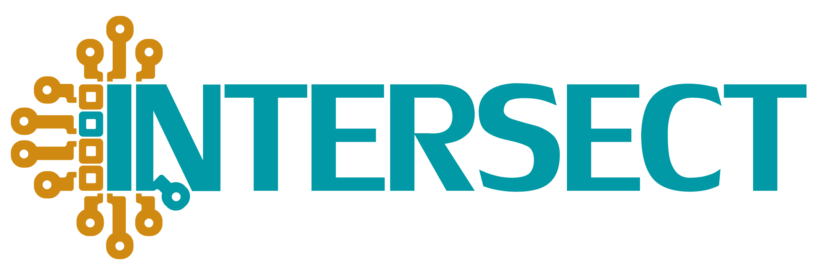

AiiDA ABC tutorial
==================

.. _ABC_2021_Homepage:

+-----------------+-----------------------------------------------------------------------------------------------------------+
| Related resources                                                                                                           |
+=================+===========================================================================================================+
| python packages | `aiida-core 1.3.0`_, `aiida-quantumespresso 3.0.0`_                                                       |
+-----------------+-----------------------------------------------------------------------------------------------------------+
| codes           | `Quantum ESPRESSO 6.5`_                                                                                   |
+-----------------+-----------------------------------------------------------------------------------------------------------+

.. _Quantum Mobile 20.03.1: https://github.com/marvel-nccr/quantum-mobile/releases/tag/20.03.1
.. _aiida-core 1.3.0: https://pypi.org/project/aiida-core/1.3.0/
.. _aiida-quantumespresso 3.0.0: https://github.com/aiidateam/aiida-quantumespresso/releases/tag/v3.0.0
.. _Quantum ESPRESSO 6.5: https://github.com/QEF/q-e/releases/tag/qe-6.5

This is the content of the virtual AiiDA tutorial organised for the University of ABC on the 10th of February 2021.

Setup
-----

The tutorial will be run on the |AiiDAlab tutorials cluster|, just click the link and log in with a username and a password of your choosing.

.. important::

    Note down your password so that you can login again in case you get inadvertently logged out.
    In case you forgot your password, the admin can make a new account, **but you will lose your progress!**

It will take a few minutes for your server to start up on first login, after that you are all set and ready to start with the tutorial!

.. |AiiDAlab tutorials cluster| raw:: html

   <a href="https://aiidalab-abc-tutorial-2021.materialscloud.org" target="_blank">AiiDAlab tutorials cluster</a>

Hands-on materials
------------------

The hands-on sessions consist of one short session on running calculations and a simple workflow with Quantum ESPRESSO, as well as a session on organising and querying your data.
If you have time left after going through the first two sections, you can have a look at the "Provenance tutorial", which explains more about the basic concepts of AiiDA.

.. toctree::
   :maxdepth: 2
   :caption: Hands-on sessions
   :numbered:

   ./source/sections/qe
   ./source/sections/data
   ./source/sections/install
   ./source/sections/basics
   

In-depth tutorial
-----------------

This tutorial is only a short introduction to AiiDA and its features.
If you want to learn more, you can check the `2020 AiiDA virtual tutorial <https://aiida-tutorials.readthedocs.io/en/tutorial-2020-intro-week/index.html>`_.

Acknowledgements
----------------

This event was made possible by support from the MaX European Centre of Excellence, the MARVEL National Centre of Competence in Research and the H2020 INTERSECT project.

.. image:: source/sponsors/max.png
   :target: http://www.max-centre.eu/
   :width: 35%

