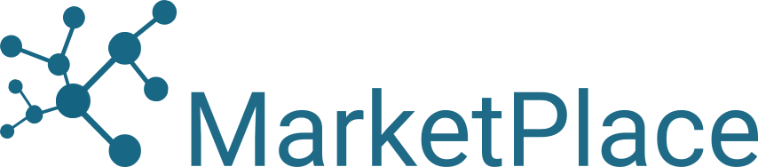

.. _Mandi 2019 Homepage:

2019, IIT Mandi, Mandi, India
=============================

+-----------------+--------------------------------------------------------------------------------+
| Related resources                                                                                |
+=================+================================================================================+
| Virtual Machine | `Quantum Mobile 19.09.0`_                                                      |
+-----------------+--------------------------------------------------------------------------------+
| python packages | `aiida-core 1.0.0b6`_, `aiida-quantumespresso 3.0.0a5`_, `aiidalab 19.08.0a1`_ |
+-----------------+--------------------------------------------------------------------------------+
| codes           | `Quantum Espresso 6.4.1`_                                                      |
+-----------------+--------------------------------------------------------------------------------+

.. _Quantum Mobile 19.09.0: https://github.com/marvel-nccr/quantum-mobile/releases/tag/19.09.0
.. _aiida-core 1.0.0b6: https://pypi.org/project/aiida-core/1.0.0b6
.. _aiida-quantumespresso 3.0.0a5: https://pypi.org/project/aiida-quantumespresso/3.0.0a5
.. _aiidalab 19.08.0a1: https://pypi.org/project/aiidalab/19.8.0a1
.. _Quantum Espresso 6.4.1: https://github.com/QEF/q-e/releases/tag/qe-6.4.1

These are the hands-on materials from the 3-day AiiDA tutorial |tutorial_name| from October 9-11, 2019.

While participants of the tutorial used virtual machines on a cloud service, you can follow the tutorial on your own computer using the Quantum Mobile VirtualBox image linked above.
The image already contains all the required software.

Getting started
---------------

.. toctree::
   :maxdepth: 2
   :numbered:

   ./sections/setup
   ./sections/first_taste

Sections
--------

.. toctree::
   :maxdepth: 2
   :numbered:

   ./sections/verdi_cmdline
   ./sections/verdi_shell
   ./sections/calculations
   ./sections/querybuilder
   ./sections/workflows

Appendices
----------

.. toctree::
   :maxdepth: 2
   :numbered:

   ./sections/appendix_computer_code_setup
   ./sections/appendix_input_validation
   ./sections/appendix_restarting_calculations
   ./sections/appendix_queries
   ./sections/appendix_workflow_logic

Acknowledgements
----------------

The |tutorial_name| was made possible by support from IIT Mandi, MARVEL, MaX, MarketPlace and EPFL, and kindly hosted by IIT Mandi.

.. image:: sponsors/max.png
   :target: http://www.max-centre.eu/
   :width: 135px

.. image:: sponsors/epfl.png
   :target: https://epfl.ch
   :width: 105px

.. |tutorial_name| raw:: html

   <a href="http://aiidaworkshop.iitmandi.ac.in/" target="_blank">National Workshop on Writing reproducible workflows for computational materials science using AiiDA</a>
