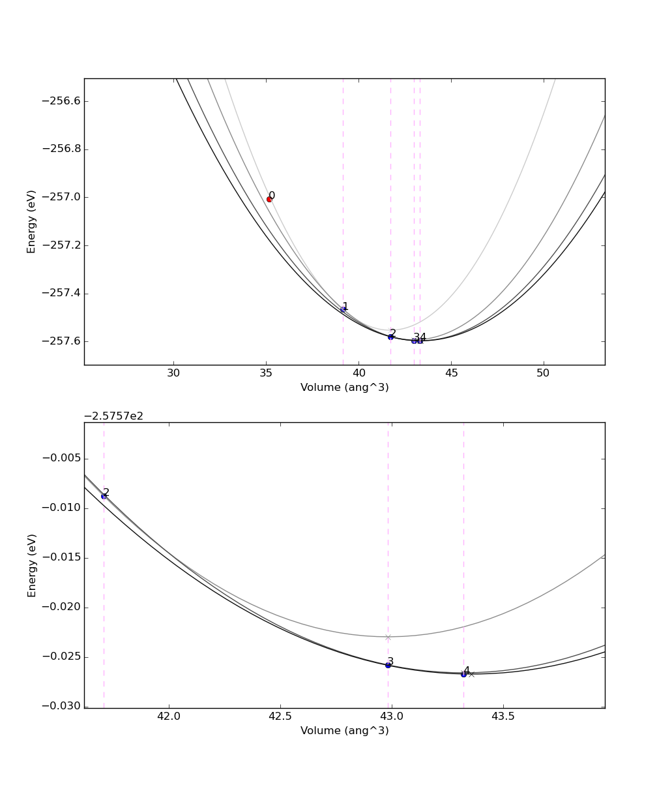

*These appendices consist of optional exercises, and are mentioned
in earlier parts of the tutorial. Go through them only if you
have time.*

.. _2019_mandi_workflow_logic:

More workflow logic: while loops and conditional statements
===========================================================

In the previous sections, you have been introduced to ``WorkChains``, and the reason for using them over 'standard' work functions.
However, in the :ref:`original example<2019_mandi_workchainsimple>`, the ``spec.outline`` was quite simple, with a 'static' sequence of two steps.
Most often, however, you need dynamic workflows, where you need to decide at runtime whether to continue to compute or not (e.g. in a convergence loop, where you need to stop if convergence has been achieved).
To support this scenario, the ``spec.outline`` can support logic: `while` loops and `if/elif/else` blocks.
The simplest way to explain it is to show an example:

.. code:: python

    from aiida.engine import if_, while_

    spec.outline(
        cls.s1,
        if_(cls.isA)(
            cls.s2
        ).elif_(cls.isB)(
            cls.s3
        ).else_(
            cls.s4
        ),
        cls.s5,
        while_(cls.condition)(
            cls.s6
        ),
    )

that would *roughly* correspond, in a python syntax, to:

.. code:: python

    s1()
    if isA():
        s2()
    elif isB():
        s3()
    else:
        s4()
    s5()
    while condition():
        s6()

The only constraint is that condition functions (in the example above ``isA``, ``isB`` and ``condition``) must be class methods that returns ``True`` or ``False`` depending on whether the condition is met or not.

A suggestion on how to write new workchains: use the outline to help you in designing the logic.
First create the spec outline writing, almost if you were explaining it in words, what you expect the workflow to do.
Then, define one by one the methods.

.. _2019_mandi_convpressure:

Pressure convergence
--------------------

For example, we have prepared a simple workflow (using work chains, work functions and calculation functions) to optimize the lattice parameter of silicon efficiently using Newton's algorithm on the energy derivative, i.e. the pressure :math:`p=-dE/dV`.
You can download this code :download:`here <../scripts/pressure_convergence.py>`
The outline looks like this:

.. code:: python

    spec.outline(
        cls.setup,
        cls.put_step0_in_ctx,
        cls.move_next_step,
        while_(cls.not_converged)(
            cls.move_next_step,
        ),
        cls.finish
    )

This outline already roughly explains the algorithm: after an initialization (``setup``) and putting the first step (number zero) in the ctx (``put_step0_in_ctx``), a function to move to the next step is called (``move_next_step``).
This is iterated while a given convergence criterion is not met (``not_converged``).
Finally, some reporting is done, including returning some output nodes (``finish``).

If you are interested in the details of the algorithm, you can inspect the file.
The main ideas are described here:

``setup``
Generate a ``pw.x`` calculation for the input structure (with volume
(V)), and one for a structure where the volume is :math:`V+4 \mbox{\normalfont\AA}^3` (just to get a closeby volume).
Store the results in the context as ``r0`` and ``r1``

``put_step0_in_ctx``
Store in the context :math:`V`, :math:`E(V)` and :math:`dE/dV` for the first calculation ``r0``

``move_next_step``
This is the most important function. Calculate :math:`V`, :math:`E(V)` and :math:`dE/dV` for ``r1``.
Also, estimate :math:`d^2E/dV^2` from the finite difference of the first derivative of ``r0`` and ``r1`` (helper functions to achieve this are provided).
Get the :math:`a`, :math:`b` and :math:`c` coefficients of a parabolic fit :math:`E = aV^2 + bV + c` and estimate the expected minimum of the EOS function as the minimum of the fit :math:`V_0 = -b / 2a`.
Finally, replace ``r0`` with ``r1`` in the context (i.e., get rid of the oldest point) and launch a new pw calculation at volume :math:`V_0`, that will be stored in the context replacing ``r1``.
In this way, at the next iteration ``r0`` and ``r1`` will contain the latest two simulations.
Finally, at each step some relevant information (coefficients :math:`a`, :math:`b` and :math:`c`, volumes, energies, energy derivatives, ...) are stored in a list called ``steps``.
This whole list is stored in the context because it provides quantities to be preserved between different work chain steps.

``not_converged``
Return ``True`` if convergence has not been achieved yet.
Convergence is achieved if the difference in volume between the two latest simulations is smaller than a given threshold ``volume_tolerance``.

``finish``
This is the final step.
Mainly, we return the output nodes: ``steps`` with the list of results at each step, and ``structure`` with the final converged structure.

The results returned in ``steps`` can be used to represent the evolution of the minimisation algorithm.
A possible way to visualize it is presented in :numref:`fig_convpressure` obtained with an initial lattice constant of `alat = 5.2`.

.. _2019_mandi_fig_convpressure:

   Example of results of the convergence algorithm presented in this section.
   The bottom plot is a zoom near the minimum.
   The dots represent the (volume,energy) points obtained from Quantum ESPRESSO, and the numbers indicate at which iteration they were obtained.
   The parabolas represent the parabolic fits used in the algorithm; the minimum of the parabola is represented with a small cross, in correspondence of the vertical lines, used as the volume for the following step.
