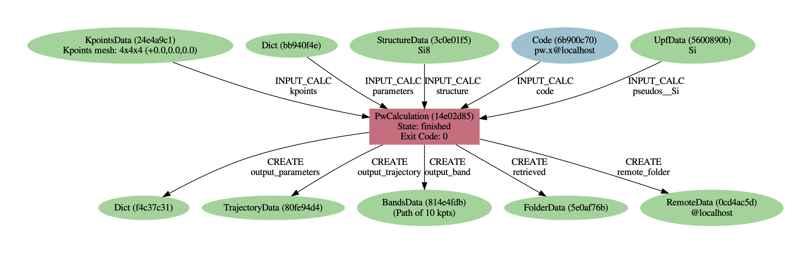

A first taste
=============

Let's start with a quick demo of how AiiDA can make your life easier as a computational scientist.

To get started, type ``workon aiida`` in your terminal to enter the *virtual environment* where AiiDA is installed.
You have entered the the virtual environment when the prompt starts with ``(aiida)``, e.g.::

  (aiida) username@hostname:~$

.. note::

    You need to retype ``workon aiida`` whenever you open a new terminal.

We'll be using the ``verdi`` command-line interface,
which lets you manage your AiiDA installation, inspect the contents of your database,  control running calculations and more.

Here are some first tasks for you:

 * The ``verdi`` command supports **tab-completion**:
   In the terminal, type ``verdi``, followed by a space and press the 'Tab' key twice to show a list of all the available sub commands.
 * For help on any ``verdi`` command, simply append the ``-h`` or ``--help`` flag:

   .. code:: bash

       verdi -h

Getting help
------------

There are a number of helpful resources available to you for getting more information about AiiDA.
Please consider:

 * consulting the extensive `AiiDA documentation <https://aiida-core.readthedocs.io/en/latest/>`_
 * asking in the `Slack channel of the tutorial <https://aiida-tutorial-india.slack.com>`_
 * asking your neighbor
 * asking a tutor
 * opening a new issue on the `tutorial issue tracker <https://github.com/aiidateam/aiida-tutorials/issues>`_

Importing a structure and running a calculation
-----------------------------------------------

Let's download a structure from the `Crystallography Open Database <http://crystallography.net/cod/>`_ and import it into AiiDA:

.. code:: bash

    wget http://crystallography.net/cod/9008565.cif
    verdi data structure import ase 9008565.cif

Each piece of data in AiiDA gets a PK number (a "primary key") that identifies it in your database.
The PK is printed to screen by the ``verdi data structure import`` command.
**Mark down the PK for your structure and use it to replace the <PK> placeholders in what follows.**

.. tip::

   You can view the structure either `online <http://crystallography.net/cod/9008565.html>`_
   or by executing the ``jmol 9008565.cif`` command on the virtual machine (or preferably on your local machine for better performance in case that ``jmol`` is installed).

.. Let jason/jianxing test speed of SSH forwarding - potentially mention jupyter

The following short python script sets up a self-consistent field calculation for the Quantum ESPRESSO code:

.. literalinclude:: include/snippets/demo_calcjob.py

Download the :download:`demo_calcjob.py <include/snippets/demo_calcjob.py>` script using ``wget`` to your working directory.
It contains a few placeholders for you to fill in:

 #. The VM already has a number of codes preconfigured. Use ``verdi code list`` to find the label for the "PW" code and use it in the script.
 #. Replace the PK of the structure with the one you noted down earlier.
 #. The VM already a number of pseudopotential families installed.
    Replace the PP family name with the one for the "SSSP efficiency" library found via ``verdi data upf listfamilies``.

Then submit the calculation using:

.. code:: bash

    verdi run demo_calcjob.py

From this point onwards, the AiiDA daemon will take care of your calculation: creating the necessary input files, running the calculation, and parsing its results.
It should take less than one minute to complete.

Analyzing the outputs of a calculation
--------------------------------------

Let's have a look how your calculation is doing:

.. code:: bash

   verdi process list  # shows only running processes
   verdi process list --all  # shows all processes

Again, your calculation will get a PK, which you can use to get more information on it:

.. code:: bash

   verdi process show <PK>

As you can see, AiiDA has tracked all the inputs provided to the calculation, allowing you (or anyone else) to reproduce it later on.
AiiDA's record of a calculation is best displayed in the form of a provenance graph

   Provenance graph for a single Quantum ESPRESSO calculation.

You can generate such a provenance graph for any calculation or data in AiiDA by running:

.. code:: bash

  verdi node graph generate <PK>

Try to reproduce the figure using the PK of your calculation.

.. note::

  By default, AiiDA uses UUIDs to label nodes in provenance graphs (more about UUIDs vs PKs later).
  Try using the ``-h`` option to figure out how to switch to the PK identifier.

You might wonder what happened under the hood, e.g. where to find the actual input and output files of the calculation.
You will learn more about this later -- until then, here are a few useful to try:

.. code:: bash

   verdi calcjob inputcat <PK>  # shows the input file of the calculation
   verdi calcjob outputcat <PK>  # shows the output file of the calculation
   verdi calcjob res <PK>  # shows the parsed output

A few questions you could answer using these commands (optional)
 * How many atoms did the structure contain?
   How many electrons?
 * How many k-points were specified? How many k-points were actually computed? Why?
 * How many SCF iterations were needed for convergence?
 * How long did Quantum ESPRESSO actually run (wall time)?

.. tip::

    Use the ``grep`` command to filter the terminal output by keywords, e.g., ``verdi calc job res 175 | grep wall_time``.

Moving to a different computer
------------------------------

The Quantum ESPRESSO calculation we just ran, was directly executed on the virtual machine.
This is fine for tests, but production calculations should typically be run on a remote compute cluster.
With AiiDA, moving a calculation from one computer to another means changing one line of code.

For the purposes of this tutorial, you'll run on your neighbor's computer.
Ask your neighbor for the IP address of their VM.
Then, download the :download:`neighbor.yml <include/configuration/neighbor.yml>` setup template, replace the placeholder by the IP address and let AiiDA know about this computer by running:

.. .. literalinclude:: include/configuration/neighbor.yml

.. code:: bash

  verdi computer setup --config neighbor.yml

.. note::

    If you do not have a partner machine available, for example because you are completing this
    tutorial at a later time, simply use "localhost" instead of the IP address.

AiiDA is now aware of the existence of the computer but you'll still need to let AiiDA
know how to connect to it.
AiiDA does this via `SSH <https://en.wikipedia.org/wiki/Secure_Shell>`_ keys.
Your tutorial VM already contains a private SSH key for connecting to the ``compute`` user of your neighbor's machine,
so all that is left is to configure it in AiiDA.

Download the :download:`neighbor-config.yml <include/configuration/neighbor-config.yml>` configuration template and run:

.. .. literalinclude:: include/configuration/neighbor-config.yml

.. code:: bash

  verdi computer configure ssh neighbor --config neighbor-config.yml --non-interactive

.. note:: Both ``verdi computer setup`` and ``verdi computer configure`` can be used interactively without
  configuration files, which are provided here just to avoid typing errors.

AiiDA should now have access to your neighbor's computer. Let's quickly test this:

.. code:: bash

  verdi computer test neighbor

Finally, let AiiDA know about the **code** we are going to use.
We've again prepared a template that looks as follows:

.. literalinclude:: include/configuration/qe.yml

Download the :download:`qe.yml <include/configuration/qe.yml>` code template and run:

.. code:: bash

  verdi code setup --config qe.yml
  verdi code list  # note the label of the new code you just set up!

Now modify the code label in your ``demo_calcjob.py`` script to the label of your new code and simply run another calculation using ``verdi run demo_calcjob.py``.

To see what is going on, AiiDA provides a command that lets you jump to the folder of the directory of the calculation on the remote computer:

.. code:: bash

  verdi process list --all  # get PK of new calculation
  verdi calcjob gotocomputer <PK>

Have a look around.
 * Do you recognize the different files?
 * Have a look at the submission script ``_aiidasubmit.sh``.
   Compare it to the submission script of your previous calculation.
   What are the differences?

From calculations to workflows
------------------------------

AiiDA can help you run individual calculations but it is really designed to help you run workflows that involve several calculations, while automatically keeping track of the provenance for full reproducibility.
As the final step, let's actually run such a workflow.

Let's have a look at the workflows that are currently installed:

.. code:: bash

  verdi plugin list aiida.workflows

The ``quantumespresso.pw.band_structure`` workflow from the `aiida-quantumespresso <https://github.com/aiidateam/aiida-quantumespresso>`_ plugin computes the electronic band structure for a given atomic structure.
Let AiiDA tell you which inputs it takes and which outputs it produces:

.. code:: bash

  verdi plugin list aiida.workflows quantumespresso.pw.band_structure

.. literalinclude:: include/snippets/demo_bands.py

Download the :download:`demo_bands.py <include/snippets/demo_bands.py>` snippet, replace the PK, and run it using

.. code:: bash

  verdi run demo_bands.py

This workflow will:

  #. Determine the primitive cell of the input structure
  #. Run a calculation on the primitive cell to relax both the cell and the atomic positions (``vc-relax``)
  #. Refine the symmetry of the relaxed structure, and find a standardised primitive cell using SeeK-path_
  #. Run a self-consistent field calculation on the refined structure
  #. Run a band structure calculation at fixed Kohn-Sham potential along a standard path between high-symmetry k-points determined by SeeK-path_

The workflow uses the PBE exchange-correlation functional with suitable pseudopotentials and energy cutoffs from the `SSSP library version 1.1 <https://www.materialscloud.org/discover/sssp/table/efficiency>`_.

.. _SeeK-path: https://www.materialscloud.org/work/tools/seekpath

.. K-point mesh is selected to have a minimum k-point density of 0.2 Å-1
   A Marzari-Vanderbilt smearing of 0.02 Ry is used for the electronic occupations

The workflow should take ~10 minutes on your virtual machine.
You may notice that ``verdi process list`` now shows more than one entry.
While you wait for the workflow to complete,
let's start exploring its provenance.

The full provenance graph obtained from ``verdi node graph generate`` will already be rather complex (you can try!),
so let's try browsing the provenance interactively instead.

Start the AiiDA REST API:

.. code:: bash

  verdi restapi

and open the |provenance browser|.

.. |provenance browser| raw:: html

   <a href="https://www.materialscloud.org/explore/ownrestapi?base_url=http://127.0.0.1:5000/api/v3" target="_blank">Materials Cloud provenance browser</a>

.. note::

   In order for the provenance browser to work, you need to configure SSH to tunnel port 5000 from your VM to your local laptop (see here :ref:`2019_chiba_connect`).

The provenance browser is a Javascript application that connects to the AiiDA REST API.
Your data never leaves your computer.

.. some general comment on importance of the graph?
.. a sentence on how to continue from here

Browse your AiiDA database.
 * Start by finding your structure in Data => StructureData
 * Use the provenance browser to explore the steps of the ``PwBandStructureWorkChain``

.. note::

     When perfoming calculations for a publication, you can export your provenance graph using ``verdi export create`` and upload it to the `Materials Cloud Archive <https://archive.materialscloud.org/>`_, enabling your peers to explore the provenance of your calculations online.

Once the workchain is finished, use ``verdi process show <PK>`` to inspect the ``PwBandStructureWorkChain`` and find the PK of its ``band_structure`` output.
Use this to produce a PDF of the band structure:

.. code:: bash

   verdi data bands export --format mpl_pdf --output band_structure.pdf <PK>

.. figure:: include/images/si_bands.png
   :width: 80%

   Band structure computed by the `PwBandStructure` workchain.

.. note::
   The ``BandsData`` node does contain information about the Fermi energy, so the energy zero in your plot will be arbitrary.
   You can produce a plot with the Fermi energy set to zero (as above) using the following code in a jupyter notebook:

   .. code:: ipython

        %aiida
        %matplotlib inline

        scf_params = load_node(<PK>)  # REPLACE with PK of "scf_parameters" output
        fermi_energy = scf_params.dict.fermi_energy

        bands = load_node(<PK>)  # REPLACE with PK of "band_structure" output
        bands.show_mpl(y_origin=fermi_energy, plot_zero_axis=True)

What next?
----------

You now have a first taste of the type of problems AiiDA tries to solve.
Now let's continue with the in-depth tutorial and learn more about the ``verdi``, ``verdi shell`` and ``python`` interfaces to AiiDA.
Please follow the link to the :ref:`2019_chiba_verdi_cli` section.
