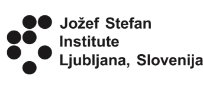

.. _Ljubljana 2019 Homepage:

2019, Jožef Stefan Institute, Ljubljana, Slovenia
=================================================

+-----------------+--------------------------------------------------------------------------------+
| Related resources                                                                                |
+=================+================================================================================+
| Virtual Machine | `Quantum Mobile 19.09.0`_                                                      |
+-----------------+--------------------------------------------------------------------------------+
| python packages | `aiida-core 1.0.0b6`_, `aiida-quantumespresso 3.0.0a5`_                        |
+-----------------+--------------------------------------------------------------------------------+
| codes           | `Quantum Espresso 6.3`_                                                        |
+-----------------+--------------------------------------------------------------------------------+

.. _Quantum Mobile 19.09.0: https://github.com/marvel-nccr/quantum-mobile/releases/tag/19.09.0
.. _aiida-core 1.0.0b6: https://pypi.org/project/aiida-core/1.0.0b6
.. _aiida-quantumespresso 3.0.0a5: https://github.com/aiidateam/aiida-quantumespresso/releases/tag/v3.0.0a5
.. _Quantum Espresso 6.3: https://github.com/QEF/q-e/releases/tag/qe-6.3

These are the hands-on materials from the 1-day AiiDA tutorial, part of the 
`Summer School on Advanced Materials and Molecular Modelling <http://qe2019.ijs.si>`_,
held on September 16-20, 2019 in Ljubljana (Slovenia).

While participants of the tutorial used virtual machines on a cloud service,
one can follow the tutorial just as well using the Quantum Mobile VirtualBox image linked above.
The image already contains all the required software.

AiiDA hands-on materials
^^^^^^^^^^^^^^^^^^^^^^^^

Demo
----

.. toctree::
   :maxdepth: 1
   :numbered:

   ./sections/setup
   ./sections/first_taste

In-depth tutorial
-----------------
In this tutorial, no in-depth tutorial has been presented.

If you are interested, you can check the in-depth tutorial of the :ref:`Xiamen 2019 tutorial <Xiamen 2019 Homepage>`
or of the :ref:`EPFL 2019 tutorial <EPFL 2019 Homepage>`.

Acknowledgements
----------------

The `Summer School on Advanced Materials and Molecular Modelling <http://qe2019.ijs.si>`_  was made possible by support from 
the Quantum ESPRESSO foundation, MaX, and the Jožef Stefan Institute.

.. image:: sponsors/qef.png
   :target: https://foundation.quantum-espresso.org/
   :width: 200px

.. image:: sponsors/max.png
   :target: http://www.max-centre.eu/
   :width: 200px

