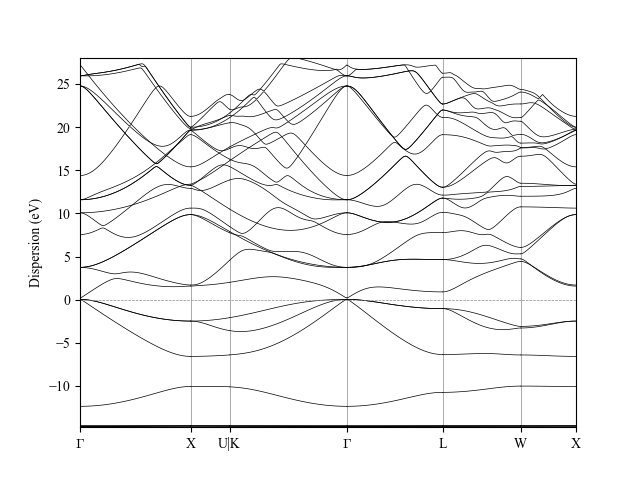
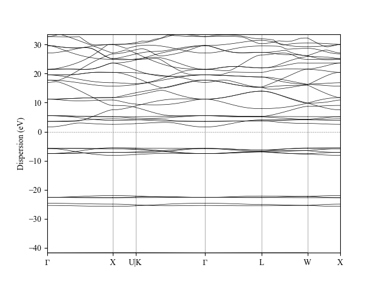
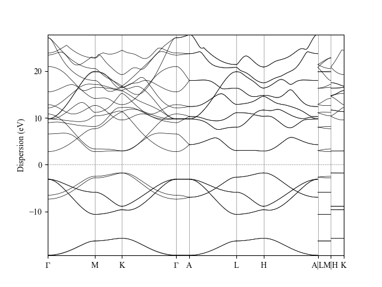

.. _bands:

A real-world WorkChain: computing a band structure
==================================================

.. note:: *If you still have enough time, you might want to check first*
          :numref:`Appendix %s <workflow_logic>` *before continuing with this section.*

As a final demonstration of the power of WorkChains in AiiDA, we want to
give a demonstration of a WorkChain that we have written that will take
a structure as its only input and will compute its band structure. All
of the steps that would normally have to be done manually by the
researcher -- choosing appropriate pseudopotentials, energy cutoffs,
k-points meshes, high-symmetry k-point paths and performing the various
calculation steps -- are performed automatically by the WorkChain.

The demonstration of the workchain will be performed in a Jupyter
notebook. To run it, follow the instructions that were given for the
querybuilder notebook in :numref:`querybuilder`. The only difference
is that instead of selecting the notebook in the ``querybuilder``
directory, go to ``pw/bandstructure`` instead and choose the
``bandstructure.ipynb`` notebook. There you will find some example
structures that are loaded from COD, through the importer integrated
within AiiDA. Note that the required time to calculate the bandstructure
for these example structures ranges from ~5 minutes to more than an
hour, given that the virtual machine is running on two cores with
CPU throttling. It is not necessary to run all these examples
as they may take too long to complete. For reference, the expected output
band structures are plotted in :numref:`fig_calc_bands_1` to :numref:`fig_calc_bands_4`.

.. _fig_calc_bands_1:
.. figure:: include/images/bandstructures/Al_bands.png
   :scale: 48 %

   Electronic band structures of Al computed with AiiDA’s PwBandsWorkChain

.. _fig_calc_bands_2:

   Electronic band structures of GaAs computed with AiiDA’s PwBandsWorkChain

.. _fig_calc_bands_3:

   Electronic band structures of CaF_2 computed with AiiDA’s PwBandsWorkChain

.. _fig_calc_bands_4:

   
   Electronic band structures of BN computed with AiiDA’s PwBandsWorkChain
