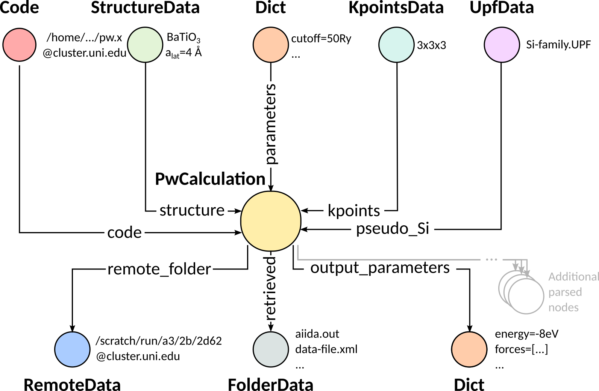

Submit, monitor and debug calculations
======================================

The goal of this section is to understand how to create new data in AiiDA. We will launch a total energy calculation and check its results. We will introduce intentionally some common mistakes along the process of defining and submitting a calculation and we will explain you how to recognize and correct them. While this debugging is done here ‘manually’, workflows (that we will learn later in this tutorial) can automate this procedure considerably. For computing the DFT energy of the silicon crystal (with a PBE functional) we will use Quantum ESPRESSO , in particular the PWscf code (`pw.x`). Besides the AiiDA-core package, a number of plugins exist for many different codes. These are listed in the [AiiDA plugin registry](https://aiidateam.github.io/aiida-registry/)[4]. In particular, the “aiida-quantumespresso” plugin (already installed in your machine) provides a very extensive set of plugins, covering most (if not all) the functionalities of the underlying codes.

The AiiDA daemon
----------------

First of all, check that the AiiDA daemon is actually running. The AiiDA daemon is a program running all the time in the background, checking if new calculations appear and need to be submitted to the scheduler. The daemon also takes care of all the necessary operations before the calculation submission, and after the calculation has completed on the cluster. Type in the terminal

```console
verdi daemon status
```

If the daemon is running, the output should look like

```console
Profile: default
Daemon is running as PID 2050 since 2019-04-30 12:37:12
Active workers [1]:
  PID    MEM %    CPU %  started
-----  -------  -------  -------------------
 2055    2.147        0  2019-04-30 12:37:12
Use verdi daemon [incr | decr] [num] to increase / decrease the amount of workers
```

If this is not the case, type in the terminal

```console
verdi daemon start
```

to start the daemon.

Creating a new calculation
--------------------------

To launch a calculation, you will need to interact with AiiDA mainly in the `verdi shell`. We strongly suggest you to first try the commands in the shell, and then copy them in a script `test_pw.py` using a text editor. This will be very useful for later execution of a similar series of commands.

**The best way to run python scripts using AiiDA functionalities is to run them in a terminal by means of the command**

```console
verdi run <scriptname>
```

Every calculation sent to a cluster is linked to a code, which describes the executable file to be used. Therefore, first load the suitable code:

``` python
code = load_code("<codename>")
```

Here `load_code` (imported for you by `verdi shell` or the `verdi run` command) returns a `Code` which is the general AiiDA class handling all possible codes, and `code` is an instance labeled as `<codename>` (see the first part of the tutorial for listing all codes installed in your AiiDA machine). You might also want to list only the codes that define a default calculation plugin for the pw.x code of Quantum ESPRESSO. You can do this with the following command:

```console
verdi code list -P quantumespresso.pw
```

Pick the correct codename, that might look like, e.g. `qe-6.3-pw@localhost`.

Once run, AiiDA calculations are instances of the class `CalcJob`, more precisely of one of its subclasses, each corresponding to a code specific plugin (for example, the PWscf plugin). You have already seen `CalcJob` classes in the previous sections.

However, to create a new calculation, rather than manually creating a new class, the suggested way is to use a `Builder`, that helps in setting the various calculation inputs and parameters, and provides TAB-completion.

To obtain a new builder, we can use the `get_builder` method of the `code` object:

``` python
builder = code.get_builder()
```

This returns a builder that helps in setting up the inputs for the `PwCalculation` class (associated to the `quantumespresso.pw` plugin, the default plugin for the code you chose before).

As the first step, you can assign a (short) label or a (long) description to the calculation that you are going to create, that you might find convenient in the future. This can be achieved with:

``` python
builder.metadata.label = "PW test"
builder.metadata.description = "My first AiiDA calc with Quantum ESPRESSO on Si"
```

This information will be saved in the database for later query or inspection. Note that you can press TAB after writing `builder.` to see all available inputs.

Now you have to specify the number of machines (a.k.a. cluster nodes) you are going to run on and the maximum time allowed for the calculation. These general calculation options, that are independent of the code or plugin, but rather mainly passed later to the scheduler that handles the queue, are all grouped under “builder.options”:

``` python
builder.metadata.options.resources = {'num_machines': 1}
builder.metadata.options.max_wallclock_seconds = 30 * 60
```

Just like the normal inputs, these builder options are also TAB-completed. Type `builder.metadata.options.` and hit the TAB button to see the list of available options.

### Preparation of inputs

Quantum ESPRESSO requires an input file containing Fortran namelists and variables, plus some cards sections (the documentation is available [online](https://www.quantum-espresso.org/Doc/INPUT_PW.html)[5]). The Quantum ESPRESSO plugin of AiiDA requires quite a few nodes in input, which are also documented [online](https://aiida-quantumespresso.readthedocs.io/en/stable/user_guide/calculation_plugins/pw.html)[6]. Here we will instruct our calculation with a minimal configuration for computing the energy of silicon. We need:

1.  Pseudopotentials
2.  a structure
3.  the k-points
4.  the input parameters

We leave the parameters as the last thing to setup and start with structure, k-points, and pseudopotentials.

Use what you learned in the previous section and define these two kinds of objects in this script. Define in particular a silicon structure and a `2x2x2` mesh of k-points. Notice that if you just copy and paste the code that you executed previously, you will create duplicated information in the database (i.e. every time you will execute the script, you will create another StructureData, another KpointsData, ...). In fact, you already have the opportunity to re-use an already existing structure.[7] Use therefore a combination of the bash command `verdi data structure list` and of the shell command `load_node()` to get an object representing the structure created earlier.

### Attaching the input information to the calculation

So far we have defined (or loaded) some of the input data, but we haven’t instructed the calculation to use them. To do this, let’s just set the appropriate attributes of the builder (we assume here that you created the structure and k-points AiiDA nodes before and called them `structure` and `kpoints`, respectively):

``` python
builder.structure = structure
builder.kpoints = kpoints
```

Note that you can set in the builder both stored and unstored nodes. AiiDA will take care of storing the unstored nodes upon submission. Otherwise, if you decide not to submit, nothing will be stored in the database.

Moreover, PWscf also needs information on the pseudopotentials, specified by UpfData objects. This is set by storing a dictionary in “builder.pseudo”, with keys being the kind names, and value being the UpfData pseudopotential nodes. To simplify the task of choosing pseudopotentials, we can however use a helper function that automatically returns this dictionary picking the pseudopotentials from a given UPF family.

You can list the preconfigured families from the command line:

```console
verdi data upf listfamilies
```

Pick the one you configured earlier or one of the `SSSP` families that we provide, and link it to the calculation using the command:

``` python
from aiida.orm.nodes.data.upf import get_pseudos_from_structure
builder.pseudos = get_pseudos_from_structure(structure, '<PSEUDO_FAMILY_NAME>')
```

### Preparing and debugging input parameters

The last thing we miss is a set of parameters (i.e. cutoffs, convergence thresholds, etc…) to launch the Quantum ESPRESSO calculation. This part requires acquaintance with Quantum ESPRESSO and, very often, this is the part to tune when a calculation shows a problem. Let’s therefore use this part of the tutorial to learn how to debug problems, and **let’s introduce errors intentionally**. Note also that some of the problems we will investigate appear the first times you launch calculations and can be systematically avoided by using workflows.

Let’s define a set of input parameters for Quantum ESPRESSO, preparing a dictionary of the form:

``` python
parameters_dict = {
    'CONTROL': {
        'calculation': 'scf',
        'tstress': True,
        'tprnfor': True,
    },
    'SYSTEM': {
        'ecutwfc': 30.,
        'ecutrho': 200.,
        'mickeymouse': 240.,
    },
    'ELECTRONS': {
        'conv_thr': 1.e-8,
    },
}
```

This dictionary is almost a valid input for the Quantum ESPRESSO plugin, except for an invalid key called “mickeymouse”. When Quantum ESPRESSO receives an unrecognized key (even when you misspell one) its behavior is to stop almost immediately. By default, the AiiDA plugin will not validate your input and simply pass it over. Therefore let’s pass this dictionary to the calculation and observe this unsuccessful behavior.

Finally, we need to attach those parameters to our builder, however, bear in mind that `parameters_dict` is a python dictionary instead of an AiiDA model that can be stored in the database, thus we need to wrap the `parameters_dict` on a `Dict` model:

```python
builder.parameters = Dict(dict=parameters_dict)
```

### Simulate submission

At this stage, you have recreated in memory (it’s not yet stored in the database) the input of the graph shown bellow, whereas the outputs will be created later by the daemon.



In order to check how AiiDA creates the actual input files for the calculation, we can perform a _dry run_ of the submission process, to achieve that, we should modify the metadata of our builder, first specifying that we want a dry run, and then telling it that we don't want to store the provenance of this calculation (yet):

```python
builder.metadata.dry_run = True
builder.metadata.store_provenance = False
```

After setting the appropriate metadata, is time for us to actually run the _dry run_, to do that we need to reach for AiiDA's run functionality:

```python
from aiida.engine import run
run(builder)
```

This creates a folder of the form `submit_test/[date]-0000[x]` in the current directory. Check (in your second terminal) the input file `aiida.in` within this folder, comparing it with the content of the input data nodes you created earlier, and that the ‘pseudo’ folder contains the needed pseudopotentials. You can also check the submission script `_aiidasubmit.sh` (the scheduler that is installed on the machine is Torque, so AiiDA creates the files with the proper format for this scheduler). Note: you cannot correct the input file from the `submit_test` folder: you have to correct the script and re-execute it; the files created by `submit_test()` are only for final inspection.

### Storing and submitting the calculation

Up to now our calculation has been kept in memory and not in the database. Now that we have inspected the input files and are sure that Quantum ESPRESSO will have all the information it needs to perform the calculation, we will submit the calculation for a full run, doing so will store the inputs that are living in memory, run and store the calculation and link the outputs to it, to achieve this, we first need to declare our intent in the builder metadata,

```python
builder.metadata.dry_run = False
builder.metadata.store_provenance = True
```

And then rely on the submit machinery of AiiDA,

```python
from aiida.engine import submit
calculation = submit(builder)
```

`calculation` will now be the stored `PwCalculation`, already submitted to the daemon. The calculation has now a "database primary key" or `pk` (an integer ID) to the calculation (typing `calculation.pk` will print this number). Moreover, it also gets a universally-unique ID (`UUID`), visible with `calculation.uuid` that does not change even upon sharing the data with collaborators (while the `pk` will change in that case).

Now that the calculation is stored, you can also attach any additional attributes of your choice, which are called “extra” and defined in as key-value pairs. For example, you can add an extra attribute called `element`, with value `Si` through

``` python
calculation.set_extra("element", "Si")
```

You will see later the advantage of doing so for querying.

In the mean time, as soon as you submitted your calculation, the daemon picked it up and started to perform all the operations to do the actual submission, going through input file generation, submission to the queue, waiting for it to run and finish, retrieving the output files, parsing them, storing them in the database and setting the state of the calculation to `Finished`.

**Note** If the daemon is not running the calculation will remain in the `NEW` state until when you start it.

### Checking the status of the calculation

You can check the calculation status from the command line:

```console
verdi process list
```

Note that `verdi` commands can be slow in this tutorial when the calculation is running (because you just have one CPU which is also used by the PWscf calculation).

By now, it is possible that the calculation you submitted has already finished, and therefore that you don’t see any calculation in the output. In fact, by default, the command only prints calculations that are still being handled by the daemon, i.e. those with a state that is not `FINISHED` yet[8].

To see also (your) calculations that have finished (and limit those only to the one created in the past day), use instead

```console
verdi process list -a -p1
```

as explained in the first section.

To inspect the list of input files generated by the AiiDA (this can be done even when the calculation did not finish yet), type

```console
verdi calcjob inputls <pk_number> -c
```

with `pk_number` the pk number of your calculation. This will show the contents of the input directory (`-c` prints directories in colour). Then you can also check the content of the actual input file with

```console
verdi calcjob inputcat <pk_number> | less
```

Troubleshooting
---------------

After all this work the calculation should end up in a FAILED Job state (last column of `verdi process list -a -p1`), and correspondingly the error code near the "Finished" status of the State should be non-zero,

```console
$ verdi process list -a -p1
  PK  Created    State             Process label    Process status
----  ---------  ----------------  ---------------  ----------------
  98  16h ago    Finished [115]    PwCalculation
...
$ # Anything but [0] after the Finished state signals a failure
```

This was expected, since we used an invalid key in the input parameters. Situations like this happen (probably often...) in real life, so we built in AiiDA the tools to traceback the problem source and correct it.

A first way to proceed is the manual inspection of the output file of PWscf. You can visualize it with:

```console
verdi calcjob outputcat <pk_number> | less
```

This might be enough to understand the reason why the calculation failed.

However, AiiDA provides some extra tools for troubleshooting in a more compact way, for starters, even if the calculation failed you can read a summary of it by running `verdi process show <pk>`:

```console
$ verdi process show <pk_number>
Property       Value
-------------  ---------------------------------------------------
type           CalcJobNode
pk             98
uuid           4c444afd-f6e2-4896-b9ae-8cb8a5ec75c5
label          PW test
description    My first AiiDA calc with Quantum ESPRESSO on Si
ctime          2019-05-01 15:59:39.180018+00:00
mtime          2019-05-01 16:01:44.870902+00:00
process state  Finished
exit status    115
computer       [1] localhost

Inputs      PK    Type
----------  ----  -------------
pseudos
    Si      50    UpfData
code        2     Code
kpoints     10    KpointsData
parameters  96    Dict
settings    97    Dict
structure   9     StructureData

Outputs          PK  Type
-------------  ----  ----------
remote_folder    99  RemoteData
retrieved       100  FolderData

Log messages
---------------------------------------------
There are 2 log messages for this calculation
Run 'verdi process report 98' to see them
```

In the last part of the output of this command you can read that there are some log messages waiting for you, if you run `verdi process report <pk>`.

Finally, after figuring out the invalid parameter from the calculation output, we can clear it out from the parameters dict and see if our calculation succeeds,

```python
parameters_dict = {
    "CONTROL": {
        "calculation": "scf",
    },
    "SYSTEM": {
        "ecutwfc": 30.,
        "ecutrho": 200.,
    },
    "ELECTRONS": {
        "conv_thr": 1.e-6,
    }
}
builder.parameters = Dict(dict=parameters_dict)
calculation = submit(builder)
```

If you have been using the separate script approach, then you can modify the script to remove the faulty input and run the script again with:

```console
verdi run test_pw.py
```

Sure enough the calculation will reach the finished status, with zero exit code now, you can verify that by running `verdi process list -a -p1` again.

Using the calculation results
-----------------------------

Now you can access the results as you have seen earlier. For example, note down the pk of the calculation so that you can load it in the `verdi shell` and check the total energy with the commands:

```python
calculation = load_node(<pk>)
calculation.res.energy
```

Notice that, in general, an AiiDA plugin won't limit itself to write some input files, running the software for you, storing the output files, and connecting it all together in your provenance graph. AiiDA will also try to interpret your program's output, and make the output values of interest available through an output dict node (as depicted in the graph above). In the case of the AiiDA quantum espresso plugin this output node is available at `calculation.outputs.output_parameters` and you can access all the available attributes (not only the energy used above) using:

```python
calculation.outputs.output_parameters.attributes
```

Since the name of this output dictionary node is an implementation detail of each plugin, AiiDA provides the shortcut `calculation.res` where the developers can indicate what they think is the result of the calculation.
