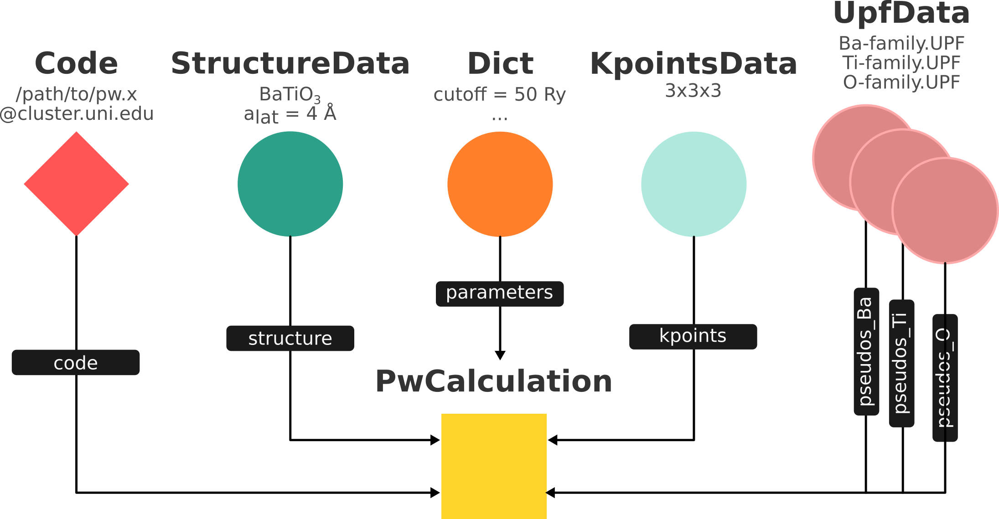
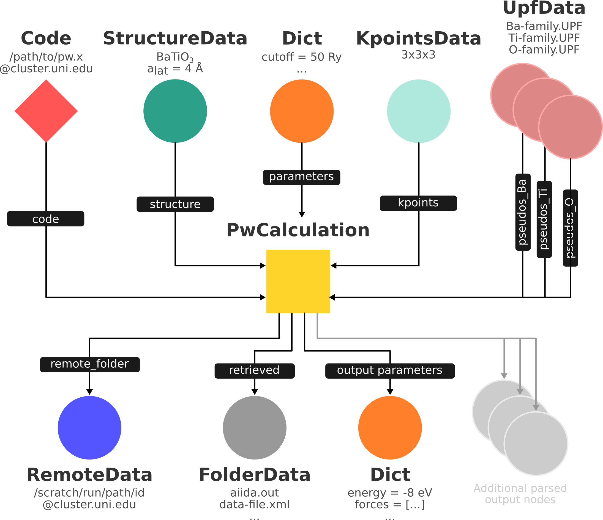

Verdi command line
==================

This part of the tutorial will help to familiarize you with the command-line utility ``verdi``, one of the most common ways to interact with AiiDA.
The ``verdi`` CLI tool, with its subcommands, enables a variety of operations, e.g. to manage your installation and inspect the contents of your database.
Similar to the ``bash`` shell, the ``verdi`` command supports tab-completion.
Try right now to type ``verdi``, followed by a space, in a terminal and tap the 'Tab' key twice.
This should display a list of all the available sub commands.
Whenever you want to see a detailed explanation of any command, simply add the ``--help/-h`` flag, e.g.:

.. code:: console

    verdi --help

For more detailed information about ``verdi``, you can refer to the `online documentation <https://aiida-core.readthedocs.io/en/latest/verdi/verdi_user_guide.html>`_.

Setting up a profile
--------------------

After you install AiiDA, the next important step is to create a "profile".
Each AiiDA installation supports multiple profiles, each of which can have its very own database, that won't interact with the other.
In this way, one can view an AiiDA profile as a representation of an individual project you want to work on.

The official way of setting up a new profile is through the command ``verdi setup``.
This command will interactively ask you about all the necessary information, but it will assume that certain external resources, like the database have already been pre-configured.
To make this process easier, there is also ``verdi quicksetup``, which will try to do this for you automatically, as much as possible.
Let's try and setup a profile that we will use to work on during this tutorial:

.. code:: console

    verdi quicksetup

This should prompt you with some questions about who you are.
This information will be stored in the database of the profile and will be used to associate all the data that you create within it.
This is useful for attribution when you start sharing your data with others.
After you have answered all the questions, a new profile should have been created, along with the required database and repository.
To see this profile, and any others that may have been configured, you can run:

.. code:: console

    verdi profile list

This should show something like the following:

.. code:: console

    Info: configuration folder: /home/aiida/.aiida
    * quicksetup
      profile_one

Each line, ``quicksetup`` and ``basic`` in this example, corresponds to a profile, where the one marked with an asterisk is the "default" profile.
This means that each ``verdi`` command that you execute, will be automatically applied to that profile.
If you want to change the default profile, you can use:

.. code:: console

    verdi profile setdefault

Importing some data
-------------------

Before we start creating data ourselves, we are going to look at an AiiDA database already created by someone else.
Let's import one from the web:

.. code:: console

    verdi import https://object.cscs.ch/v1/AUTH_b1d80408b3d340db9f03d373bbde5c1e/marvel-vms/tutorials/aiida_tutorial_2019_05_perovskites_v0.2.aiida

Contrary to most databases, AiiDA databases contain not only results of calculations but also their inputs and information on how a particular result was obtained.
This information (provenance) is stored in the form of a directed acyclic graph (DAG).
In the following, we are going to introduce you to different ways of browsing this graph and ask you to find out some information regarding the database you just imported.

The list of processes
---------------------

Anything that 'runs' in AiiDA, be it calculations or workflows, are called processes.
To find out about currently running processes or processes that have already finished, we can use the following command:

.. code:: console

    verdi process list

.. note::

    The first time you run this command, it might take a few seconds as it is the first time you are accessing the database in the virtual machine.
    Subsequent calls will be faster.

This will print the list of currently active processes, which should be empty, because there should be no processes running.
The first output line should look something like:

.. code:: console

    PK    Created    State    Process label    Process status
    ----  ---------  -------  ---------------  ----------------

    Total results: 0

    Info: last time an entry changed state: never

In order to print a list with all processes that have already finished, you can use the ``-S/--process-state`` flag as follows:

.. code:: console

    verdi process list -S finished

This command will list all the processes that have a process state ``Finished`` and should look something like:

.. code:: console

    PK    Created    State           Process label    Process status
    ----  ---------  --------------  ---------------  ----------------
    1178  1653D ago  ⏹ Finished [0]  PwCalculaton
    1953  1653D ago  ⏹ Finished [0]  PwCalculaton
    1734  1653D ago  ⏹ Finished [0]  PwCalculaton
     336  1653D ago  ⏹ Finished [0]  PwCalculaton
    1056  1653D ago  ⏹ Finished [0]  PwCalculaton
    1369  1653D ago  ⏹ Finished [0]  PwCalculaton

    Total results: 6

    Info: last time an entry changed state: never

The 'Finished' state is not the only state that a process can have, but a process can have any of the following states:

    * ``Created``
    * ``Waiting``
    * ``Running``
    * ``Finished``
    * ``Excepted``
    * ``Killed``

The first three states are 'active' states, meaning the process is not done yet, and the last three are 'terminal' states.
Once a process is in a terminal state, it will never become active again.
The `official documentation <https://aiida-core.readthedocs.io/en/latest/concepts/processes.html#process-state>`_ contains more details on process states.

In order to list processes of *all* states, use the ``-a/--all`` flag:

.. code:: console

    verdi process list -a

This command will list all the processes that have *ever* been launched.
As your database will grow, so will the output of this command.
To limit the number of results, you can use the ``-p/--past-days <NUM>`` option, that will only show processes that were created ``NUM`` days ago.
For example, this lists all processes launched since yesterday:

.. code:: console

    verdi process list -a -p1

.. _2019-aiida-identifiers:

Each row of the output identifies a process with some basic information about its status.
For a more detailed list of properties, you can use ``verdi process show``, but to address any specific process, you need an identifier for it.
An identifier for any entity in AiiDA comes in three different forms:

 * "Primary Key" (PK): An integer, e.g. ``723``, that identifies your entity within your database (automatically assigned)
 * `Universally Unique Identifier <https://en.wikipedia.org/wiki/Universally_unique_identifier#Version_4_(random)>`_ (UUID): A string, e.g. ``ce81c420-7751-48f6-af8e-eb7c6a30cec3`` that identifies your entity globally (automatically assigned)
 * Label: A string, e.g. ``test_process`` that allows you to assign a human readable label

The first one, the PK or primary key, you have already seen in the first column of the output printed by ``verdi process list``.
That is why, in addition to their PK, all AiiDA entities also have a UUID (Universal Unique Identifier), which as the name suggests, should be unique, `even across databases`, and will never change.
That is to say, if you share some of your data with somebody else, the UUIDs will remain identical, unlike the PKs, which will most likely change.

.. note::

    Any ``verdi`` parameter that expects an identifier will accept either a PK, a UUID or a label, although, not all entities will have a label, as it is an optional field.
    For a UUID you can even specify only a part of it, as long as it starts at the beginning and the partial can be uniquely resolved.
    You may be wondering why AiiDA doesn't rely just on UUIDs.
    Besides the historical fact that PKs came first, UUIDs need to encode more information in order to be universally unique.
    While we recommend using UUIDs wherever they feel comfortable, PKs are shorter and can be easier to work with.
    For more information on identifiers in ``verdi`` and AiiDA in general, refer to the `documentation online <https://aiida-core.readthedocs.io/en/latest/verdi/verdi_user_guide.html#cli-identifiers>`_.

Let's now consider the process with the UUID ``ce81c420-7751-48f6-af8e-eb7c6a30cec3``.
Use this identifier to get more information about it:

.. code:: console

    verdi process show <IDENTIFIER>

.. note::

    For the remainder of this section, when commands are displayed, any fields enclosed in angular brackets, such as ``<IDENTIFIER>``, are placeholders to be replaced by the actual value of that field.

Again, since the UUID is universally unique, we know what it represents, even in your database: a Quantum Espresso ``pw.x`` relaxation of a BaTiO\ :sub:`3` unit cell.

.. code:: console

    Property       Value
    -------------  ------------------------------------
    type           CalcJobNode
    pk             828
    uuid           ce81c420-7751-48f6-af8e-eb7c6a30cec3
    label
    description
    ctime          2014-10-27 17:51:21.781045+00:00
    mtime          2019-05-09 14:10:09.307986+00:00
    process state  Finished
    exit status    0
    computer       [1] daint

    Inputs      PK    Type
    ----------  ----  -------------
    pseudos
        Ba      611   UpfData
        O       661   UpfData
        Ti      989   UpfData
    code        825   Code
    kpoints     811   KpointsData
    parameters  829   Dict
    settings    813   Dict
    structure   27    StructureData

    Outputs                    PK  Type
    -----------------------  ----  -------------
    output_kpoints           1894  KpointsData
    output_parameters          62  Dict
    output_structure           61  StructureData
    output_trajectory_array    63  ArrayData
    remote_folder             357  RemoteData
    retrieved                  60  FolderData

The output should show a overview with some general information about the process.
Additionally, it will show what its inputs and outputs were and if it was called by another process, or if it called other processes itself.
You can use the PKs shown for the inputs and outputs to get more information about those nodes.

.. warning::

    Since the inputs and outputs are ``Data`` nodes, not ``Process`` nodes, use ``verdi node show`` instead.

.. _aiidagraph:

A typical AiiDA graph
---------------------

AiiDA stores inputs, used by a calculation, as well as the outputs it created, in the database.
These objects are connected in a graph that looks like :numref:`fig_graph_input_only`.
We suggest that you have a look to the figure before going ahead.

.. _fig_graph_input_only:

   Graph with all inputs (data, circles; and code, diamond) to the Quantum ESPRESSO calculation (square) that you will create in the :ref:`calculations` section of this tutorial.

.. _fig_graph:

   Same as :numref:`fig_graph_input_only`, but also with the outputs that the engine will create and connect automatically.
   The ``RemoteData`` node is created during submission and can be thought as a symbolic link to the remote folder in which the calculation runs on the cluster.
   The other nodes are created when the calculation has finished, after retrieval and parsing.
   The node with linkname 'retrieved' contains the raw output files stored in the AiiDA repository; all other nodes are added by the parser.
   Additional nodes (symbolized in gray) can be added by the parser (e.g. an output ``StructureData`` if you performed a relaxation calculation, a ``TrajectoryData`` for molecular dynamics etc.).

You can create a similar graph for any calculation node by using the utility ``verdi graph generate <IDENTIFIER>``.
For example, before you obtained information (in text form) for UUID ``ce81c420`` using the command ``verdi process show``.
To visualize similar information in graph(ical) form, run the command:

.. code:: console

    verdi graph generate <IDENTIFIER>

This command will create the file ``<PK>.dot`` that can be rendered by means of the utility ``dot`` as follows:

.. code:: console

    dot -Tpdf -o <PK>.pdf <PK>.dot

you will create a pdf file ``<PK>.pdf``.
You can open this file on the Amazon machine by using ``evince`` or, if you feel that the ssh connection is too slow, copy it via ``scp`` to your local machine.
To do so, if you are using Linux/Mac OS X, you can type in your *local* machine:

.. code:: console

    scp aiidatutorial:<path_with_the_graph_pdf> <local_folder>

and then open the file.
Alternatively, you can use graphical software to achieve the same, for instance: WinSCP on Windows, Cyberduck on the Mac, or the 'Connect to server' option in the main menu after clicking on the desktop for Ubuntu.

Spend some time to familiarize yourself with the graph structure.
After that, you can continue to the next section where we will inspect the different elements of this graph.

Inspecting the nodes of a graph
-------------------------------

Dict and CalcJobNode
~~~~~~~~~~~~~~~~~~~~~~~~~~~~~~

Now, let us have a closer look at the some of the nodes appearing in the graph.
Choose the node of the type ``Dict`` with input link name ``parameters`` and type in the terminal:

.. code:: console

    verdi data dict show <IDENTIFIER>

A ``Dict`` contains a dictionary (i.e. key–value pairs), stored in the database in a format ready to be queried.
We will learn how to run queries later on in this tutorial.
The command above will print the content dictionary, containing the parameters used to define the input file for the calculation.
You can compare the dictionary with the content of the raw input file to Quantum ESPRESSO (that was generated by AiiDA) via the command:

.. code:: console

    verdi calcjob inputcat <IDENTIFIER>

where you substitute the identifier of the calculation node.
Check the consistency of the parameters written in the input file and those stored in the ``Dict`` node.
Even if you don't know the meaning of the input flags of a Quantum ESPRESSO calculation, you should be able to see how the input dictionary has been converted to Fortran namelists.

The previous command just printed the content of the 'default' input file ``aiida.in``.
To see a list of all the files used to run a calculation (input file, submission script, etc.) instead type:

.. code:: console

    verdi calcjob inputls <IDENTIFIER>

Adding a ``--color`` flag allows you to easily distinguish files from folders by a different coloring.
Once you know the name of the file you want to visualize, you can call the ``verdi calcjob inputcat [PATH]`` command specifying the path.
For instance, to see the submission script, you can do:

.. code:: console

    verdi calcjob inputcat <IDENTIFIER> _aiidasubmit.sh

StructureData
~~~~~~~~~~~~~

Now let us focus on ``StructureData`` objects, which represent a crystal structure.
We can consider for instance the input structure to the calculation we were considering before (it should have the UUID ``3a4b1270``).
Such objects can be inspected interactively by means of an atomic viewer such as the one provided by ``ase``.
AiiDA however supports several other viewers such as ``xcrysden``, ``jmol``, and ``vmd``.
Type in the terminal:

.. code:: console

    verdi data structure show --format ase <IDENTIFIER>

to show the selected structure, although it will take a few seconds to appear
You should be able to rotate the view with the right mouse button.

.. note::

    If you receive some errors, make sure you started your SSH connection with the ``-X`` or ``-Y`` flag.

Alternatively, especially if showing them interactively is too slow over SSH, you can export the content of a structure node in various popular formats such as ``xyz`` or ``xsf``.
This is achieved by typing in the terminal:

.. code:: console

    verdi data structure export --format xsf <IDENTIFIER> > <IDENTIFIER>.xsf

You can open the generated ``xsf`` file and observe the cell and the coordinates.
Then, you can then copy ``<IDENTIFIER>.xsf`` from the Amazon machine to your local one and then visualize it, e.g. with ``xcrysden`` (if you have it installed):

.. code:: console

    xcrysden --xsf <IDENTIFIER>.xsf

Codes and computers
~~~~~~~~~~~~~~~~~~~

Let us focus now on the nodes of type ``Code``.
A code represents (in the database) the actual executable used to run the calculation.
Find the identifier of such a node in the graph and type:

.. code:: console

    verdi code show <IDENTIFIER>

The command prints information on the plugin used to interface the code to AiiDA, the remote machine on which the code is executed, the path of its executable, etc.
To show a list of all available codes type:

.. code:: console

    verdi code list

If you want to show all codes, including hidden ones and those created by other users, use ``verdi code list -a -A``.
Now, among the entries of the output you should also find the code just shown.

Similarly, the list of computers on which AiiDA can submit calculations is accessible by means of the command:

.. code:: console

    verdi computer list -a

The ``-a`` flag shows all computers, also the one imported in your database but that you did not configure, i.e. to which you don't have access.
Details about each computer can be obtained by the command:

.. code:: console

    verdi computer show <COMPUTERNAME>

Now you have the tools to answer the question: what is the scheduler installed on the computer where the calculations of the graph have run?

Calculation results
~~~~~~~~~~~~~~~~~~~

The results of a calculation can be accessed directly from the calculation node.
Type in the terminal:

.. code:: console

    verdi calcjob res <IDENTIFIER>

which will print the output dictionary of the 'scalar' results parsed by AiiDA at the end of the calculation.
Note that this is actually a shortcut for:

.. code:: console

    verdi data dict show <IDENTIFIER>

where ``IDENTIFIER`` refers to the ``Dict`` node attached as an output of the calculation node, with link name ``output_parameters``.
By looking at the output of the command, what is the Fermi energy of the calculation with UUID ``ce81c420``?

Similarly to what you did for the calculation inputs, you can access the output files via the commands:

.. code:: console

    verdi calcjob outputls <IDENTIFIER>

and

.. code:: console

    verdi calcjob outputcat <IDENTIFIER>

Use the latter to verify that the Fermi energy that you have found in the last step has been extracted correctly from the output file

.. note::

    Hint: filter the lines containing the string 'Fermi', e.g. using ``grep``, to isolate the relevant lines

The results of calculations are stored in two ways: ``Dict`` objects are stored in the database, which makes querying them very convenient, whereas ``ArrayData`` objects are stored on the disk.
Once more, use the command ``verdi data array show <IDENTIFIER>`` to determine the Fermi energy obtained from calculation with the UUID ``ce81c420``.
This time you will need to use the identifier of the output ``ArrayData`` of the calculation, with link name ``output_trajectory_array``.
As you might have realized the difference now is that the whole series of values of the Fermi energy calculated after each relax/vc-relax step are stored.
The choice of what to store in ``Dict`` and ``ArrayData`` nodes is made by the parser of ``pw.x`` implemented in the ``aiida-quantumespresso`` plugin.

(Optional section) Comments
~~~~~~~~~~~~~~~~~~~~~~~~~~~

AiiDA offers the possibility to attach comments to a any node, in order to be able to remember more easily its details.
Node with UUID prefix ``ce81c420`` should have no comments, but you can add a very instructive one by typing in the terminal:

.. code:: console

    verdi comment add "vc-relax of a BaTiO3 done with QE pw.x" -N <IDENTIFIER>

Now, if you ask for a list of all comments associated to that calculation by typing:

.. code:: console

    verdi comment show <IDENTIFIER>

the comment that you just added will appear together with some useful information such as its creator and creation date.
We let you play with the other options of ``verdi comment`` command to learn how to update or remove comments.

AiiDA groups of calculations
----------------------------

In AiiDA, calculations (and more generally nodes) can be organized in groups, which are particularly useful to assign a set of calculations or data to a common project.
This allows you to have quick access to a whole set of calculations with no need for tedious browsing of the database or writing complex scripts for retrieving the desired nodes.
Type in the terminal:

.. code:: console

    verdi group list

to show a list of the groups that already exist in the database.
Choose the PK of the group named ``tutorial_pbesol`` and look at the calculations that it contains by typing:

.. code:: console

    verdi group show <IDENTIFIER>

In this case, we have used the name of the group to organize calculations according to the pseudopotential that has been used to perform them.
Among the rows printed by the last command you will be able to find the calculation we have been inspecting until now.

If, instead, you want to know all the groups to which a specific node belongs, you can run:

.. code:: console

    verdi group list -N/--node <IDENTIFIER>
