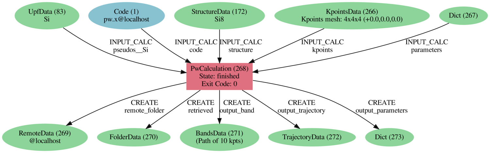

A first taste
=============

We're going to start with a quick demo of a few ways of how AiiDA can make your life easier as a computational scientist.

We'll be using the ``verdi`` command-line interface (CLI),
which lets you manage your AiiDA installation, inspect the contents of your database,  control running calculations and more.

 * The ``verdi`` command supports **tab-completion**:
   In the terminal, type ``verdi``, followed by a space and press the 'Tab' key twice to show a list of all the available sub commands.
 * For help on ``verdi`` or any of its subcommands, simply append the ``--help/-h`` flag:

   .. code:: bash

       verdi -h

For more details on ``verdi`` see `AiiDA's documentation <https://aiida-core.readthedocs.io/en/latest/verdi/verdi_user_guide.html>`_.

Importing a structure and running a calculation
-----------------------------------------------

Let's download a structure from the Crystallography Open Database and import it into AiiDA:

.. code:: bash

    wget http://crystallography.net/cod/9008565.cif
    verdi data structure import ase 9008565.cif

Each piece of data in AiiDA gets a PK number and a UUID.
These identifiers allow you to easily reuse a piece of data anywhere in AiiDA.
Remember the PK of the structure, which we will now use to run our first calculation.

.. note::

   You can view the structure either `online <http://crystallography.net/cod/9008565.html>`_
   or use ``jsmol 9008565.cif`` locally.

.. Let jason/jianxing test speed of SSH forwarding - potentially mention jupyter

The following short python script :download:`demo_calcjob.py <include/snippets/demo_calcjob.py>` contains a few placeholders for you to fill in:

.. literalinclude:: include/snippets/demo_calcjob.py

Copy the ``demo_calcjob.py`` script to your working directory.

 #. the VM already has a number of codes preconfigured. Use ``verdi code list`` to find the label for the "PW" code and use it in the script.
 #. replace PK of the structure with the one you obtained
 #. the VM already contains a number of pseudopotential families. Replace the PP family name with the one for the "SSSP efficiency" library.

Then submit the calculation using:

.. code:: bash

    verdi run demo_calcjob.py

From this point onwards, the AiiDA daemon will take care of your calculation: creating the input files, running the calculation, and parsing its results.

Analyzing the outputs of a calculation
--------------------------------------

Let's have a look how your calculation is doing.

.. code:: bash

   verdi process list

.. code:: bash

   verdi calcjob inputcat # (compare with python file)
   verdi process list -a
   verdi calcjob outputcat
   verdi calcjob res

AiiDA has tracked the provenance of your calculation.

.. code:: bash

   verdi process show

This is easier displayed in a provenance graph
.. + put  pdf in web site + point out that this makes it reproducible)

   Provenance graph for a single Quantum ESPRESSO calculation.

You can generate such a graph for any calculation or data in AiiDA by running:

.. code:: bash

  verdi node graph generate <PK>

Moving to a different computer
------------------------------

Now, this Quantum ESPRESSO calculation ran on your (virtual) machine, which was already pre-configured in AiiDA.
This works fine for test calculations but for production runs you'll need to run on a compute cluster.

For the purposes of this tutorial, you'll run on your neighbor's computer.
Download the 
:download:`neighbor.yml <include/configuration/neighbor.yml>` configuration template script and replace the IP address by the one of your neighbor's VM.

.. literalinclude:: include/configuration/neighbor.yml

.. note::

    If you're completing this tutorial at a later time and have no partner machine,
    simply use "localhost" instead.

Let AiiDA know about this new computer:

.. code:: bash

  verdi computer setup --config neighbor.yml

Now AiiDA is aware of the computer but you'll need to let AiiDA know how to connect to it.

.. literalinclude:: include/configuration/neighbor-config.yml

.. code:: bash

  verdi computer configure ssh neighbor --config neighbor-config.yml --non-interactive

.. code:: bash

  verdi computer test

AiiDA has access to the remote computer.
What is left is to let AiiDA know about the code we are going to use.

.. Add template for code
.. literalinclude:: include/configuration/qe.yml

.. code:: bash

  verdi code setup --config qe.yml
  verdi code list

Now, modify the code label in your ``demo_calcjob.py`` script to use your newly set up code
and run it again.

.. code:: bash

  verdi process list

To see what is going on, AiiDA provides a command that lets you jump to the folder of the 
calculation on the remote computer:

.. code:: bash

  verdi calcjob gotocomputer

Have a look at the submission script ``...sh``.
Notice the SLURM directives.

From calculations to workflows
------------------------------

AiiDA can help you run individual calculations but AiiDA is really designed to
help you run workflows that involve several calculations, while automatically
keeping track of the provenance for full reproducibility.

As the final step, we're going to launch the ``PwBandStructure`` workflow of the ``aiida-quantumespresso`` plugin.

.. literalinclude:: include/snippets/demo_bands.py

Save the snipped in ``demo_bands.py`` and run it using

.. code:: bash

  verdi run demo_bands.py

This workflow will:

  #. Determine the primitive cell of the input structure
  #. Run a calculation on the primitive cell to relax both the cell and the atomic positions (``vc-relax``)
  #. Refine the symmetry of the relaxed structure, and find a standardised primitive cell using 2019_xmn_seekpath_.
  #. Run a self-consistent field calculation on the refined structure
  #. Run a band structure calculation at fixed Kohn-Sham potential along a standard path between high-symmetry k-points determined by 2019_xmn_seekpath_.

The workflow uses the PBE exchange-correlation functional with suitable pseudopotentials and energy cutoffs from the `SSSP library version 1.1 <https://www.materialscloud.org/discover/sssp/table/efficiency>`_

.. _2019_xmn_seekpath: https://www.materialscloud.org/work/tools/seekpath

.. K-point mesh is selected to have a minimum k-point density of 0.2 Å-1
   A Marzari-Vanderbilt smearing of 0.02 Ry is used for the electronic occupations

The workflow should take ~10 minutes on your virtual machine.
You may notice that ``verdi process list`` now shows more than one entry.
While you wait for the workflow to complete,
let's start exploring its provenance.

The full provenance graph obtained from ``verdi node graph generate`` will already be rather complex (you can try!),
so let's try browsing the provenance interactively instead.

Let's start the AiiDA REST API

.. code:: bash

  verdi restapi

and open the `Materials Cloud provenance browser <https://www.materialscloud.org/explore/ownrestapi?base_url=http://127.0.0.1:5000/api/v3`_.

.. note::

  The provenance browser is a Javascript application that connects to the AiiDA REST API.
  Your data never leaves your computer.

.. some general comment on importance of the graph?
.. a sentence on how to continue from here

