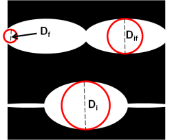
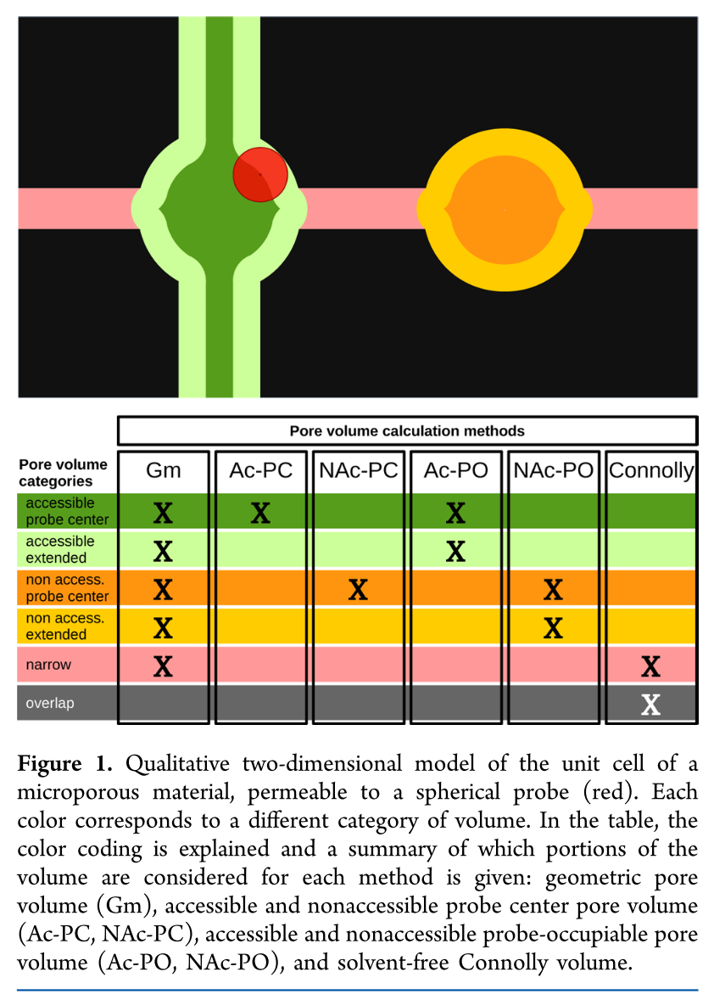

There are several metrics we want you to use to pre-evaluate the performance
of a material for methane storage.

We used [Zeo++](http://www.zeoplusplus.org/) to compute this properties.

* *largest included sphere (Di)*, the largest sphere that can fit the largest
pore of the structure

* *largest free sphere (Df)*, the largest spherical probe that can percolate through the material

* *largest included sphere along the free sphere path (Dif)*, the largest sphere that
can fit along the channel where the largest free sphere was evaluated.
Therefore Di = Dif if there is only one channel or if the largest pore is along the largest channel.

|  |
|:--:|
| Graphical explanation for Di, Df and Dif. |

* *internal surface*, considering the atoms of the frameworks as spheres,
and rolling a spherical probe on their surface. By convention the probe has a radius
of 1.86 Angstrom, half the kinetic diameter of the nitrogen molecule.
This is a purely geometrical quantity and may differ a lot with the measured BET surface.

* *geometric pore volume*, considering the atoms of the frameworks as spheres,
all the volume outside the spheres.

* *probe-occupiable pore volume* (or Connolly volume ),
considering the atoms of the frameworks as spheres,
all the pore volume where a spherical probe could fit.
The pore volume can also be distinguished into accessible or not-accessible,
if the probe can actually diffuse or not inside that space: in the second case
you are expected to use blocking spheres to avoid the insertion of gas molecule
in Monte Carlo algorithms.

* *void fraction*, fraction of pore volume over the total volume of the unit cell.
If you wonder why sometimes it is called "helium void fraction", it was a convention
to use the helium atom as probe to compute (BC: NOT measure experimentally!)
this quantity. However, how explained [here](https://pubs.acs.org/doi/10.1021/acs.langmuir.7b01682),
using helium to compute the void fraction is not very physically meaningful.

|  |
