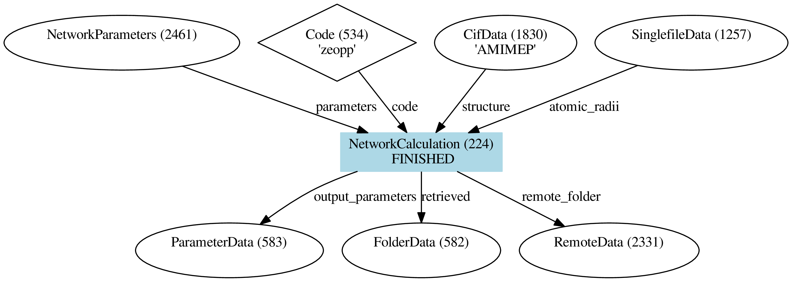

The verdi command line
======================

The ``verdi`` command line utility is another common way of interacting
with AiiDA, be it to investigate the provenance, to submit or monitor
calculations.

.. code:: console

    $ verdi
    Usage: verdi [--profile=PROFILENAME|-p PROFILENAME] COMMAND [<args>]

    List of the most relevant available commands:
      * calculation   Query and interact with calculations
      * code          Setup and manage codes to be used
      * comment       Manage general properties of nodes in the database
      * computer      Setup and manage computers to be used
      * daemon        Manage the AiiDA daemon
      * data          Setup and manage data specific types
      * devel         AiiDA commands for developers
      * export        Create and manage AiiDA export archives
      * graph         Utility to explore the nodes in the database graph
      * group         Setup and manage groups
      * help          Describe a specific command
      * import        Import nodes and group of nodes
      * install       Install/setup aiida for the current user
      * node          Manage operations on AiiDA nodes
      * profile       List AiiDA profiles, and set the default profile.
      * quicksetup    Quick setup for the most common usecase (1 user, 1 machine).
      * rehash        Re-hash all nodes.
      * restapi       verdi command used to hook up the AiIDA REST API.
      * run           Execute an AiiDA script
      * setup         Setup aiida for the current user
      * shell         Run the interactive shell with the AiiDA environment loaded.
      * user          List and configure new AiiDA users.
      * work          Manage the AiiDA worflow manager
      * workflow      Manage the AiiDA legacy worflow manager
    See 'verdi help' for more help.

    | **Note**
    | ``verdi`` has tab completion. Just type a command and press Tab
    twice to list the availble subcommands.
    |  Whenever you need help with a command, add the ``-h`` flag.
    Fields enclosed in angular brackets, such as ``<pk>``, are
    placeholders to be replaced by the actual value of that field (an
    integer, a string, etc...).

Let's try to get a list of calculations using ``verdi``:

.. code:: console

    $ verdi calculation list

It turns out the list of calculations is empty because you currently
don't have any calculations running.

.. admonition:: Exercise

   Use the ``-h`` flag to figure out how to list calculations of any state
   (both running and finished ones) and from all users (both your current
   AiiDA profile and others).

   How do you list all calculations that ran in the past week?

Let's have a closer look at a zeo++ calculation node. Pick a primary key
(PK) number and run:

.. code:: console

    $ verdi calculation show <pk>
    -----------  ------------------------------------
    type         NetworkCalculation
    pk           224
    uuid         5a92d1e2-e243-4386-8ba1-e6c540e93b20
    label
    description
    ctime        2019-01-14 19:11:30.678462+00:00
    mtime        2019-01-14 21:17:44.639323+00:00
    computer     [1] fidis
    code         zeopp
    -----------  ------------------------------------
    ##### INPUTS:
    Link label      PK  Type
    ------------  ----  -----------------
    atomic_radii  1257  SinglefileData
    parameters    2461  NetworkParameters
    structure     1830  CifData
    ##### OUTPUTS:
    Link label           PK  Type
    -----------------  ----  -------------
    remote_folder      2331  RemoteData
    retrieved           582  FolderData
    output_parameters   583  ParameterData

This provides a textual representation of the provenance of a single
node, similar to what we've already seen in the interactive provenance
browser before.

Another way to produce a visual representation of the provenance is
``verdi graph``.

.. admonition:: Excercise

   Pick a PK number from the list of calculations and generate a provenance
   graph for a ``NetworkCalculation``:

   .. code:: console

       $ verdi graph generate <pk>
       $ dot -Tpdf -o <pk>.pdf <pk>.dot   # convert .dot to .pdf
       $ evince <pk>.pdf                  # open pdf

   Dependency graph of a zeo++ calculation.

Contrary to the interactive graph browser, ``verdi graph generate`` can
show not only the direct inputs and outputs of the given node (shown in
blue) but the full graph the node is connected to. We will make use of
this functionality later.

.. admonition:: Exercise

   Famliarize yourself with the other options of the ``calculation`` and
   ``data`` subcommands, such as:

   .. code:: console

       verdi data parameter show <pk>   # for ParameterData PKs
       verdi data cif show --format jmol <pk>  # for CifData PKs
       verdi calculation res <pk>   # for Calculation PKs
       verdi calculation show <pk>   # for Calculation PKs, shows code & computer labels
       verdi code show <label>      # for Code labels (see output of
       verdi computer show <label>  # for Computer labels

   and use them to answer the questions below:

   -  What are the density and unit cell volume of the structure used in
      the calculation you picked?
   -  Which version of zeo++ was used to compute the geometric properties?
   -  What is the scheduler installed on the computer where the
      calculations were run?

.. note::

    ``verdi calculation res <pk>`` simply is a shortcut for
    ``verdi data parameter show <pk2>`` where ``pk2`` refers to the
    ``ParameterData`` with link name ``output_parameters``.
