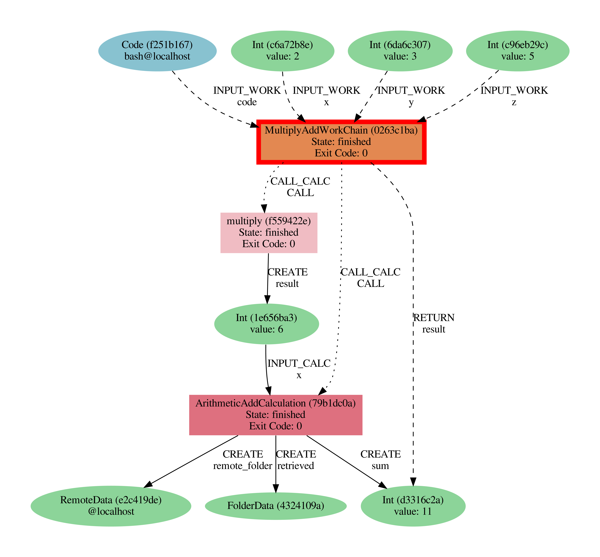
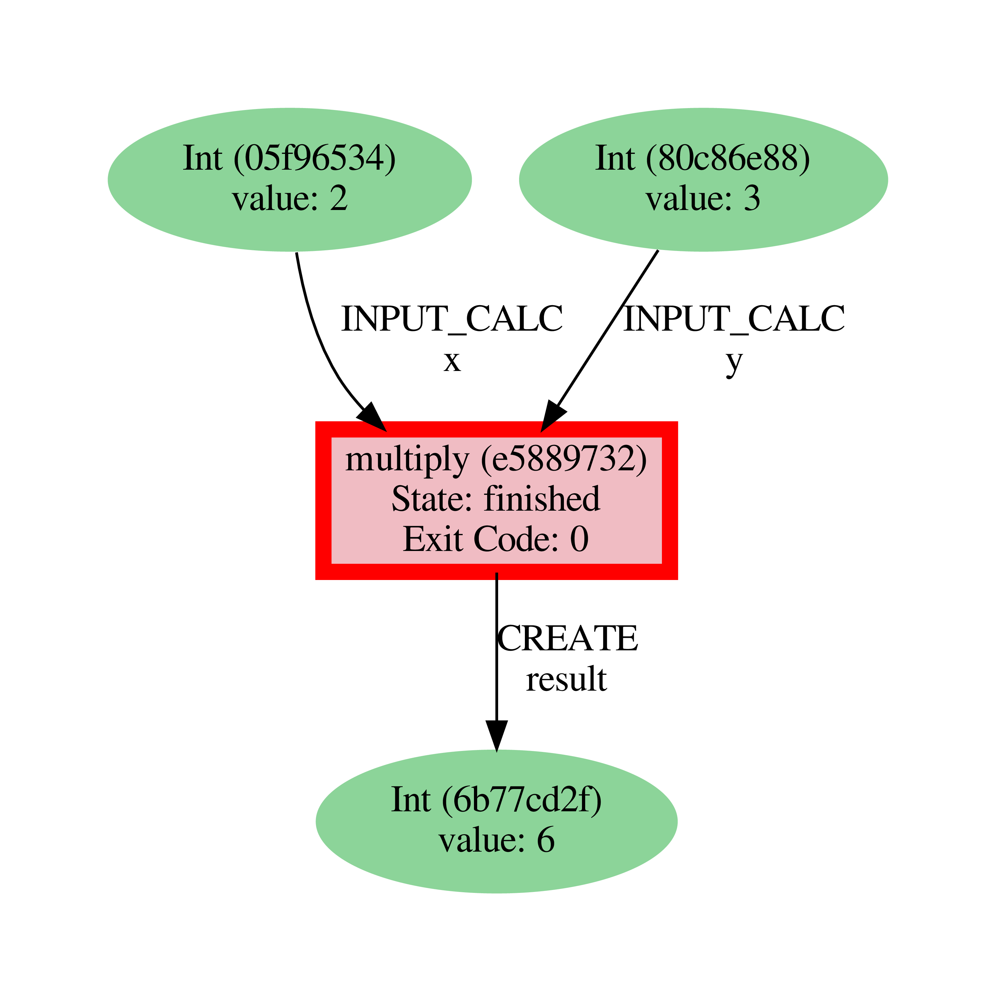
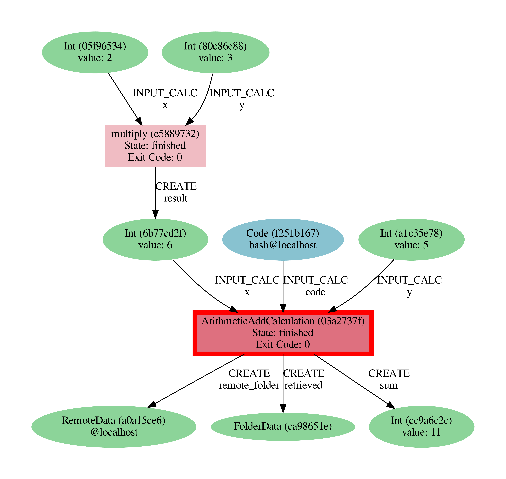

.. _BIGMAP_2020_Basics:

**************
Basic tutorial
**************

Welcome to the AiiDA tutorial!
The goal of this tutorial is to give you a basic idea of how AiiDA helps you in executing data-driven workflows.
At the end of this tutorial you will know how to:

* Store data in the database and subsequently retrieve it.
* Decorate a Python function such that its inputs and outputs are automatically tracked.
* Run and monitor the status of processes.
* Explore and visualize the provenance graph.

.. important::

    Before starting, make sure you are in the correct Python environment using ``workon aiida``.

.. _BIGMAP_2020_Basics:provenance:

Provenance
==========

Before we dive in, we need to briefly introduce one of the most important concepts for AiiDA: *provenance*.
An AiiDA database does not only contain the results of your calculations, but also their inputs and each step that was executed to obtain them.
All of this information is stored in the form of a *directed acyclic graph* (DAG).
As an example, :numref:`BIGMAP_2020_Basics_fig_intro_workchain_graph` shows the provenance of the calculations of this tutorial.

.. _BIGMAP_2020_Basics_fig_intro_workchain_graph:

    Provenance Graph of a basic AiiDA WorkChain.

In the provenance graph, you can see different types of *nodes* represented by different shapes.
The green ellipses are ``Data`` nodes, the blue ellipse is a ``Code`` node, and the rectangles represent *processes*, i.e. the calculations performed in your *workflow*.

The provenance graph allows us to not only see what data we have, but also how it was produced.
During this tutorial we will be using AiiDA to generate the provenance graph in :numref:`fig_intro_workchain_graph` step by step.

.. note::

  Throughout this tutorial we will be using the ``verdi`` command line interface.
  Here's couple of tricks that will make your life easier:

  * The ``verdi`` command supports **tab-completion**:
    In the terminal, type ``verdi``, followed by a space and press the 'Tab' key twice to show a list of all the available sub commands.
  * For help on ``verdi`` or any of its subcommands, simply append the ``--help/-h`` flag:

    .. code-block:: console

        $ verdi -h

.. _BIGMAP_2020_Basics:data_nodes:

Data nodes
==========

Before running any calculations, let's create and store a *data node*.
AiiDA ships with an interactive IPython shell that has many basic AiiDA classes pre-loaded.
To start the IPython shell, simply type in the terminal:

.. code-block:: console

    $ verdi shell

AiiDA implements data node types for the most common types of data (int, float, str, etc.), which you can extend with your own (composite) data node types if needed.
For this tutorial, we'll keep it very simple, and start by initializing an ``Int`` node and assigning it to the `node` variable:

.. code-block:: ipython

    In [1]: node = Int(2)

We can check the contents of the ``node`` variable like this:

.. code-block:: ipython

    In [2]: node
    Out[2]: <Int: uuid: de5c6cde-a420-405f-b1e5-85519b64efda (unstored) value: 2>

Quite a bit of information on our freshly created node is returned:

* The data node is of the type ``Int``
* The node has the *universally unique identifier* (**UUID**), which will be different in each case (in the example above, it turned out to be ``de5c6cde-a420-405f-b1e5-85519b64efda``)
* The node is currently not stored in the database ``(unstored)``
* The integer value of the node is ``2``

Let's store the node in the database:

.. code-block:: ipython

    In [3]: node.store()
    Out[3]: <Int: uuid: de5c6cde-a420-405f-b1e5-85519b64efda (pk: 146) value: 2>

As you can see, the data node has now been assigned a *primary key* (**PK**), a number that identifies the node in your database ``(pk: 146)``.
The PK and UUID both reference the node with the only difference that the PK is unique *for your local database only*, whereas the UUID is a globally unique identifier and can therefore be used between *different* databases.

.. important::

    It is likely that the PK numbers shown throughout this tutorial are different for your database!
    Moreover, the UUIDs are generated randomly and are therefore **guaranteed** to be different.

    Make a note of the PK of the ``Int`` node above, we'll be using it later in the tutorial.
    In the commands that follow, replace ``<PK>``, or ``<UUID>`` by the appropriate identifier.

Next, let's leave the IPython shell by typing ``exit()`` and then enter.
Back in the terminal, use the ``verdi`` command line interface (CLI) to check the data node we have just created:

.. code:: console

    $ verdi node show <PK>
    Property     Value
    -----------  ------------------------------------
    type         Int
    pk           146
    uuid         de5c6cde-a420-405f-b1e5-85519b64efda
    label
    description
    ctime        2020-11-29 14:47:04.196421+00:00
    mtime        2020-11-29 14:47:13.108914+00:00

Once again, we can see that the node is of type ``Int``, has PK = 146, and UUID = ``de5c6cde-a420-405f-b1e5-85519b64efda`.
Besides this information, the ``verdi node show`` command also shows the (empty) ``label`` and ``description``, as well as the time the node was created (``ctime``) and last modified (``mtime``).

.. seealso::

    AiiDA already provides many standard data types, but you can also `create your own <https://aiida.readthedocs.io/projects/aiida-core/en/latest/topics/data_types.html#adding-support-for-custom-data-types>`_.

.. dropdown:: **When should I use the PK and when should I use the UUID?**

  A **PK** is a short integer identifying the node and therefore easy to remember.
  However, the same PK number (e.g., PK=10) might appear in two different databases referring to two completely different pieces of data.

  A **UUID** has instead the nice feature of being globally unique: even if you export your data and a colleague imports it, the UUIDs will remain the same (while the PKs will typically be different).

  Therefore, use the UUID to keep a long-term reference to a node, but feel free to use the PK for quick, everyday use in your own database.

.. dropdown:: **UUID/PK - Tips and tricks**

  All AiiDA commands that accept a PK can also accept a UUID. Check this by trying the command before, this time with ``verdi node show <UUID>``.

  Note the following:

  - AiiDA does not require the full UUID, but just the first part of it, as long as only one node starts with the string you provide.
    E.g., in the example above, you could also say ``verdi node show de5c6cde-a420``.
    Once you start having a lot of nodes in your database, ``verdi node show de`` might return an error, since at that point you can have more than one node starting with the string ``de``.

  - By default, if what you pass is a valid integer, AiiDA will assume it is a PK; if at least one of the characters is not a digit, then AiiDA will assume it is (the first part of) a UUID.

  - How to solve the issue, then, when the first part of the UUID is composed only by digits (e.g. in ``2495301c-dd00-42d6-92e4-1a8c171bbb4a``)?
    Indeed, using ``verdi node show 24953`` would look for a node with ``PK=24953``.
    As a solution, just add a dash, e.g. ``verdi node show 24953-`` so that AiiDA will consider this as the beginning of the UUID.

  - Note that you can put the dash in any part of the string, and you don't need to respect the typical UUID pattern with 8-4-4-4-12 characters per section: AiiDA will anyway first strip all dashes, and then put them back in the right place, so e.g. ``verdi node show 24-95-3`` will give you the same result as ``verdi node show 24953-``.

  Try to use again ``verdi node show`` on the ``Int`` node above, just with the first part of the UUID (that you got from the first call to ``verdi node show`` above).

.. _BIGMAP_2020_Basics:calcfunction:

Calculation functions
=====================

Once your data is stored in the database, it is ready to be used for some computational task.
For example, let's say you want to multiply two ``Int`` data nodes.
The following Python function:

.. code-block:: python

    def multiply(x, y):
        return x * y

will give the desired result when applied to two ``Int`` nodes, but the calculation will not be stored in the provenance graph.
However, we can use a `Python decorator <https://docs.python.org/3/glossary.html#term-decorator>`_ provided by AiiDA to automatically make it part of the provenance graph.
Start up the AiiDA IPython shell again using ``verdi shell`` and execute the following code snippet:

.. code-block:: ipython

    In [1]: from aiida.engine import calcfunction
       ...:
       ...: @calcfunction
       ...: def multiply(x, y):
       ...:     return x * y

This converts the ``multiply`` function into an AiIDA *calculation function*, the most basic execution unit in AiiDA.
Next, load the ``Int`` node you have created in the previous section using the ``load_node`` function and the PK of the data node:

.. code-block:: ipython

    In [2]: x = load_node(pk=<PK>)

Of course, we need another integer to multiply with the first one.
Let's create a new ``Int`` data node and assign it to the variable ``y``:

.. code-block:: ipython

    In [3]: y = Int(3)

Now it's time to multiply the two numbers!

.. code-block:: ipython

    In [4]: multiply(x, y)
    Out[4]: <Int: uuid: 752cca48-8dff-4dcb-88bd-8f5cf55e68cf (pk: 149) value: 6>

Success!
The ``calcfunction``-decorated ``multiply`` function has multiplied the two ``Int`` data nodes and returned a new ``Int`` data node whose value is the product of the two input nodes.
Note that by executing the ``multiply`` function, all input and output nodes are automatically stored in the database:

.. code-block:: ipython

    In [5]: y
    Out[5]: <Int: uuid: 075ca5b4-b9a4-4387-9e7b-0953bdf6bb13 (pk: 147) value: 3>

We had not yet stored the data node assigned to the ``y`` variable, but by providing it as an input argument to the ``multiply`` function, it was automatically stored with PK = 147.
Similarly, the returned ``Int`` node with value 6 has been stored with PK = 149.

Let's once again leave the IPython shell with ``exit()`` and look for the process we have just run using the ``verdi`` CLI:

.. code:: console

    $ verdi process list

The returned list will be empty, but don't worry!
By default, ``verdi process list`` only returns the *active* processes.
If you want to see *all* processes (i.e. also the processes that are *terminated*), simply add the ``-a`` option:

.. code:: console

    $ verdi process list -a
      PK  Created    Process label                 Process State    Process status
    ----  ---------  ----------------------------  ---------------  ----------------
     107  5m ago     PwBandsWorkChain              ⏹ Finished [0]
     108  5m ago     seekpath_structure_analysis   ⏹ Finished [0]
     115  5m ago     PwBaseWorkChain               ⏹ Finished [0]
     117  5m ago     create_kpoints_from_distance  ⏹ Finished [0]
     121  5m ago     PwCalculation                 ⏹ Finished [0]
     129  5m ago     PwCalculation                 ⏹ Finished [0]
     137  5m ago     PwBaseWorkChain               ⏹ Finished [0]
     140  5m ago     PwCalculation                 ⏹ Finished [0]
     148  25s ago    multiply                      ⏹ Finished [0]

Total results: 9

Info: last time an entry changed state: 24s ago (at 14:48:08 on 2020-11-29)

Notice how the band structure workflow (``PwBandsWorkChain``) you ran in the `Quantum ESPRESSO`_ app of `AiiDAlab`_ is also in the process list!
Moreover, we can see that our ``multiply`` calculation function was created 1 minute ago, assigned the PK 148, and has ``Finished``.

As a final step, let's have a look at the provenance of this simple calculation.
The provenance graph can be automatically generated using the verdi CLI.
Let's generate the provenance graph for the ``multiply`` calculation function we have just run:

.. _BIGMAP_2020_Basics:calcfunction:graph:

.. code-block:: console

  $ verdi node graph generate <PK>

The command will write the provenance graph to a ``.pdf`` file.
If you open a *file manager* on the start page, you should be able to see and open the PDF.

It should look something like the graph shown in :numref:`BIGMAP_2020_Basics_fig_calcfun_graph`.

.. _BIGMAP_2020_Basics_fig_calcfun_graph:

    Provenance graph of the ``multiply`` calculation function.

.. note:: Remember that the PK of the ``calcfunction`` can be different for your database, and that the UUID will **always** be different.

.. _tutorial:basic:calcjob:

CalcJobs
========

When running calculations that require an external code or run on a remote machine, a simple calculation function is no longer sufficient.
For this purpose, AiiDA provides the ``CalcJob`` process class.

To run a ``CalcJob``, you need to set up two things: a ``code`` that is going to implement the desired calculation and a ``computer`` for the calculation to run on.

`Quantum Mobile`_ ships with the ``localhost`` computer set up, which is the one we'll be using throughout the tutorial.
However, we still have to set up the ``add`` code, which we'll be using for this tutorial:

.. code-block:: console

    $ verdi code setup -L add --computer=localhost -P arithmetic.add --remote-abs-path=/bin/bash -n
    Success: Code<150> add@localhost created

This command sets up a code with *label* ``add`` on the *computer* ``localhost``, using the *plugin* ``arithmetic.add``.
The absolute path to the "remote" executable is ``\bin\bash``, i.e. this code simply prepares and runs a bash script.
Finally, the *non-interactive* option (``-n``) is added to not prompt for extra input.

.. note::

    As you can see, the ``Code`` node has also been assigned a PK in the database (``150``), and hence can be a part of the provenance.

A typical real-world example of a computer is a remote supercomputing facility.
Codes can be anything from a Python script to powerful *ab initio* codes such as `Quantum ESPRESSO`_ or machine learning tools like `TensorFlow`_.

.. seealso::

   More details for how to :ref:`run external codes <how-to:run-codes>`.

Let's have a look at the codes that are available to us:

.. code:: console

    $ verdi code list
    # List of configured codes:
    # (use 'verdi code show CODEID' to see the details)
    * pk 1 - pw@localhost
    * pk 150 - add@localhost

The first code is the one you set up in the `AiiDAlab`_ `Quantum ESPRESSO`_ app earlier..
The second one in the list is the code you have just set up: ``add@localhost`` with PK = 150.
This code allows us to add two integers together.
The ``add@localhost`` identifier indicates that the code with label ``add`` is run on the computer with label ``localhost``.
To see more details about the computer, you can use the following ``verdi`` command:

.. code:: console

    $ verdi computer show localhost
    --------------  ------------------------------------
    Label           localhost
    PK              1
    UUID            43cc04f9-92f0-4a5c-9019-2bf679c1dece
    Description     this computer
    Hostname        localhost
    Transport type  local
    Scheduler type  direct
    Work directory  /home/aiida/aiida_run/
    Shebang         #!/bin/bash
    Mpirun command  mpirun -np {tot_num_mpiprocs}
    Prepend text
    Append text
    --------------  ------------------------------------

The ``localhost`` computer has PK = 1, UUID ``43cc04f9-92f0-4a5c-9019-2bf679c1dece``, and has the following setup:

    * Set up on the ``localhost``.
    * Uses the ``local`` transport.
    * Uses a `direct scheduler`_.
    * The work directory, where the calculations will run, is set up in ``/home/aiida/aiida_run/``.
    * The launch script uses the ``#!/bin/bash`` `shebang interpreter directive`_.
    * The `mpirun`_ command is ``mpirun -np {tot_num_mpiprocs}``.
      Note that ``{tot_num_mpiprocs}`` will be replaced during the preparation of the calculation for submission.

.. note::

    You may have noticed that the PK of the ``localhost`` computer is the same as the ``pw@localhost`` code, which is represented by a node in the database.
    This is because different entities, such as nodes, computers and groups, are stored in different tables of the database.
    So, the PKs for each entity type are unique for each database, but entities of different types can have the same PK within one database.

Let's now start up the ``verdi shell`` again and load the ``add@localhost`` code using its label:

.. code-block:: ipython

    In [1]: code = load_code(label='add')

Every code has a convenient tool for setting up the required input, called the *builder*.
It can be obtained by using the ``get_builder`` method:

.. code-block:: ipython

    In [2]: builder = code.get_builder()

Using the builder, you can easily set up the calculation by directly providing the input arguments.
Let's use the ``Int`` node that was *created* by our previous ``calcfunction`` as one of the inputs and a new node as the second input:

.. code-block:: ipython

    In [3]: builder.x = load_node(pk=<PK>)
       ...: builder.y = Int(5)

In case that your nodes' PKs are different and you don't remember the PK of the output node from the previous calculation, check the provenance graph you generated earlier and use the UUID of the output node instead:

.. code-block:: ipython

    In [3]: builder.x = load_node(uuid='<UUID>')
       ...: builder.y = Int(5)

Note how you don't have to provide the entire UUID to load the node.
As long as the first part of the UUID is unique within your database, AiiDA will find the node you are looking for.

.. note::

    One nifty feature of the builder is the ability to use tab completion for the inputs.
    Try it out by typing ``builder.`` + ``<TAB>`` in the verdi shell.

To execute the ``CalcJob``, we use the ``run`` function provided by the AiiDA engine:

.. code-block:: ipython

    In [4]: from aiida.engine import run
       ...: run(builder)

Wait for the process to complete.
Once it is done, it will return a dictionary with the output nodes:

.. code-block:: ipython

    Out[4]:
    {'sum': <Int: uuid: 9487718e-fbb7-45c6-815a-a2a6db4d3d5d (pk: 155) value: 11>,
     'remote_folder': <RemoteData: uuid: 4b6fc278-4784-4b05-8cc0-2b865e36578d (pk: 153)>,
     'retrieved': <FolderData: uuid: 95d6fb83-b3c4-4252-ba9a-fa259be48cf1 (pk: 154)>}

Besides the sum of the two ``Int`` nodes, the calculation function also returns two other outputs: one of type ``RemoteData`` and one of type ``FolderData``.
See the :ref:`topics section on calculation jobs <topics:calculations:usage:calcfunctions>` for more details.
Now, exit the IPython shell and once more check for *all* processes:

.. code-block:: console

    $ verdi process list -a
    PK  Created    Process label                 Process State    Process status
    ----  ---------  ----------------------------  ---------------  ----------------
    <! OUTPUT REMOVED !>
    148  14m ago    multiply                      ⏹ Finished [0]
    152  19s ago    ArithmeticAddCalculation      ⏹ Finished [0]

    Total results: 10

    Info: last time an entry changed state: 16s ago (at 15:02:51 on 2020-11-29)

Note that we've removed the output regarding the band structure calculation that you ran in the `AiiDAlab`_ `Quantum ESPRESSO`_ app earlier.
We now see two *arithmetic* processes in the list.
One is the ``multiply`` calcfunction you ran earlier, the second is the ``ArithmeticAddCalculation`` CalcJob that you have just run.
Grab the PK of the ``ArithmeticAddCalculation``, and generate the provenance graph.
The result should look like the graph shown in :numref:`BIGMAP_2020_Basics_fig_calcjob_graph`.

.. code-block:: console

    $ verdi node graph generate <PK>

.. _BIGMAP_2020_Basics_fig_calcjob_graph:

    Provenance graph of the ``ArithmeticAddCalculation`` CalcJob, with one input provided by the output of the ``multiply`` calculation function.

You can see more details on any process, including its inputs and outputs, using the verdi shell:

.. code:: console

    $ verdi process show 152
    Property     Value
    -----------  ------------------------------------
    type         ArithmeticAddCalculation
    state        Finished [0]
    pk           152
    uuid         184a5c5f-0ea3-4bf6-957b-75490b6013e4
    label
    description
    ctime        2020-11-29 15:02:48.595695+00:00
    mtime        2020-11-29 15:02:51.647130+00:00
    computer     [1] localhost

    Inputs      PK  Type
    --------  ----  ------
    code       150  Code
    x          149  Int
    y          151  Int

    Outputs          PK  Type
    -------------  ----  ----------
    remote_folder   153  RemoteData
    retrieved       154  FolderData
    sum             155  Int

.. _BIGMAP_2020_Basics:submit:

Submitting to the daemon
========================

When we used the ``run`` command in the previous section, the IPython shell was blocked while it was waiting for the ``CalcJob`` to finish.
This is not a problem when we're simply adding two numbers together, but if we want to run multiple calculations that take hours or days, this is no longer practical.
Instead, we are going to *submit* the ``CalcJob`` to the AiiDA *daemon*.
The daemon is a program that runs in the background and manages submitted calculations until they are *terminated*.
Let's first check the status of the daemon using the ``verdi`` CLI:

.. code-block:: console

    $ verdi daemon status

If the daemon is running, the output will be something like the following:

.. code-block:: bash

    Profile: default
    Daemon is running as PID 1033 since 2020-11-29 14:37:59
    Active workers [1]:
    PID    MEM %    CPU %  started
    -----  -------  -------  -------------------
    1036    0.415        0  2020-11-29 14:38:00

In this case, let's stop it for now:

.. code-block:: console

    $ verdi daemon stop

Next, let's *submit* the ``CalcJob`` we ran previously.
Start the ``verdi shell`` and execute the Python code snippet below.
This follows all the steps we did previously, but now uses the ``submit`` function instead of ``run``:

.. code-block:: ipython

    In [1]: from aiida.engine import submit
       ...:
       ...: code = load_code(label='add')
       ...: builder = code.get_builder()
       ...: builder.x = load_node(pk=<PK>)
       ...: builder.y = Int(5)
       ...:
       ...: submit(builder)

When using ``submit`` the calculation job is not run in the local interpreter but is sent off to the daemon and you get back control instantly.
Instead of the *result* of the calculation, it returns the node of the ``CalcJob`` that was just submitted:

.. code-block:: ipython

    Out[1]: <CalcJobNode: uuid: 5f0025b3-8d44-46fb-b627-9d8be71c0e86 (pk: 157) (aiida.calculations:arithmetic.add)>

Let's exit the IPython shell and have a look at the process list:

.. code-block:: console

    $ verdi process list
      PK  Created    Process label             Process State    Process status
    ----  ---------  ------------------------  ---------------  ----------------
     157  15s ago    ArithmeticAddCalculation  ⏹ Created

    Total results: 1

    Info: last time an entry changed state: 15s ago (at 15:04:57 on 2020-11-29)
    Warning: the daemon is not running

You can see the ``CalcJob`` you have just submitted, with the state ``Created``.
The ``CalcJob`` process is now waiting to be picked up by a daemon runner, but the daemon is currently disabled.
Let's start it up (again):

.. code-block:: console

    $ verdi daemon start
    Starting the daemon... RUNNING

Now you can use ``verdi process list`` to follow the progress of the calculation.
Let's wait for the ``CalcJob`` to complete and then use ``verdi process list -a`` to see all processes we have run so far:

.. code-block:: bash

    $ verdi process list -a
      PK  Created    Process label                 Process State    Process status
    ----  ---------  ----------------------------  ---------------  ----------------
    <! OUTPUT REMOVED !>
     148  17m ago    multiply                      ⏹ Finished [0]
     152  2m ago     ArithmeticAddCalculation      ⏹ Finished [0]
     157  41s ago    ArithmeticAddCalculation      ⏹ Finished [0]

    Total results: 11

    Info: last time an entry changed state: 7s ago (at 15:05:31 on 2020-11-29)

.. _BIGMAP_2020_Basics:workflow:

Workflows
=========

So far we have executed each process manually.
AiiDA allows us to automate these steps by linking them together in a *workflow*, whose provenance is stored to ensure reproducibility.
For this tutorial we have prepared a basic ``WorkChain`` that is already implemented in ``aiida-core``.
You can see the code below:

.. dropdown:: **MultiplyAddWorkChain code**

    .. literalinclude:: include/snippets/multiply_add.py
        :language: python
        :start-after: start-marker

    First, we recognize the ``multiply`` function we have used earlier, decorated as a ``calcfunction``.
    The ``define`` class method specifies the ``input`` and ``output`` of the ``WorkChain``, as well as the ``outline``, which are the steps of the workflow.
    These steps are provided as methods of the ``MultiplyAddWorkChain`` class.

.. note::

    Besides work chains, workflows can also be implemented as *work functions*.
    These are ideal for workflows that are not very computationally intensive and can be easily implemented in a Python function.

Let's run the ``WorkChain`` above!
Start up the ``verdi shell`` and load the ``MultiplyAddWorkChain`` using the ``WorkflowFactory``:

.. code-block:: ipython

    In [1]: MultiplyAddWorkChain = WorkflowFactory('arithmetic.multiply_add')

The ``WorkflowFactory`` is a useful and robust tool for loading workflows based on their *entry point*, e.g. ``'arithmetic.multiply_add'`` in this case.
Similar to a ``CalcJob``, the ``WorkChain`` input can be set up using a builder:

.. code-block:: ipython

    In [2]: builder = MultiplyAddWorkChain.get_builder()
       ...: builder.code = load_code(label='add')
       ...: builder.x = Int(2)
       ...: builder.y = Int(3)
       ...: builder.z = Int(5)

Once the ``WorkChain`` input has been set up, we submit it to the daemon using the ``submit`` function from the AiiDA engine. Since the workflow completes very quickly, we'll immediately execute `verdi process list -a` from within the IPython shell so we can catch it in progress:

.. code-block:: ipython

    In [3]: from aiida.engine import submit
       ...: submit(builder)
       ...: !verdi process list -a

Depending on which step the workflow is running, you should get something like the following:

.. code-block:: console

      PK  Created    Process label                 Process State    Process status
    ----  ---------  ----------------------------  ---------------  ------------------------------------
    <! OUTPUT REMOVED !>
     148  18m ago    multiply                      ⏹ Finished [0]
     152  3m ago     ArithmeticAddCalculation      ⏹ Finished [0]
     157  1m ago     ArithmeticAddCalculation      ⏹ Finished [0]
     164  4s ago     MultiplyAddWorkChain          ⏵ Waiting        Waiting for childprocesses: 167
     165  3s ago     multiply                      ⏹ Finished [0]
     167  3s ago     ArithmeticAddCalculation      ⏵ Waiting        Waiting for transport task: retrieve

    Total results: 14

    Info: last time an entry changed state: 0s ago (at 15:06:16 on 2020-11-29)

We can see that the ``MultiplyAddWorkChain`` is currently waiting for its *child process*, the ``ArithmeticAddCalculation``, to finish.
Check the process list again for *all* processes (You should know how by now!).
After about half a minute, all the processes should be in the ``Finished`` state.
The ``verdi process status`` command prints a *hierarchical* overview of the processes called by the work chain:

.. code-block:: console

    $ verdi process status <PK>
    MultiplyAddWorkChain<164> Finished [0] [3:result]
        ├── multiply<165> Finished [0]
        └── ArithmeticAddCalculation<167> Finished [0]

The bracket ``[3:result]`` indicates the current step in the outline of the :py:class:`~aiida.workflows.arithmetic.multiply_add.MultiplyAddWorkChain` (step 3, with name ``result``).
The ``process status`` is particularly useful for debugging complex work chains, since it helps pinpoint where a problem occurred.

We can now generate the full provenance graph for the ``WorkChain`` with:

.. code-block:: console

    $ verdi node graph generate <PK>

Look familiar?
The provenance graph should be similar to the one we showed at the start of this tutorial (:numref:`BIGMAP_2020_Basics_fig_workchain_graph`).

.. _BIGMAP_2020_Basics_fig_workchain_graph:

    Final provenance Graph of the basic AiiDA tutorial.

Great work so far!
Once you're ready, click on the "Next" button below to go to the second part of the tutorial.

.. Links:

.. _Quantum Mobile: https://quantum-mobile.readthedocs.io/en/latest/
.. _AiiDAlab: https://www.materialscloud.org/work/aiidalab
.. _Quantum ESPRESSO: https://www.quantum-espresso.org/
.. _TensorFlow: https://www.tensorflow.org/
.. _direct scheduler: https://aiida-core.readthedocs.io/en/v1.5.0/topics/schedulers.html#direct-execution-bypassing-schedulers
.. _shebang interpreter directive: https://en.wikipedia.org/wiki/Shebang_(Unix)
.. _mpirun: https://www.open-mpi.org/doc/current/man1/mpirun.1.php
