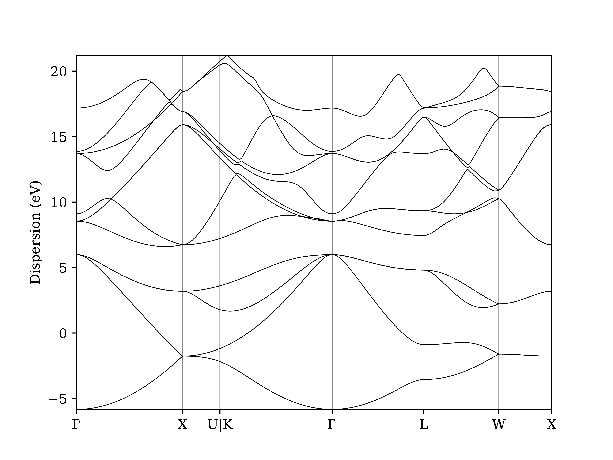

.. _BIGMAP_2020_QE:

Quantum ESPRESSO
================

Now that we've covered the basics, let's continue with a quick demo of how AiiDA can make your life easier as a computational scientist.

Importing a structure and inspecting it
---------------------------------------

Let's download a structure from the `Crystallography Open Database <http://crystallography.net/cod/>`_ and import it into AiiDA.

.. note::

    You can also view the structure online `here <http://crystallography.net/cod/9008565.html>`_.

First, download the file and from the COD with ``wget``:

.. code-block:: console

    $ wget http://crystallography.net/cod/9008565.cif
    --2020-11-25 11:32:32--  http://crystallography.net/cod/9008565.cif
    Resolving crystallography.net (crystallography.net)... 158.129.170.82
    Connecting to crystallography.net (crystallography.net)|158.129.170.82|:80... connected.
    HTTP request sent, awaiting response... 200 OK
    Length: 4948 (4.8K) [chemical/x-cif]
    Saving to: ‘9008565.cif’

    9008565.cif          100%[=====================>]   4.83K  --.-KB/s    in 0s

    2020-11-25 11:32:32 (351 MB/s) - ‘9008565.cif’ saved [4948/4948]

Next, you can import it with the ``verdi`` CLI.

.. code-block:: console

    $ verdi data structure import ase 9008565.cif
      Successfully imported structure Si8 (PK = 171)

Remember that each piece of data in AiiDA gets a PK number (a "primary key") that identifies it in your database.
This is printed out on the screen by the ``verdi data structure import`` command.
It's a good idea to mark it down, but should you forget, you can always have a look at the structures in the database using:

.. code-block:: console

    $ verdi data structure list
      Id  Label    Formula
    ----  -------  ---------
     171           Si8

    Total results: 1

.. important::

    Throughout this section, remember to replace the string ``<PK>`` with the appropriate PK number.

Let us first inspect the node you just created:

.. code-block:: console

    $ verdi node show <PK>
    Property     Value
    -----------  ------------------------------------
    type         StructureData
    pk           171
    uuid         ac3626d2-60ec-4e54-953f-7b7cf3716b16
    label
    description
    ctime        2020-11-29 16:11:39.900886+00:00
    mtime        2020-11-29 16:11:40.025347+00:00

You can see some information on the node, including its type (``StructureData``, the AiiDA data type for storing crystal structures), a label and a description (empty for now, can be changed), a creation time (``ctime``) and a last modification time (``mtime``), the PK of the node and its UUID (universally unique identifier).

Running a calculation
---------------------

The following short Python script sets up a self-consistent field calculation for the `Quantum ESPRESSO`_ code:

.. literalinclude:: include/snippets/demo_calcjob.py

Download the :download:`demo_calcjob.py <include/snippets/demo_calcjob.py>` script to your working directory.
You can download the file to the AiiDAlab cluster by right clicking on the link, selecting "Copy link address", and using ``wget``:

.. code-block:: console

    wget <LINK>

**Exercise:** The ``demo_calcjob.py`` script contains a few placeholders for you to fill in:

    #. Replace replace ``<CODE LABEL>`` in the script with label of the `Quantum ESPRESSO`_ code you set up in the      AiiDAlab demo.
       Use ``verdi code list`` to find the label for the ``pw.x`` in case you forgot.
    #. replace ``<STRUCTURE PK>`` with the PK of the structure you imported.
    #. Replace ``<PP FAMILY>`` with the label for the "SSSP efficiency" library.
       Use ``verdi data upf listfamilies`` to find the right label.

Finally, submit the calculation using:

.. code-block:: console

    $ verdi run demo_calcjob.py
    Submitted CalcJob with PK=179

From this point onwards, the AiiDA daemon will take care of your calculation: creating the necessary input files, running the calculation, and parsing its results.

In order to be able to do this, the AiiDA daemon must of course be running: to check this, you can run the command:

.. code-block:: console

    $ verdi daemon status

and, if the daemon is not running, you can start it with

.. code-block:: console

    $ verdi daemon start

It should take less than one minute to complete.

Analyzing the outputs of a calculation
--------------------------------------

Let's have a look how your calculation is doing:

.. code-block:: console

    $ verdi process list -a
      PK  Created    Process label                 Process State    Process status
    ----  ---------  ----------------------------  ---------------  ----------------
     <! OUTPUT REMOVED !>
     164  1h ago     MultiplyAddWorkChain          ⏹ Finished [0]
     165  1h ago     multiply                      ⏹ Finished [0]
     167  1h ago     ArithmeticAddCalculation      ⏹ Finished [0]
     179  1m ago     PwCalculation                 ⏹ Finished [0]

    Total results: 15

    Info: last time an entry changed state: 28s ago (at 16:20:43 on 2020-11-29)

Once again we've removed some of the output.
Use the PK of the calculation to get more information on it:

.. code-block:: console

    $ verdi process show 179
    Property     Value
    -----------  ------------------------------------
    type         PwCalculation
    state        Finished [0]
    pk           179
    uuid         e3cd88d9-d47c-4599-adb4-7ab5010de614
    label
    description
    ctime        2020-11-29 16:20:06.685655+00:00
    mtime        2020-11-29 16:20:43.282874+00:00
    computer     [1] localhost

    Inputs      PK    Type
    ----------  ----  -------------
    pseudos
        Si      79    UpfData
    code        1     Code
    kpoints     178   KpointsData
    parameters  177   Dict
    structure   171   StructureData

    Outputs              PK  Type
    -----------------  ----  --------------
    output_band         182  BandsData
    output_parameters   184  Dict
    output_trajectory   183  TrajectoryData
    remote_folder       180  RemoteData
    retrieved           181  FolderData

As you can see, AiiDA has tracked all the inputs provided to the calculation, allowing you (or anyone else) to reproduce it later on.
AiiDA's record of a calculation is best displayed in the form of a provenance graph:

.. figure:: include/images/demo_calc.png
    :width: 100%

    Provenance graph for a single `Quantum ESPRESSO`_ calculation.

Try to reproduce the figure using the PK of your calculation based on what you learned `in the basics section <BIGMAP_2020_Basics:calcfunction:graph>`_.

Let's have a look at one of the outputs, i.e. the ``output_parameters``.
You can get the contents of this dictionary easily using the ``verdi shell``:

.. code-block:: ipython

    In [1]: node = load_node(<PK>)

    In [2]: d = node.get_dict()

    In [3]: d['energy']
    Out[3]: -1242.9731397272

Moreover, you can also easily access the input and output files of the calculation using the ``verdi`` CLI:

.. code-block:: console

    $ verdi calcjob inputls <PK>     # Shows the list of input files
    $ verdi calcjob inputcat <PK>    # Shows the input file of the calculation
    $ verdi calcjob outputls <PK>    # Shows the list of output files
    $ verdi calcjob outputcat <PK>   # Shows the output file of the calculation
    $ verdi calcjob res <PK>         # Shows the parser results of the calculation

**Exercise:** A few questions you could answer using these commands (optional):

    * How many atoms did the structure contain? How many electrons?
    * How many k-points were specified? How many k-points were actually computed? Why?
    * How many SCF iterations were needed for convergence?
    * How long did `Quantum ESPRESSO`_ actually run (wall time)?

From calculations to workflows
------------------------------

AiiDA can help you run individual calculations but it is really designed to help you run workflows that involve several calculations, while automatically keeping track of the provenance for full reproducibility.

As the final step, we are going to launch the ``PwBandStructure`` workflow of the ``aiida-quantumespresso`` plugin.

.. literalinclude:: include/snippets/demo_bands.py

Download the :download:`demo_bands.py <include/snippets/demo_bands.py>` snippet (use ``wget``, as above) and replace the ``<CODE LABEL>`` and structure ``<PK>``.
Then run it using:

.. code-block:: console

    $ verdi run demo_bands.py

This workflow will:

    #. Determine the primitive cell of the input structure.
    #. Run a calculation on the primitive cell to relax both the cell and the atomic positions (``vc-relax``).
    #. Refine the symmetry of the relaxed structure, and find a standardised primitive cell using SeeK-path_.
    #. Run a self-consistent field calculation on the refined structure.
    #. Run a band structure calculation at fixed Kohn-Sham potential along a standard path between high-symmetry k-points determined by SeeK-path_.

The workflow uses the PBE exchange-correlation functional with suitable pseudopotentials and energy cutoffs from the `SSSP library version 1.1 <https://www.materialscloud.org/discover/sssp/table/efficiency>`_.

.. K-point mesh is selected to have a minimum k-point density of 0.2 Å-1
   A Marzari-Vanderbilt smearing of 0.02 Ry is used for the electronic occupations

The workflow should take ~10 minutes on your virtual machine.
You may notice that ``verdi process list`` now shows more than one entry:

.. code-block:: console

    $ verdi process list
      PK  Created    Process label             Process State    Process status
    ----  ---------  ------------------------  ---------------  ---------------------------------------
     186  3m ago     PwBandStructureWorkChain  ⏵ Waiting        Waiting for child processes: 201
     201  3m ago     PwBandsWorkChain          ⏵ Waiting        Waiting for child processes: 203
     203  3m ago     PwRelaxWorkChain          ⏵ Waiting        Waiting for child processes: 206
     206  3m ago     PwBaseWorkChain           ⏵ Waiting        Waiting for child processes: 212
     212  3m ago     PwCalculation             ⏵ Waiting        Monitoring scheduler:job state RUNNING

    Total results: 5

    Info: last time an entry changed state: 3m ago (at 16:30:24 on 2020-11-29)

While you wait for the workflow to complete, let's start exploring its provenance.

The full provenance graph obtained from ``verdi node graph generate`` will already be rather complex (you can try!), so let's try browsing the provenance interactively instead.

Start the AiiDA REST API:

.. code-block:: console

    $ verdi restapi

Now, open a new terminal from the start page and run `ngrok`_, a tool that allows us to expose the REST API to a public URL:

.. code-block:: console

    $ ngrok http 5000 --region eu --bind-tls true

and open the |provenance browser|.

.. |provenance browser| raw:: html

    <a href="https://www.materialscloud.org/explore/connect" target="_blank">Materials Cloud Explore section</a>

Next copy the public URL that ``ngrok`` is using, i.e. if the following is the output in your terminal:

.. code-block:: console

    ngrok by @inconshreveable                                                                                  (Ctrl+C to quit)

    Session Status                online
    Session Expires               7 hours, 52 minutes
    Version                       2.3.35
    Region                        Europe (eu)
    Web Interface                 http://127.0.0.1:4040
    Forwarding                    https://bb84d27809e0.eu.ngrok.io -> http://localhost:5000

Then the URL you should provide the provenance browser is ``https://bb84d27809e0.eu.ngrok.io/api/v4``.

.. note::

    The provenance browser is a Javascript application that connects to the AiiDA REST API.
    Your data never leaves your computer.

.. todo::

    Update/improve this final part, see issue `279`_.

    .. _279: https://github.com/aiidateam/aiida-tutorials/issues/279

.. some general comment on importance of the graph?
.. a sentence on how to continue from here

Browse your AiiDA database:

    * Start by finding your `Quantum ESPRESSO`_ calculation (the type of node is called a ``CalcJobNode`` in AiiDA, since it is run as a job on a scheduler).
    * Select ``Calculations`` in the left menu to filter for calculations only.
    * Inspect the raw inputs and outputs of the calculation, and use the provenance browser to explore the input and output nodes of the calculation and the whole provenance of your simulations.

.. note::

    When perfoming calculations for a publication, you can export your provenance graph (meaning all the content of the nodes and their connections) into an archive file using ``verdi export create``, and then upload it to the `Materials Cloud Archive`_, enabling your peers to explore the provenance of your calculations online.

Once the workchain is finished, use ``verdi process show <PK>`` to inspect the ``PwBandStructureWorkChain`` and find the PK of its ``band_structure`` output.
Use this to produce a PDF of the band structure:

.. code-block:: console

   $ verdi data bands export --format mpl_pdf --output band_structure.pdf <PK>

   Band structure computed by the ``PwBandStructureWorkChain``.

.. note::
   The ``BandsData`` node does contain information about the Fermi energy, so the energy zero in your plot will be arbitrary.
   You can produce a plot with the Fermi energy set to zero (as above) using the following steps in the ``verdi shell``.
   Just look for the ``scf_parameters`` and ``band_structure`` output nodes of the ``PwBandStructureWorkChain`` using ``verdi process show`` and replace them in the following code:

   .. code-block:: ipython

        In [1]: scf_params = load_node(<PK>)  # PK of the `scf_parameters` node
           ...: fermi_energy = scf_params.dict.fermi_energy
           ...: bands = load_node(<PK>)  # PK of the `band_structure` node
           ...: bands.show_mpl(y_origin=fermi_energy, plot_zero_axis=True)

Querying the database
---------------------

As you will use AiiDA to run your calculations, the database that stores all the data and the provenance will quickly grow to be very large.
To help you find the needle that you might be looking for in this big haystack, we need an efficient search tool.
AiiDA provides a tool to do exactly this: the ``QueryBuilder``.
The ``QueryBuilder`` acts as the gatekeeper to your database, to whom you can ask questions about the contents of your database (also referred to as queries), by specifying what are looking for.
In the final part of the tutorial, we will show an short demo on how to use the ``QueryBuilder`` to make these queries and understand/use the results.

First, we'll import a set of previously created data entries that we'll use in this section:

.. code-block:: console

    $ verdi import https://object.cscs.ch/v1/AUTH_b1d80408b3d340db9f03d373bbde5c1e/marvel-vms/tutorials/aiida_tutorial_2020_07_perovskites_v0.9.aiida

.. note::

    This can take a bit of time when running on the AiiDAlab cluster.

To help you organise your data, AiiDA allows you to *group* nodes together.
Let's have a look at the groups we've imported from the archive above:

.. code-block:: console

    $ verdi group list
    Info: to show groups of all types, use the `-a/--all` option.
      PK  Label            Type string    User
    ----  ---------------  -------------  ---------------
       6  tutorial_pbesol  core           aiida@localhost
       7  tutorial_lda     core           aiida@localhost
       8  tutorial_pbe     core           aiida@localhost

Image you want to understand the influence of the functional on the magnetization of the structure.
Let's *build* a query that helps us investigate this question.
Start the ``verdi shell``, and load the ``StructureData`` and ``PwCalculation`` classes:

.. code-block:: ipython

    In [1]: StructureData = DataFactory('structure')
       ...: PwCalculation = CalculationFactory('quantumespresso.pw')

We start every query by creating an instance of the ``QueryBuilder`` class:

.. code-block:: ipython

    In [2]: qb = QueryBuilder()

To build a query, we *append* entities (nodes, groups, ...) to the query.
Let's build the query for one of the groups - say, ``tutorial_pbesol`` - step by step to help understand the process.
We first append the ``Group`` to our ``QueryBuilder`` instance:

.. code-block:: ipython

    In [3]: qb.append(Group, filters={'label': 'tutorial_pbesol'}, tag='group');

Let's explain the different arguments used in this call of the ``append()`` method:

    * The first *positional* argument is the ``Group`` class, preloaded in the ``verdi shell``.
    * The first *keyword* argument is ``filters``, here we *filter* for the group with ``label`` equal to ``tutorial_pbesol``.
    * The second *keyword* argument is ``tag``.
      This is reference we use to indicate *relationships* between nodes in future ``append()`` calls.

Next, we'll look for all the ``PwCalculations`` in this group:

.. code-block:: ipython

    In [4]: qb.append(PwCalculation, with_group='group', tag='pw');

Here, we use the ``'group'`` tag we created in the previous step to query for ``PwCalculation``'s in the ``tutorial_pbesol`` group using the ``with_group`` *relationship* argument.
Moreover, we once again *tag* this append step of our query with ``pw``.
Let's have a look at how many nodes we have in the ``tutorial_pbesol`` group:

.. code-block:: ipython

    In [5]: qb.count()
    Out[5]: 57

Great, now let's figure out which structures are magnetic!
Of course, the information we are interested in are the structures and their absolute magnetization, which we'll query for in the final two steps.
First, we'll *append* the ``StructureData`` to the query:

.. code-block:: ipython

    In [6]: qb.append(StructureData, with_outgoing='pw', project='extras.formula');

In this step, we've used the ``with_outgoing`` relationship to look for structures that have an *outgoing* link to the ``PwCalculations`` referenced with the ``pw`` tag.
That means that from the ``PwCalculation``'s perspective, the ``StructureData`` is an input, exactly what we want.
We also use the ``project`` keyword argument to *project* the formula of the structure, which for this tutorial has been stored in the ``extras`` of the ``StructureData`` nodes.
By *projecting* the formula, it will be a part of the results of our query.

The final ``append()`` call puts using *relationships*, *filters* and *projections* together.
Here we are looking for the ``output_parameters`` ``Dict`` nodes, which are outputs of the ``PwCalculation`` nodes.
However, we are only interested in structures for which the ``absolute_magnetization`` is larger than zero:

.. code-block:: ipython

    In [7]: qb.append(
       ...:     Dict, with_incoming='pw', filters={'attributes.absolute_magnetization': {'>': 0.0}},
       ...:     project='attributes.absolute_magnetization'
       ...: );

Let's go over the arguments again:

    * The first *positional* argument tells the ``QueryBuilder`` we want to append ``Dict`` nodes to our query.
    * ``with_incoming`` indicates there is an incoming link from a ``PwCalculation``, referenced by the ``'pw'`` tag.
    * We're ``filter``-ing for magnetic structures, i.e. with ``absolute_magnetization`` above zero.
    * Finally, we ``project`` the absolute magnetization so it is added to the list of our results for *each* query result.

Our query is now complete!
Let's have a look at the results:

.. code-block:: ipython

    In [8]: qb.all()
    Out[8]:
    [['LaMnO3', 3.5],
     ['MnO3Sr', 3.15],
     ['CoO3Sr', 2.42],
     ['FeLaO3', 3.11],
     ['CoLaO3', 1.13],
     ['NiO3Sr', 0.77],
     ['FeO3Sr', 3.38]]

You can see that we've found 7 magnetic structures for the calculations in the ``tutorial_pbesol`` group, along with their formulas and magnetizations.
We've set up a little script (:download:`demo_query.py <include/snippets/demo_query.py>`) that performs a similar query to obtain these results for all three groups, and then postprocess the data to make a simple plot.
Download it and use ``verdi run`` to execute it:

.. code-block:: console

    $ verdi run demo_query.py

The resulting plot should look something like the one shown in :numref:`BIGMAP_2020_Query_demo`.

.. _BIGMAP_2020_Query_demo:
.. figure:: include/images/demo_query.png
    :width: 80%
    :align: center

    Comparison of the absolute magnetization of the cell of the perovskite structures, calculated with different functionals.

What next?
----------

You now have a first taste of the type of problems AiiDA tries to solve.
Here are some options for how to continue:

* Continue with the :ref:`in-depth tutorial<2020_Intro_Week_Homepage>`.
* Download the `Quantum Mobile`_ virtual machine and try running the tutorial on your laptop instead.
* Try `setting up AiiDA`_ directly on your laptop.

.. Links

.. _setting up AiiDA: https://aiida.readthedocs.io/projects/aiida-core/en/latest/intro/install_system.html#intro-get-started-system-wide-install
.. _Quantum Mobile: https://github.com/marvel-nccr/quantum-mobile/releases/tag/20.03.1
.. _visualization tools: https://wiki.fysik.dtu.dk/ase/ase/visualize/visualize.html
.. _XCrySDen: http://www.xcrysden.org/
.. _Quantum ESPRESSO: https://www.quantum-espresso.org/
.. _SeeK-path: https://www.materialscloud.org/work/tools/seekpath
.. _ngrok: https://ngrok.com/
.. _Materials Cloud Archive: https://archive.materialscloud.org/
