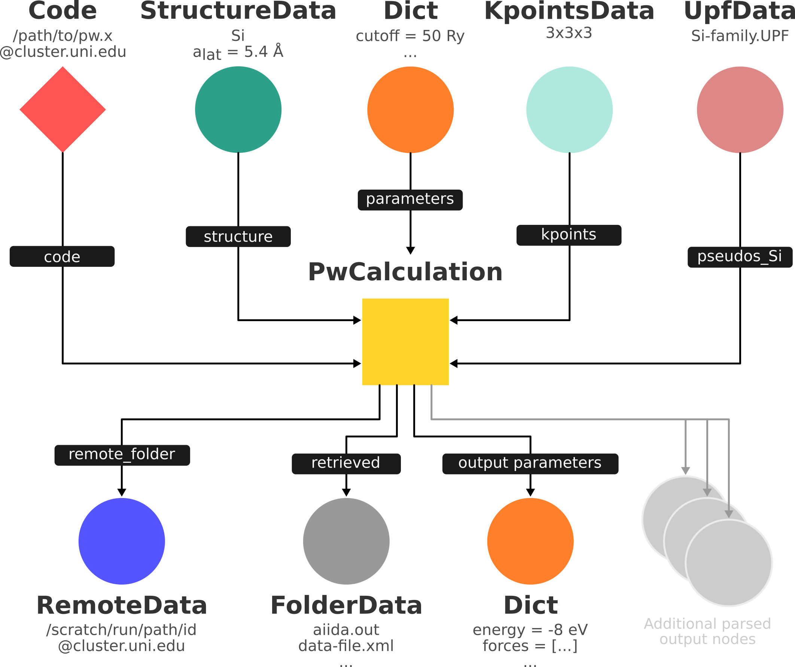

.. _2020_virtual_intro:running:

********************
Running computations
********************

In this section we'll be learning how to run external codes with AiiDA through calculation plugins.

We will use the `Quantum ESPRESSO <https://www.quantum-espresso.org/>`_ package to launch a simple `density functional theory <https://en.wikipedia.org/wiki/Density_functional_theory>`_ calculation of a silicon crystal using the :doi:`PBE exchange-correlation functional <10.1103/PhysRevLett.77.3865>` and check its results.
In doing so, we will intentionally introduce some bogus input parameters in order to show how to 'manually' debug problems when encountering errors.
Workflows, which you'll see later in this tutorial, can help you avoid these issues systematically.

Note that besides the `aiida-quantumespresso <https://github.com/aiidateam/aiida-quantumespresso>`_ plugin, AiiDA comes with plugins for many other codes, all of which are listed in the `AiiDA plugin registry <https://aiidateam.github.io/aiida-registry/>`_.

.. _2020_virtual_intro:running:computer:

Computer setup
==============

In a production environment, AiiDA would typically be running on your work station or laptop, while launching calculations on remote high-performance compute resources that you have SSH access to.
For this reason AiiDA has the concept of a ``Computer`` to run calculations on.

To keep things simple, Quantum ESPRESSO (together with several other *ab initio* codes) has been installed directly in your virtual machine, and you are going to launch your first calculations on the same computer where AiiDA is installed.
Nevertheless, even if it is the same computer, we need to create a new ``Computer`` instance in AiiDA in order to launch calculations on it:

.. code:: bash

    verdi computer setup --config computer.yml

where ``computer.yml`` is a configuration file in the `YAML format <https://en.wikipedia.org/wiki/YAML#Syntax>`_  that you can :download:`download here <include/configuration/computer.yml>`. This is its content:

.. literalinclude:: include/configuration/computer.yml
    :language: yaml

.. note::
    When used without the ``--config`` option, ``verdi computer setup`` will prompt you for the required information, just like you have seen when :ref:`setting up a profile<2020_virtual_intro:setup_profile>`.
    The configuration file should work for the virtual machine that comes with this tutorial but may need to be adapted when you are running AiiDA in a different environment, as explained in the :ref:`aiida online documentation <aiida:how-to:run_codes:computer>`.

The ``computer setup`` step informs AiiDA of the existence of the computer and of its basic settings, like the scheduler installed on it. Before being able to use the computer, you also need to provide AiiDA with information on how to access the ``Computer``.
For remote computers with ``ssh`` transport, this would involve e.g. an SSH key, the username on the remote computer, the port to connect to, etc.
For ``local`` computers, this is just a "formality" (press enter to confirm the default cooldown time, that is the time between consecutive opening of a connection - for a local computer this can be safely set to zero, while when connecting via SSH it is better to leave a time of a few seconds, to avoid overloading of the remote computer):

.. code:: bash

    verdi computer configure local localhost

.. note::

   For remote computers with ``ssh`` transport, use ``verdi computer configure ssh`` instead of ``verdi computer configure local``.

Your ``localhost`` computer should now show up in

.. code:: bash

   verdi computer list

.. note::

    AiiDA export archives like the one we imported :ref:`in the very beginning <2020_virtual_importing_data>` can also contain computers set up by other AiiDA users (without the private *configuration* information).
    Use ``verdi computer list -a`` to list both configured and unconfigured computers.

Before proceeding, test that it works:

.. code:: bash

    verdi computer test localhost

Code setup
==========

Now that we have our localhost set up, let's configure the ``Code``, namely the ``pw.x`` executable.
As with the computer, we have prepared a configuration file for you to :download:`download <include/configuration/code.yml>`.
This is its content:

.. literalinclude:: include/configuration/code.yml
    :language: yaml

Once you have the configuration file in your local working environment, set up the code:

.. code:: bash

    verdi code setup --config code.yml

Try to understand the various parameters in the YAML file.
In particular, we note that this code needs the ``quantumespresso.pw`` plugin, and we are specifying the fact that the code is already present on the computer, the absolute path to this code, the name of the AiiDA computer (``localhost``) on which it is, and some text to prepend before each execution (in this case ``ulimit -s unlimited``, but in other cases it could e.g. be a ``module load``).

.. warning::

    The configuration should work for the virtual machine that comes with this tutorial.
    If you are following this tutorial in a different environment, you will need to install Quantum ESPRESSO and adapt the configuration to your needs, as explained in the :ref:`aiida online documentation <aiida:how-to:run_codes:code>`.

Similar to the computers, you can list all the configured codes with:

.. code:: bash

    verdi code list

Verify that it now contains a code named ``qe-6.5-pw`` that we just configured.
You can always check the configuration details of an existing code using:

.. code:: bash

    verdi code show qe-6.5-pw

.. note::

   The ``generic`` profile has already a number of other codes configured.
   See ``verdi -p generic code list``.

   In order to also show codes created by other users (e.g. from imported archives), use ``verdi code list -A``.

The AiiDA daemon
================

First of all, check that the AiiDA daemon is actually running.
The AiiDA daemon is a program that

 * runs continuously in the background
 * waits for new calculations to be submitted
 * transfers the inputs of new calculations to your compute resource
 * checks the status of your calculation on the compute resource, and
 * retrieves the results from the compute resource

Check the status of the daemon process by typing in the terminal:

.. code:: bash

    verdi daemon status

If the daemon is running, the output should look like

.. code:: bash

    Profile: quicksetup
    Daemon is running as PID 2050 since 2019-04-30 12:37:12
    Active workers [1]:
      PID    MEM %    CPU %  started
    -----  -------  -------  -------------------
     2055    2.147        0  2019-04-30 12:37:12
    Use verdi daemon [incr | decr] [num] to increase / decrease the amount of workers

If this is not the case, type in the terminal

.. code:: bash

    verdi daemon start

to start the daemon.

Creating and launching calculations
===================================

In the following, we'll be working in the ``verdi shell``.
As you go along, feel free to keep track of your commands by copying them into a python script ``test_pw.py``.

.. note::

    The ``verdi shell`` imports a number of AiiDA internals so that you as the user don't have to.
    You can also make those available to a python script, by running it using

    .. code:: bash

        verdi run <scriptname>

Every calculation sent to a cluster is linked to a *code*, which describes the executable file as we saw earlier.
We also saw how to list all codes available using

.. code:: bash

    verdi code list

In this part of the tutorial we are interested in running the ``pw.x`` executable of Quantum ESPRESSO, i.e. in codes for the ``quantumespresso.pw`` plugin. If you have many codes for different executables, you can filter only those using a specific plugin with the command:

.. code:: bash

    verdi code list -P quantumespresso.pw

Pick the correct codename (``qe-6.5-pw@localhost`` if you followed the instrucitons earlier) and load it in the verdi shell:

.. code:: python

    code = load_code("<codename>")

.. note::

   ``load_code`` returns an object of type ``Code``, which is the general AiiDA class for describing simulation codes.

Let's build the inputs for a new ``PwCalculation`` (defined by the ``quantumespresso.pw`` plugin) using a "builder", a class provided by AiiDA that will help you out:

.. code:: python

    builder = code.get_builder()

As the first step, assign a (short) label or a (long) description to your calculation, that you might find convenient in the future.

.. code:: python

    builder.metadata.label = "PW test"
    builder.metadata.description = "My first AiiDA calc with Quantum ESPRESSO on Si"

This information will be saved in the database for later queries or inspection.
Note that you can press TAB after writing ``builder.`` to see all inputs available for this calculation.
In order to figure out which data type is expected for a particular input, such as ``builder.structure``, and whether the input is optional or required, use ``builder.structure?``.

Now, specify the number of machines (a.k.a. cluster nodes) you are going to run on and the maximum time allowed for the calculation.
The general options grouped under ``builder.metadata.options`` are independent of the code or plugin, and will be passed to the scheduler that handles the queue on your compute resource.

.. code:: python

    builder.metadata.options.resources = {'num_machines': 1}
    builder.metadata.options.max_wallclock_seconds = 30 * 60

Again, to see the list of available options, type ``builder.metadata.options.`` and hit the TAB button.

Preparation of inputs
---------------------

A Quantum Espresso calculation needs a number of inputs:

1. `Pseudopotentials <https://en.wikipedia.org/wiki/Pseudopotential>`_
2. a structure
3. a mesh in reciprocal space (k-points)
4. a number of input parameters

These are mirrored in the inputs of the ``aiida-quantumespresso`` plugin (see `documentation <https://aiida-quantumespresso.readthedocs.io/en/stable/user_guide/calculation_plugins/pw.html>`_).
We'll start with the structure, k-points, and pseudopotentials and leave the input parameters as the last thing to setup.

.. admonition:: Exercise

    Use what you learned in the previous section to load the ``structure`` and ``kpoints`` inputs for your calculation:

    * Use a silicon crystal structure
    * Define a ``2x2x2`` mesh of k-points.

    Note: If you just copy and paste code that you executed previously, this may result in duplication of information on your database.
    In fact, you can re-use an existing structure stored in your database [#f1]_.
    Use a combination of the bash command ``verdi data structure list`` and the python function ``load_node()`` to get an object representing the structure created earlier.

Attaching the input information to the calculation
--------------------------------------------------

Once you've created a ``structure`` node and a ``kpoints`` node, attach it to the calculation:

.. code:: python

    builder.structure = structure
    builder.kpoints = kpoints

.. note::

  The builder accepts both *stored* and *unstored* data nodes.
  AiiDA will take care of storing the unstored nodes upon submission.
  If you decide not to submit, nothing will be stored in the database.

PWscf also needs information on the pseudopotentials, in the form of a dictionary, where keys are the names of the elements and the values are the corresponding ``UpfData`` objects containing the information on the pseudopotential.
However, instead of creating the dictionary by hand, we can use a helper function that picks the right pseudopotentials for our structure from a pseudopotential *family*.
You can list the preconfigured families from the command line:

.. code:: bash

    verdi data upf listfamilies

Pick the one you :ref:`configured in the basics hands on<2020_virtual_intro:basic:pseudopotentials>` (the``SSSP`` family) and link the correct pseudopotentials to the calculation using the command:

.. code:: python

    from aiida.orm.nodes.data.upf import get_pseudos_from_structure
    builder.pseudos = get_pseudos_from_structure(structure, '<PSEUDO_FAMILY_NAME>')

Print the content of the ``pseudos`` namespace with ``print(builder.pseudos)`` to see what the helper function created.

Preparing and debugging input parameters
----------------------------------------

Finally, we need to specify a number of input parameters (i.e. plane wave cutoffs, convergence thresholds, etc.) to launch the Quantum ESPRESSO calculation.
The structure of the parameter dictionary closely follows the structure of the `PWscf input file <https://www.quantum-espresso.org/Doc/INPUT_PW.html>`_.

Since these are often the parameters to tune in a calculation, let's **introduce a few mistakes intentionally** and use this part of the tutorial to learn how to debug problems.

Define a set of input parameters for Quantum ESPRESSO, preparing a dictionary of the form:

.. code:: python

    parameters_dict = {
        'CONTROL': {
            'calculation': 'scf',
        },
        'SYSTEM': {
            'ecutwfc': 30.,
            'ecutrho': 200.,
            'mickeymouse': 240.,
        },
        'ELECTRONS': {
            'conv_thr': 1.e-14,
            'electron_maxstep': 3,
        },
    }

This dictionary is almost a valid input for the Quantum ESPRESSO plugin, except for an invalid key ``mickeymouse``. When Quantum ESPRESSO receives an unrecognized key, it will stop.
By default, the AiiDA plugin will *not* validate your input and simply pass it on to the code.

We have also introduced a combination of a very high accuracy (``'conv_thr': 1.e-14``) coupled with a very low maximum number of self consistent iterations (``'electron_maxstep': 3``).
This means that even if we eliminate the invalid key, the calculation will not converge and will not be successful, despite there not being any other mistake in the parameters dictionary.

Let's wrap the ``parameters_dict`` python dictionary in an AiiDA ``Dict`` node, and set it as the input of name ``parameters``. We'll see what happens.

.. code:: python

    builder.parameters = Dict(dict=parameters_dict)

Simulate submission
-------------------

At this stage, you have created in memory (it's not yet stored in the database) the input of the graph shown below.
The outputs will be created by the daemon later on.

In order to check which input files AiiDA creates, we can perform a *dry run* of the submission process.
Let's tell the builder that we want a dry run and that we don't want to store the provenance of the dry run:

.. code:: python

    builder.metadata.dry_run = True
    builder.metadata.store_provenance = False

It's time to run:

.. code:: python

    from aiida.engine import run
    run(builder)

.. note::

   Instead of using the builder, you can also simply pass the calculation class as the first argument, followed by the inputs as keyword arguments, e.g.:

   .. code:: python

      run(PwCalculation, structure=structure, pseudos={'Si': pseudo_node}, ....)

   The builder is simply a convenience wrapper providing tab-completion in the shell and automatic help strings.

This creates a folder of the form ``submit_test/[date]-0000[x]`` in the current directory.
In your second terminal:

 * open the input file ``aiida.in`` within this folder
 * compare it to input data nodes you created earlier
 * verify that the `pseudo` folder contains the needed pseudopotentials
 * have a look at the submission script ``_aiidasubmit.sh``

.. note::

   The files created by a dry run are only intended for  inspection
   and cannot be used to correct the inputs of your calculation.

Submitting the calculation
--------------------------

Up to now we've just been playing around and our calculation has been kept in memory and not in the database.
Now that we have inspected the input files and convinced ourselves that Quantum ESPRESSO will have all the information it needs to perform the calculation, we will submit the calculation properly.
Doing so will make sure that all inputs are stored in the database, will run and store the calculation and link the outputs to it.

Let's revert the following values in our builder to their defaults:

.. code:: python

    builder.metadata.dry_run = False
    builder.metadata.store_provenance = True

And then rely on the submit machinery of AiiDA,

.. code:: python

    from aiida.engine import submit
    calculation = submit(builder)

As soon as you have executed these lines, the ``calculation`` variable contains a ``PwCalculation`` instance, already submitted to the daemon.

.. note::

   You may have noticed that we used ``submit`` here instead of ``run``.
   The difference is that ``submit`` will hands over the calculation to the daemon running in the background, while ``run`` will execute all tasks in the current shell.

   All processes in AiiDA (you will soon get to know more) can be "launched" using one of available functions:

    * run
    * run_get_node
    * run_get_pk
    * submit

   which are explained in more detail in the `online documentation <https://aiida.readthedocs.io/projects/aiida-core/en/v1.3.0/topics/processes/usage.html?highlight=run_get_pk#launching-processes>`_.

The calculation is now stored in the database and was assigned a "database primary key" or ``pk`` (``calculation.pk``) as well as a UUID (``calculation.uuid``).
See the :ref:`previous section <2019-aiida-identifiers>` for more details on these identifiers.

To preserve the integrity of the data provenance, AiiDA will prevent you from changing the core content ("attributes") of a stored node.
There is an "extras" section though, which is writable after storage, to allow you to set additional information, e.g. as a way of labelling nodes and providing information for querying.

For example, let's add an extra attribute called ``element``, with value ``Si``:

.. code:: python

    calculation.set_extra("element", "Si")

In the mean time, after you submitted your calculation, the daemon picked it up and started to: generate the input files, submit the calculation to the queue, wait for it to run and finish, retrieve the output files, parse them, store them in the database and set the state of the calculation to ``Finished``.

.. note::

   If the daemon is not running, the calculation will remain in the ``NEW`` state until you start the daemon.

Checking the status of the calculation
--------------------------------------

You can check the calculation status from the command line:

.. code:: bash

    verdi process list

If you don't see any calculation in the output, the calculation you submitted has already finished.

.. note::

   Since you are running your DFT calculation directly on the VM, ``verdi`` commands can be a bit slow until the calculation finishes.

By default, the command only prints calculations that are still active [#f2]_.
Let's also list your finished calculations (and limit those only to the one created in the past day):

.. code:: bash

    verdi process list -a -p1

as explained in the first section.

Similar to the dry run, we can also inspect the input files of the *actual* calculation:

.. code:: bash

    verdi calcjob inputls <pk_number> -c

for the ``pk_number`` of your calculation. This will show the contents of the input directory (``-c`` prints directories in color).
Check the content of input files with

.. code:: bash

    verdi calcjob inputcat <pk_number> | less

Troubleshooting
===============

Your calculation should end up in a finished state, but with some error: this is represented by a non-zero error code in brackets near the "Finished" status of the State:

.. code:: bash

    $ verdi process list -a -p1
      PK  Created    Process label    Process State     Process status
    ----  ---------  ---------------  ----------------  ----------------
    2060  5m ago     PwCalculation    ⏹ Finished [305]
    ...
    $ # Anything but [0] after the Finished state signals a failure

This was expected, since we used an invalid key in the input parameters.
Situations like this happen in real life, so AiiDA provides tools to trace back to the source of the problem and correct it.

In general for any calculation (both successful and failed) you can get a more detailed summary by running:

.. code:: bash

    $ verdi process show <pk_number>
    Property     Value
    -----------  --------------------------------------------------------------------------------
    type         PwCalculation
    state        Finished [305] Both the stdout and XML output files could not be read or parsed.
    pk           2060
    uuid         95a58902-9c2a-47a7-b858-a058a2ea76e5
    label        PW test
    description  My first AiiDA calc with Quantum ESPRESSO on Si
    ctime        2020-06-30 07:16:45.987116+00:00
    mtime        2020-06-30 07:19:55.964423+00:00
    computer     [2] localhost

    Inputs      PK    Type
    ----------  ----  -------------
    pseudos
        Si      2043  UpfData
    code        2056  Code
    kpoints     2058  KpointsData
    parameters  2059  Dict
    structure   2057  StructureData

    Outputs              PK  Type
    -----------------  ----  --------------
    output_parameters  2064  Dict
    output_trajectory  2063  TrajectoryData
    remote_folder      2061  RemoteData
    retrieved          2062  FolderData

    Log messages
    ---------------------------------------------
    There are 4 log messages for this calculation
    Run 'verdi process report 2060' to see them

The last part of the output alerts you to the fact that there are some log messages waiting for you, if you run ``verdi process report <pk>``.

If you read the report, you will see that it says that the output files could not be parsed.
In this case you can also try inspecting directly the output file of PWscf.

.. code:: bash

    verdi calcjob outputcat <pk_number> | less

You will see an error message complaining about the ``mickeymouse`` line in the input.

Let's now correct our input parameters dictionary by leaving out the invalid key and see if our calculation succeeds:

.. code:: python

    parameters_dict = {
        "CONTROL": {
            "calculation": "scf",
        },
        "SYSTEM": {
            "ecutwfc": 30.,
            "ecutrho": 200.,
        },
        "ELECTRONS": {
            "conv_thr": 1.e-14,
            'electron_maxstep': 3,
        }
    }
    builder.parameters = Dict(dict=parameters_dict)
    calculation = submit(builder)

(Note: If you have been using the separate script approach, modify the script to remove the faulty input and run it again).

Use ``verdi process list -a -p1`` to verify that the error code is different now.
You can check again the outputs and the reports with the tools explained in this section and try to fix it yourself before going on to the next.

Restarting calculations
-----------------------

It turns out that your last calculation did not converge because we stopped the self-consistency iteration cycle before it converged (3).
In this simple case, you could just re-run the calculation from scratch with a sufficient number of iterations, but for expensive calculations (including a structural relaxation or molecular dynamics), you would like instead to restart your calculation from the previous one to save time.

For this purpose, ``CalcJobNode`` provides the ``get_builder_restart`` method.
Just like the ``get_builder`` method of the ``Code`` or of the ``Process`` class, this creates an instance of the ``ProcessBuilder``, but with all inputs already pre-populated from those of the "parent" node.

Let us load the node of the calculation job that we want to restart in a ``verdi shell`` and create a new builder from it:

.. code:: python

    failed_calculation = load_node(<pk>)
    restart_builder = failed_calculation.get_builder_restart()

Type ``restart_builder`` and press Enter to verify that all inputs have already been set to those that were used for the original calculation.
Let's give the new calculation some more steps in the SCF cycle in order to let it converge:

.. code:: python

    parameters = restart_builder.parameters.get_dict()
    parameters['ELECTRONS']['electron_maxstep'] = 80

The ``aiida-quantumespresso`` plugin supports restarting a calculation by setting the corresponding ``restart_mode`` and attaching the remote working directory of the previous calculations as the ``parent_folder`` input [#f3]_:

.. code:: python

    parameters['CONTROL']['restart_mode'] = 'restart'
    restart_builder.parent_folder = failed_calculation.outputs.remote_folder
    restart_builder.parameters = Dict(dict=parameters)

Note that we've created a new ``Dict`` node for the modifed parameters since the original input is stored in the database and immutable.

Finally, let's label this calculation as a restarted one and submit the new calculation:

.. code:: python

    restart_builder.metadata.label = 'Restart from PwCalculation<{}>'.format(failed_calculation.pk)
    calculation = submit(builder)

Inspect the restarted calculation to verify that, this time, it completes successfully.
You should see a "finished" status with exit code zero when running ``verdi process list -a -p1``.

Calculation results
===================

The results of a calculation can be accessed directly from the calculation node using the following:

.. code-block:: console

    $ verdi calcjob res <IDENTIFIER>

which will print the output dictionary of the 'scalar' results parsed by AiiDA at the end of the calculation.
Note that this is actually a shortcut for:

.. code-block:: console

    $ verdi data dict show <IDENTIFIER>

where ``IDENTIFIER`` refers to the ``Dict`` node attached as an output of the calculation node, with link name ``output_parameters``.
By looking at the output of the command, what is the Fermi energy of the calculation you have run?

Similarly to what you did for the calculation inputs, you can access the output files via the commands:

.. code-block:: console

    $ verdi calcjob outputls <IDENTIFIER>

and

.. code-block:: console

    $ verdi calcjob outputcat <IDENTIFIER>

Use the latter to verify that the Fermi energy that you have found in the last step has been extracted correctly from the output file.

.. tip::

    Filter the lines containing the string 'Fermi', e.g. using ``grep``, to isolate the relevant lines.

The results of calculations are stored in two ways: ``Dict`` objects are stored in the database, which makes querying them very convenient, whereas ``ArrayData`` objects are stored on the disk.
Once more, use the command ``verdi data array show <IDENTIFIER>`` to determine the Fermi energy obtained from calculation you ran.
This time you will need to use the identifier of the output ``ArrayData`` of the calculation, with link name ``output_trajectory_array``.
As you might have realized, the difference now is that the whole series of values of the Fermi energy calculated after each relax/vc-relax step are stored.
The choice of what to store in ``Dict`` and ``ArrayData`` nodes is made by the parser of ``pw.x`` implemented in the `aiida-quantumespresso <https://github.com/aiidateam/aiida-quantumespresso>`__ plugin.

The output of calculation jobs can also be obtained via the ``verdi shell``.
 For example, note down the PK of the calculation so that you can load it in the ``verdi shell`` and check the total energy with the commands:

.. code-block:: ipython

    In [1]: pw_node = load_node(<PK>)

Then get the energy of the calculation with the command:

.. code-block:: ipython

    In [2]: pw_node.res.energy
    Out[2]: -3890.18043749032

You can also type

.. code-block:: python

    node.res.

and then press ``TAB`` to see all the available results of the calculation.

Besides writing input files, running the software for you, storing the output files, and connecting it all together in your provenance graph, many AiiDA plugins will parse the output of your code and make output values of interest available through an output dictionary node (as depicted in the graph above).
In the case of the ``aiida-quantumespresso`` plugin this output node is available at ``calculation.outputs.output_parameters`` and you can access all the available attributes (not only the energy) using:

.. code:: python

    calculation.outputs.output_parameters.attributes

While the name of this output dictionary node can be chosen by the plugin, AiiDA provides the "results" shortcut ``calculation.res`` that plugin developers can use to provide what they consider the result of the calculation (so, in this case, ``calculation.res.energy`` is just a shortcut to ``calculation.outputs.output_parameters.attributes['energy']``).

.. rubric:: Footnotes

.. [#f1] In order to avoid duplication of KpointsData, you would first need to learn how to query the database, therefore we will ignore this issue for now.
.. [#f2] A process is considered active if it is either ``Created``, ``Running`` or ``Waiting``. If a process is no longer active, but terminated, it will have a state ``Finished``, ``Killed`` or ``Excepted``.
.. [#f3] The ``parent_folder`` input for reusing the remote working folder of a previous calculation is specific to the ``aiida-quantumespresso`` plugin, but similar patterns are used in other plugins.
    The ``PwCalculation`` ``CalcJob`` plugin will copy the ``outdir`` of the parent simulation into the appropriate location, where Quantum ESPRESSO's ``pw.x`` executable looks for wavefunctions, charge densities, etc.
    This allows to keep the checkpoint files (which may be large) on the remote machine, while still recording the provenance of the new calculation in the AiiDA graph as: ``parent_calculation --> remote_folder --> restart_calculation``.
