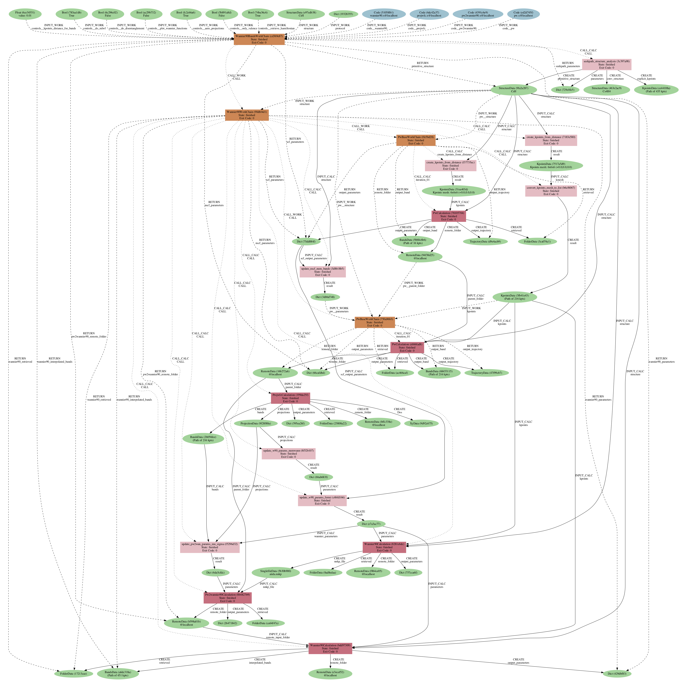

Automated high-throughput wannierisation
========================================

In the following tutorial you will learn how to perform automated high-throughput Wannierisation using \ 
a dedicated AiiDA workchain. 

The protocol for automating the construction of Wannier functions is discussed in the following article

* Valerio Vitale, Giovanni Pizzi, Antimo Marrazzo, Jonathan Yates, Nicola Marzari, Arash Mostofi,
  *Automated high-throughput wannierisation*, accepted in npj Computational Materials (2020);
  https://arxiv.org/abs/1909.00433; https://doi.org/10.24435/materialscloud:2019.0044/v2. 

which leverages the SCDM method that was introduced in:

* Anil Damle, Lin Lin, and Lexing Ying, 
  *Compressed representation of kohn–sham orbitals via selected columns of the density matrix*
  Journal of Chemical Theory and Computation 11, 1463–1469 (2015).

* Anil Damle and L. Lin, 
  *Disentanglement via entanglement: A unified method for wannier localization*,
  Multiscale Modeling & Simulation 16, 1392–1410 (2018).

Introduction
------------

The use of maximally-localised Wannier functions (MLWFs) in high-throughput (HT) workflows \ 
has been hindered by the fact that generating MLWFs automatically and robustly without any user \ 
intervention and for arbitrary materials is, in general, very challenging.

The procedure to obtain MLWFs requires to specify \ 
a number of parameters that depends on the specific system under study, \
such as 

* the type of projections to build the :math:`A_{mn}({\mathbf{k}})` matrix

and, in the case entangled bands, many other parameters like

* the number of Wannier functions
* the frozen energy window 
* the outer energy window

The SCDM method allows to circumvent the need to specify projections, \
by introducting an algorithm that builds the :math:`A_{mn}({\mathbf{k}})` matrix by \
optimally selecting columns of the density matrix :math:`P_{\mathbf{k}}`

.. math ::

    P_{\mathbf{k}}(\mathbf{r},\mathbf{r'})=\sum_{n=1}^{J}f(\epsilon_{n\mathbf{k}})\psi_{n{\mathbf{k}}}(\mathbf{r})\psi^*_{n{\mathbf{k}}}(\mathbf{r'})

where :math:`f(\epsilon_{n\mathbf{k}})` is an occupation function. 
The SCDM algorithm is based on a QR factorization with column pivoting (QRCP) and it is \
currently implemented in the pw2wannier90 code.

It is worth to stress that the occupation function does not necessarily correspond to \
a physical smearing, but it used as window function that restrics the manifold to the region of interest.
For example, the isolated-band case can be recovered by setting :math:`f(\epsilon_{n\mathbf{k}})=1` for energy values \
:math:`\epsilon_{n\mathbf{k}}` within the energy range of the isolated bands, and zero elsewhere. 
The occupation function can also be the so-called *error function* (erfc) 

.. math ::
  
  f(\epsilon)=\frac{1}{2}\mathrm{erfc}\left(\frac{\epsilon - \mu}{\sigma}\right)

and it is used to to deal with a manifold of bands that are entangled only in the upper energy region. 
The occupation function can also be a gaussian, for instance to extract specific bands from a fully \
entangled manifold.

While the SCDM method allows to avoid the disentanglement procedure, and so the need to specify \
the frozen and outer window, it does not provide a recipe to set the smearing function parameters \
:math:`\mu` and :math:`\sigma`. In addition, the number of Wannier function remains to be set and \
a sensible value typically requires some consideration, such as counting the number of atomic orbitals \
of a given orbital character (e.g. *s*, *p*, *d* or *sp3* like).

The Wannier90BandsWorkChain AiiDA workchain implements a protocol that deals with the choice \
of the number of Wannier functions and sets the parameters :math:`\mu` and :math:`\sigma` defining \
the smearing function. For a full explanation of protocol we refer to the article \
`Automated high-throughput wannierisation  <https://arxiv.org/abs/1909.00433>`_, while here we \
just outline the main features.

The workflow starts by running the DFT calculation, in particular by calling the dedicated AiiDA-QuantumESPRESSO \
workchains (more info `here <https://github.com/aiidateam/aiida-quantumespresso>`_) that take care of \
automation for the calculations performed with QuantumESPRESSO (QE). \
This is followed by a calculation of the *projectability*, that is the projection of the KS states \
over atomic orbitals

.. math ::
  
    p_{n\mathbf{k}} = \sum_{I,l,m}|\langle \psi_{n\mathbf{k}} | \phi_{Ilm}^{\mathbf{k}}\rangle|^2,

where the :math:`\phi_{Ilm}(\mathbf{k})` are the pseudo-atomic orbitals (PAO) employed in \
the generation of the pseudopotentials, :math:`I` is an index running over the atoms in the cell \
and :math:`lm` define the usual angular momentum quantum numbers. 

The workflow is designed on the use case where we wannierise the occupied bands plus some unoccupied \
or partially occupied bands.
The **number of Wannier functions** is set equal to the number of PAOs and the proctabilities are used to 
set the **optimal smearing function (erfc) parameters** :math:`\mu` and :math:`\sigma` as explained in \
`Automated high-throughput wannierisation  <https://arxiv.org/abs/1909.00433>`_.

After the calculation of the projectability, the workflow proceeds with standard wannierisation: first \
it computes the overlap and projection matrices and then runs the Wannier90 code.

Here we summarise the main steps of the Wannier90BandsWorkChain:

* SCF (QuantumESPRESSO pw.x)
* NSCF (QuantumESPRESSO pw.x)
* Projectability (QuantumESPRESSO projwfc.x)
* Wannier90 pre-processing (wannier90.x -pp)
* Overlap matrices, :math:`A_{mn}` with SCDM (QuantumESPRESSO pw2wannier90.x)
* Wannierisation (wannier90.x)

The output of the workflow include several objects, including the interpolated band structure, \
that we are going to inspect.

Running the workflow
--------------------

Let's finally run the workflow! Here we focus on how to run the Wannier90BandsWorkChain, the AiiDA workchain \
that implements the automation workflow to obtain MLWFs,for the full code documentation please visit the `AiiDA-Wannier90 documentation <https://aiida-wannier90.readthedocs.io/en/latest/>`_.

.. literalinclude:: include/snippets/scdm_workflow.py

Download the :download:`scdm_workflow.py <include/snippets/scdm_workflow.py>` script to your working directory.

Analyze and compare the band structure
--------------------------------------

.. code:: bash

   verdi data bands export --format mpl_pdf --output band_structure.pdf <PK>

Analyzing the outputs of the workflow
-------------------------------------

Now we analyse the outputs of the workflow. We begin by generating the provenance graph with

.. code:: bash

  verdi node graph generate <PK>

where the PK correspond to the workflow you have just run.
You should obtain something like the following 

   Provenance graph for a single Wannier90BandsWorkChain run.

As you can see, AiiDA has tracked all the inputs provided to the calculation, allowing you (or anyone else) to reproduce it later on.
AiiDA's record of a calculation is best displayed in the form of a provenance graph

(Optional) maximal localistion & SCDM
-------------------------------------

Try to modify the :download:`scdm_workflow.py <include/snippets/scdm_workflow.py>` script to disable the MLWF \
procedure in order to obtain Wannier functions with SCDM projections that are not localised.
Run the code for 1-2 materials of the dataser, do you notice any difference.