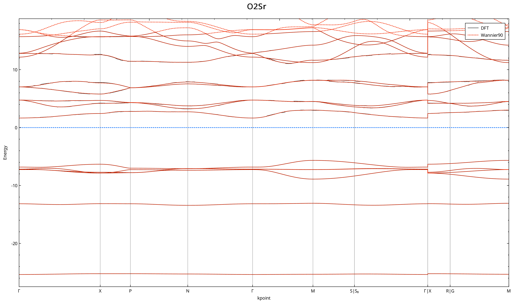
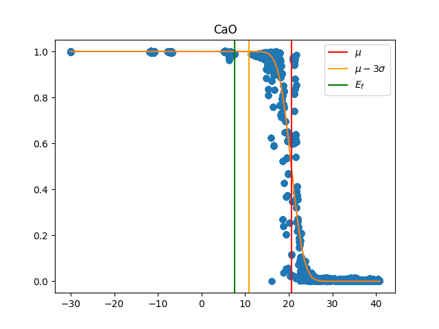
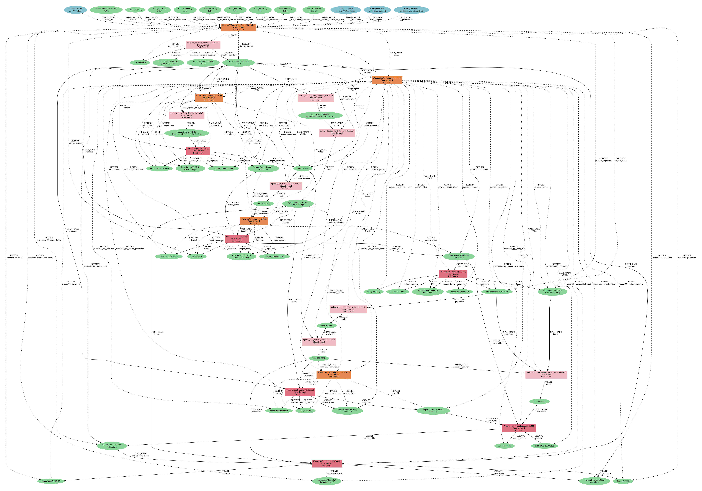

.. _Oxford 2020 autowannier:

Automated high-throughput wannierisation
========================================

In the following tutorial you will learn how to perform automated high-throughput Wannierisation using \ 
a dedicated AiiDA workchain. 

The protocol for automating the construction of Wannier functions is discussed in the following article

* Valerio Vitale, Giovanni Pizzi, Antimo Marrazzo, Jonathan Yates, Nicola Marzari, Arash Mostofi,
  *Automated high-throughput wannierisation*, accepted in npj Computational Materials (2020);
  https://arxiv.org/abs/1909.00433; https://doi.org/10.24435/materialscloud:2019.0044/v2. 

which leverages the SCDM method that was introduced in:

* Anil Damle, Lin Lin, and Lexing Ying, 
  *Compressed representation of kohn–sham orbitals via selected columns of the density matrix*
  Journal of Chemical Theory and Computation 11, 1463–1469 (2015).

* Anil Damle and L. Lin, 
  *Disentanglement via entanglement: A unified method for wannier localization*,
  Multiscale Modeling & Simulation 16, 1392–1410 (2018).

The initial workflow was written by Antimo Marrazzo (EPFL) and Giovanni Pizzi (EPFL), it was later \
substantially improved and upgraded to AiiDA v1.1.1 by Junfeng Qiao (EFPL). The SCDM implementation in \
QuantumESPRESSO was done by Valerio Vitale (Imperial College London and University of Cambridge).

**Launch while you read!**

The workflow should take a few minutes to run on the virtual machine, you can launch it now \
in the background while you read the introduction. 

Download the Wannier90BandsWorkChain
------------------------------------

First, let's download the Wannier90BandsWorkChain from GitHub and install it

.. code:: bash

    git clone https://github.com/aiidateam/aiida-wannier90-workflows.git
    cd aiida-wannier90-theosworkflows/
    pip install -e .

Now you can download the launch script here :download:`launch_auto-wannier_workflow.py <include/snippets/launch_auto-wannier_workflow.py>`.
The script can parse some input variables, like the protocol for the calculation \
and the location of the crystal structure file in the xsf format.
You can download some simple crystal structures from this list:

    * :download:`Ar2.xsf <include/xsf/Ar2.xsf>`
    * :download:`BrNa.xsf.xsf <include/xsf/BrNa.xsf>`
    * :download:`C6Mg4.xsf <include/xsf/C6Mg4.xsf>`
    * :download:`Cl2Ti.xsf <include/xsf/Cl2Ti.xsf>`
    * :download:`F4Ni2.xsf <include/xsf/F4Ni2.xsf>`
    * :download:`O2Rb2.xsf <include/xsf/O2Rb2.xsf>`
    * :download:`BaS.xsf <include/xsf/BaS.xsf>`
    * :download:`C6Mg4.xsf <include/xsf/C6Mg4.xsf>`
    * :download:`Cl2V.xsf <include/xsf/Cl2V.xsf>`
    * :download:`FNa.xsf <include/xsf/FNa.xsf>`
    * :download:`O2Sr.xsf <include/xsf/O2Sr.xsf>`
    * :download:`BeO4S.xsf <include/xsf/BeO4S.xsf>`
    * :download:`CaO.xsf <include/xsf/CaO.xsf>`
    * :download:`Cr2F4.xsf <include/xsf/Cr2F4.xsf>`
    * :download:`O2Pb2.xsf <include/xsf/O2Pb2.xsf>` 
    * :download:`PtS2.xsf <include/xsf/PtS2.xsf>`
    * :download:`Br2Ti.xsf <include/xsf/Br2Ti.xsf>`
    * :download:`Cl2O2Ti2.xsf <include/xsf/Cl2O2Ti2.xsf>`
    * :download:`CsH.xsf <include/xsf/CsH.xsf>`
    * :download:`O2Pd2.xsf <include/xsf/O2Pd2.xsf>`

Launch the script with the following command

.. code:: bash
    
    verdi run launch_auto-wannier_workflow.py CaO.xsf

You can replace CaO.xsf with any other structure that you find in the xsf folder, e.g. CsH.xsf or Br2Ti.xsf.

Introduction
------------

The use of maximally-localised Wannier functions (MLWFs) in high-throughput (HT) workflows \ 
has been hindered by the fact that generating MLWFs automatically and robustly without any user \ 
intervention and for arbitrary materials is, in general, very challenging.

The procedure to obtain MLWFs requires to specify \ 
a number of parameters that depends on the specific system under study, \
such as 

* the type of projections to build the :math:`A_{mn}({\mathbf{k}})` matrix

and, in the case entangled bands, many other parameters like

* the number of Wannier functions
* the frozen energy window 
* the outer energy window

The SCDM method allows to circumvent the need to specify projections, \
by introducting an algorithm that builds the :math:`A_{mn}({\mathbf{k}})` matrix by \
optimally selecting columns of the density matrix :math:`P_{\mathbf{k}}`

.. math ::

    P_{\mathbf{k}}(\mathbf{r},\mathbf{r'})=\sum_{n=1}^{J}f(\epsilon_{n\mathbf{k}})\psi_{n{\mathbf{k}}}(\mathbf{r})\psi^*_{n{\mathbf{k}}}(\mathbf{r'})

where :math:`f(\epsilon_{n\mathbf{k}})` is an occupation function. 
The SCDM algorithm is based on a QR factorization with column pivoting (QRCP) and it is \
currently implemented in the pw2wannier90 code.

It is worth to stress that the occupation function does not necessarily correspond to \
a physical smearing, but it used as a window function that restrics the manifold to the region of interest.
For example, the isolated-band case can be recovered by setting :math:`f(\epsilon_{n\mathbf{k}})=1` for energy values \
:math:`\epsilon_{n\mathbf{k}}` within the energy range of the isolated bands, and zero elsewhere. 
The occupation function can also be the so-called *error function* (erfc) 

.. math ::
  
  f(\epsilon)=\frac{1}{2}\mathrm{erfc}\left(\frac{\epsilon - \mu}{\sigma}\right)

and it is used to to deal with a manifold of bands that are entangled only in the upper energy region. 
The occupation function can also be a gaussian, for instance to extract specific bands from a fully \
entangled manifold.

While the SCDM method allows to avoid the disentanglement procedure, and so the need to specify \
the frozen and outer window, it does not provide a recipe to set the smearing function parameters \
:math:`\mu` and :math:`\sigma`. In addition, the number of Wannier function remains to be set and \
a sensible value typically requires some consideration, such as counting the number of atomic orbitals \
of a given orbital character (e.g. *s*, *p*, *d* or *sp3* like).

The Wannier90BandsWorkChain is an AiiDA workchain that implements a protocol that deals with the choice \
of the number of Wannier functions and sets the parameters :math:`\mu` and :math:`\sigma` defining \
the smearing function. For a full explanation of protocol we refer to the article \
`Automated high-throughput wannierisation  <https://arxiv.org/abs/1909.00433>`_, while here we \
just outline the main features.

The workflow starts by running the DFT calculation, in particular by calling the dedicated AiiDA-QuantumESPRESSO \
workchains (more info `here <https://github.com/aiidateam/aiida-quantumespresso>`_) that take care of \
automation for the calculations performed with QuantumESPRESSO (QE). \
This is followed by a calculation of the *projectability*, that is the projection of the KS states \
over atomic orbitals

.. math ::
  
    p_{n\mathbf{k}} = \sum_{I,l,m}|\langle \psi_{n\mathbf{k}} | \phi_{Ilm}^{\mathbf{k}}\rangle|^2,

where the :math:`\phi_{Ilm}(\mathbf{k})` are the pseudo-atomic orbitals (PAO) employed in \
the generation of the pseudopotentials, :math:`I` is an index running over the atoms in the cell \
and :math:`lm` define the usual angular momentum quantum numbers. 

The workflow is designed on the use case where we wannierise the occupied bands plus some unoccupied \
or partially occupied bands.
The **number of Wannier functions** is set equal to the number of PAOs and the proctabilities are used to 
set the **optimal smearing function (erfc) parameters** :math:`\mu` and :math:`\sigma` as explained in \
`Automated high-throughput wannierisation  <https://arxiv.org/abs/1909.00433>`_.

After the calculation of the projectability, the workflow proceeds with the standard wannierisation: first \
it computes the overlap and projection matrices and then runs the Wannier90 code.

Here we summarise the main steps of the Wannier90BandsWorkChain:

* SCF (QuantumESPRESSO pw.x)
* NSCF (QuantumESPRESSO pw.x)
* Projectability (QuantumESPRESSO projwfc.x)
* Wannier90 pre-processing (wannier90.x -pp)
* Overlap matrices, :math:`A_{mn}` with SCDM (QuantumESPRESSO pw2wannier90.x)
* Wannierisation (wannier90.x)

The output of the workflow include several objects, including the projectabilities \
and interpolated band structure, that we are going to inspect after the run.

Running the workflow
--------------------

If you have not launch the script yet, let's finally run the workflow! \
Here we focus on how to run the Wannier90BandsWorkChain, the AiiDA workchain \
that implements the automation workflow to obtain MLWFs, for the full code documentation of the \
AiiDA-Wannier90 plugin please visit the \
`AiiDA-Wannier90 documentation <https://aiida-wannier90.readthedocs.io/en/latest/>`_.

If you have not done it yet, you can start by downloading the \
:download:`launch_auto-wannier_workflow.py <include/snippets/launch_auto-wannier_workflow.py>` script to your work directory.
The script is reported also here below and allows to initialise and launch the AiiDA workchain. 

.. literalinclude:: include/snippets/launch_auto-wannier_workflow.py

The script can parse some input variables, like the protocol for the calculation \
and the location of the crystal structure file in the xsf format.
You can again download some simple crystal structures from this list

    * :download:`Ar2.xsf <include/xsf/Ar2.xsf>`
    * :download:`BrNa.xsf.xsf <include/xsf/BrNa.xsf>`
    * :download:`C6Mg4.xsf <include/xsf/C6Mg4.xsf>`
    * :download:`Cl2Ti.xsf <include/xsf/Cl2Ti.xsf>`
    * :download:`F4Ni2.xsf <include/xsf/F4Ni2.xsf>`
    * :download:`O2Rb2.xsf <include/xsf/O2Rb2.xsf>`
    * :download:`BaS.xsf <include/xsf/BaS.xsf>`
    * :download:`C6Mg4.xsf <include/xsf/C6Mg4.xsf>`
    * :download:`Cl2V.xsf <include/xsf/Cl2V.xsf>`
    * :download:`FNa.xsf <include/xsf/FNa.xsf>`
    * :download:`O2Sr.xsf <include/xsf/O2Sr.xsf>`
    * :download:`BeO4S.xsf <include/xsf/BeO4S.xsf>`
    * :download:`CaO.xsf <include/xsf/CaO.xsf>`
    * :download:`Cr2F4.xsf <include/xsf/Cr2F4.xsf>`
    * :download:`O2Pb2.xsf <include/xsf/O2Pb2.xsf>` 
    * :download:`PtS2.xsf <include/xsf/PtS2.xsf>`
    * :download:`Br2Ti.xsf <include/xsf/Br2Ti.xsf>`
    * :download:`Cl2O2Ti2.xsf <include/xsf/Cl2O2Ti2.xsf>`
    * :download:`CsH.xsf <include/xsf/CsH.xsf>`
    * :download:`O2Pd2.xsf <include/xsf/O2Pd2.xsf>`

Launch the script with the following command

.. code:: bash
    
    verdi run launch_auto-wannier_workflow.py --protocol 'testing' --xsf CaO.xsf

You can use a different structure now, so replace CaO.xsf with any other structure that you saw above folder, e.g. Cl2V.xsf or CsH.xsf.

For a full list of the available input arguments, use 

.. code:: bash

    verdi run -- launch_auto-wannier_workflow.py -h

with the output as

.. literalinclude:: include/snippets/launch_script_help.txt

**NB** Here for the tutorial we run the workflow in *testing* mode, where all the wavefunction cutoffs are halved to \
speed up the calculations. For production please use the 'theos-ht-1.0' protocol or any other sensible choice.

To get a list of all the AiiDA workchains that are running and their status you can use

.. code:: bash

    verdi process list

Analyzing the outputs of the workflow
-------------------------------------

Now we analyse the reports and outputs of the workflow using the command line.

While the Wannier90BandsWorkChain is running you can monitor the progress of the workflow by \
looking at the report using the command

.. code:: bash

    verdi process report <PK>

where PK corresponds to the workchain pk. You will see a log with messages printed by the workchain, \
including the pks of all the sub-workchains and calculations launched by the Wannier90BandsWorkChain, \
similar to the following:

.. literalinclude:: include/snippets/workchain_report.txt

Once the workchain has finished to run, you can look at all the inputs and outputs with

.. code:: bash

    verdi node show <PK>

You should obtain an output similar to what follows:

.. literalinclude:: include/snippets/workchain_show.txt

Analyzing and comparing the band structure
------------------------------------------

First let's give a look at the interpolated band structure by exporting a pdf file with

.. code:: bash

    verdi data bands export --format mpl_pdf --output band_structure.pdf <PK_bands>

where PK_bands stands for the BandsData pk produced by the workflow. \ 
You can find it :code:`verdi node show <PK>` with PK being the workchain pk.
You should obtain a pdf like the following:

.. figure:: `include/images/GaAs_wan_band.png`
   :width: 100%

Now we compare the Wannier-interpolated bands with the full DFT bands calculation.
For convenience, we have already computed for you all the full DFT band structures for the \
compounds you find the xsf folder. You can find the bands in the xmgrace (.agr) format in the the folder \
`/dft_bands`.

Take O2Sr as an example, :download:`O2Sr_wan_bands.agr <include/images/O2Sr_wan_bands.agr>`, \
:download:`O2Sr_dft_bands.agr <include/images/O2Sr_dft_bands.agr>`

You can first export the bands in the xmgrace format with 

.. code:: bash

    verdi data bands export --format agr --output O2Sr_wan_bands.agr <PK_bands>

and compare it with the full DFT band structure using xmgrace

.. code:: bash

    xmgrace O2Sr_dft_bands.agr O2Sr_wan_bands.agr

where you can replace O2Sr with any chemical formula of the other crystal structures we provide.

You should obtain something like this:

Analyzing the projectabilities
------------------------------

Now you will see how to look at the projectabilities that were use in the automation protocol.
You can download the following script \
:download:`plot_projectabilities.py <include/snippets/plot_projectabilities.py>` and run it

.. code:: bash

    verdi run plot_projectabilities.py <PK>

where PK stands for the Wannier90BandsWorkChain pk.

You should obtain a plot similar to the following:

As you can see the protocol to choose :math:`\mu` and :math:`\sigma` ensures that the \
SCDM algorithm is applied to a density-matrix that is made only by Kohn-Sham states \
that can be projected on the manifold spanned by the PAOs.

Analyzing the provenance graph
------------------------------

 We begin by generating the provenance graph with

.. code:: bash

    verdi node graph generate <PK>

where the PK correspond to the workflow you have just run.
You should obtain something like the following 

   Provenance graph for a single Wannier90BandsWorkChain run. (PDF version \
   :download:`O2Sr.dot.pdf <include/images/O2Sr.dot.pdf>`)

As you can see, AiiDA has tracked all the inputs provided to the calculation, allowing you (or anyone else) to reproduce it later on.
AiiDA's record of a calculation is best displayed in the form of a provenance graph

(Optional) Maximal localisation & SCDM
--------------------------------------

Try to modify the :download:`launch_auto-wannier_workflow.py <include/snippets/launch_auto-wannier_workflow.py>` script to disable the MLWF \
procedure in order to obtain Wannier functions with SCDM projections that are not localised.
Run the code for 1-2 materials of the dataser, do you notice any difference?

(Optional) Browse your database with the REST API
-------------------------------------------------

Connect to the `AiiDA REST API <https://www.materialscloud.org/explore/connect>`_ and browse your database! 
Follow the instruction that you find on the `Materials Cloud website <https://www.materialscloud.org/explore/connect>`_.

(Optional) More on AiiDA
------------------------

You now have a first taste of the type of problems AiiDA tries to solve.
Here are some options for how to continue:

 * Continue with the in-depth tutorial and learn more about the ``verdi``, ``verdi shell`` and ``python`` interfaces to AiiDA.
   There is more than enough material to keep you busy for a day.
 * Try `setting up AiiDA directly on your laptop <https://aiida-core.readthedocs.io/en/latest/install/quick_installation.html>`_.

   .. note:: **For advanced Linux & python users only**.
     AiiDA depends on a number of services and software that require some skill to set up. 
     Unfortunately, we don't have the human resources to help you solve
     issues related to your setup in a tutorial context.
