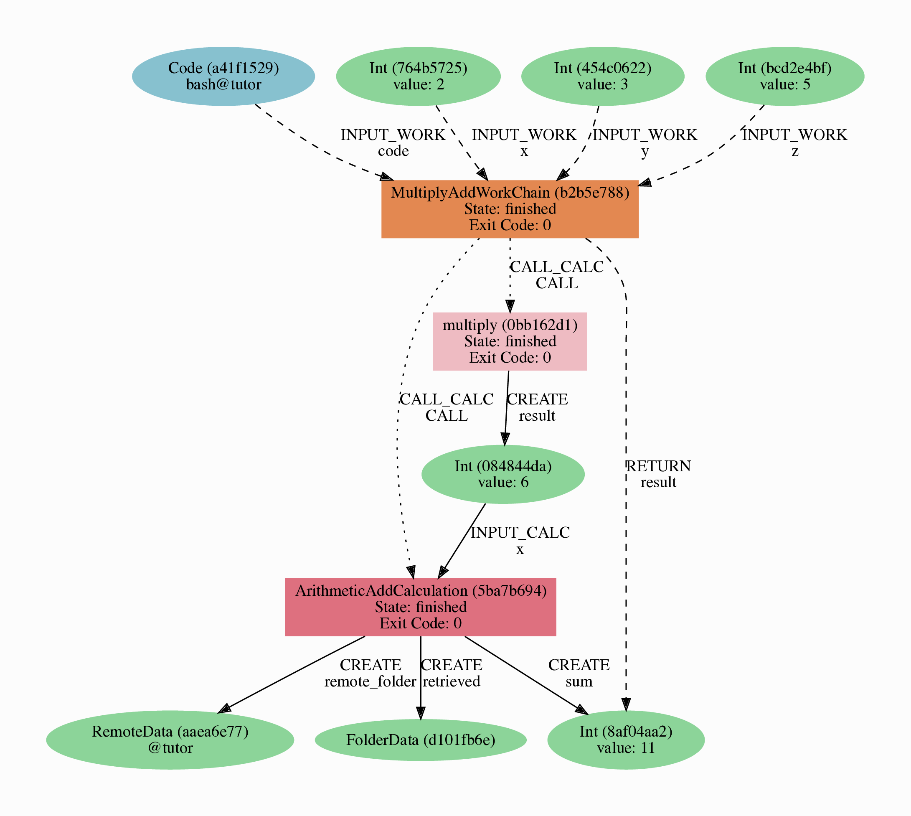
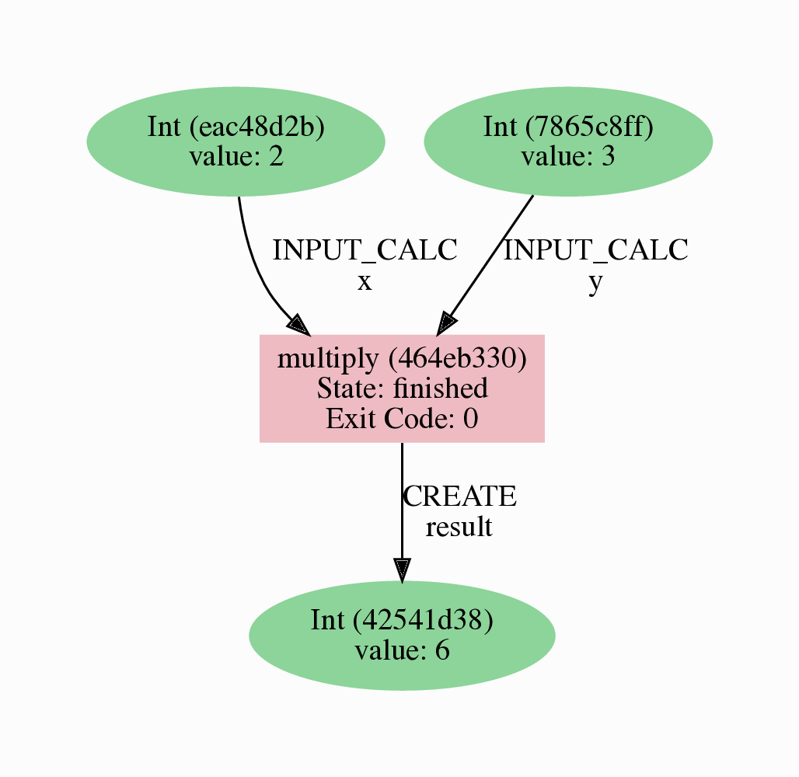
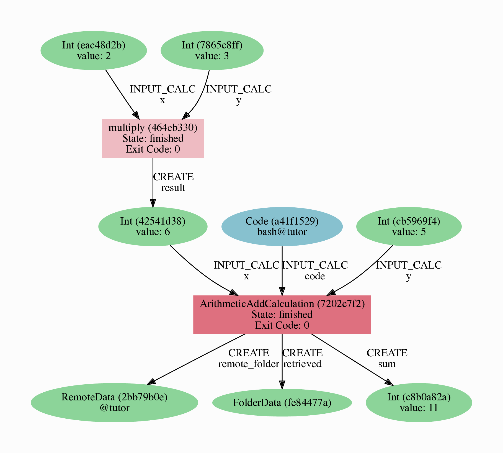

(fundamentals-basics)=

# AiiDA basics

This module will give you a first taste of some of the features of AiiDA, and help familiarize you with the `verdi` command-line interface (CLI), as well as AiiDA's IPython shell.

::::{tip}

The `verdi` command supports **tab-completion**!
In the terminal, type `verdi`, followed by a space and press the 'Tab' key twice to show a list of all the available sub commands.
Next, try typing `verdi sta` and then press "Tab" again.
This should _tab-complete_ into `verdi status`.
If not, try running the following commands:

```{code-block} console
echo 'eval "$(_VERDI_COMPLETE=bash_source verdi)"' > ~/.profile
source ~/.profile
```

For help on `verdi` or any of its subcommands, simply append the `--help` flag, e.g.:

```{code-block} console
$ verdi status --help
```

::::

:::{margin} {{ aiida }} **Further reading**

More details on the `verdi` CLI can be found in the {ref}`AiiDA documentation <aiida:topics:cli>`.

:::

## Provenance

To start, we need to briefly introduce one of the most important concepts in AiiDA: *provenance*.
An AiiDA database does not only contain the results of your calculations, but also their inputs and each step that was executed to obtain them.
All of this information is stored in the form of a *directed acyclic graph* (DAG).
As an example, {numref}`fig-intro-workchain-graph` shows the provenance of the calculations of the first part of this tutorial.

:::{figure-md} fig-intro-workchain-graph
:align: center



Provenance Graph of a basic AiiDA WorkChain.

:::

In the provenance graph, you can see different types of *nodes* represented by different shapes.
The green ellipses are `Data` nodes, the blue ellipse is a `Code` node, and the rectangles represent *processes*, i.e. the calculations performed in your *workflow*.

The provenance graph allows us to not only see what data we have, but also how it was produced.
During this basic tutorial we will first be using AiiDA to generate the provenance graph in {numref}`fig-intro-workchain-graph`, step by step.

## Data nodes

Before running any calculations, let's create and store a *data node*.
AiiDA ships with an interactive IPython shell that has many basic AiiDA classes pre-loaded.
To start the IPython shell, simply type in the terminal:

```{code-block} console
$ verdi shell
```

:::{margin} {{ python }} **Variables**

Variables are a basic concept in Python and most programming languages.
Understanding them is essential, so in case you are unfamiliar you can find a very short introduction [here](https://pythonbasics.org/variables/).

:::

AiiDA implements data node types for the most common types of data (int, float, str, etc.), which you can extend with your own (composite) data node types if needed.
For this tutorial, we'll keep it very simple, and start by initializing an `Int` node and assigning it to the `node` variable:

```{code-block} ipython

In [1]: node = Int(2)

```

:::{tip}

Commands you have to execute in the bash terminal or the `verdi shell` can be clearly distinguished via the corresponding prompts:

* Bash terminal:
  ```{code-block} console
  $ I am a bash command!
  ```
* `verdi shell`:
  ```{code-block} ipython
  In [1]: I am a verdi shell command
  ```

There is also a [copy button](https://sphinx-copybutton.readthedocs.io/en/latest/) in the top right of each code-snippet, that will only copy the _input_.
Try this with the code snippet after this tip!

:::


We can check the contents of the `node` variable like this:

```{code-block} ipython
In [2]: node
Out[2]: <Int: uuid: eac48d2b-ae20-438b-aeab-2d02b69eb6a8 (unstored) value: 2>
```

Quite a bit of information on our freshly created node is returned:

* The data node is of the type `Int`
* The node has the *universally unique identifier* (**UUID**) `eac48d2b-ae20-438b-aeab-2d02b69eb6a8`
* The node is currently not stored in the database `(unstored)`
* The integer value of the node is `2`

Let's store the node in the database:

```{code-block} ipython
In [3]: node.store()
Out[3]: <Int: uuid: eac48d2b-ae20-438b-aeab-2d02b69eb6a8 (pk: 1) value: 2>
```

As you can see, the data node has now been assigned a *primary key* (**PK**), a number that identifies the node in your database `(pk: 1)`.
The PK and UUID both reference the node with the only difference that the PK is unique *for your local database only*, whereas the UUID is a globally unique identifier and can therefore be used between *different* databases.
You'll typically use the PK when you are working within a single database and the UUID when you are collaborating with others to refer to nodes in other databases.

:::{important}

It is very likely that the PKs shown in the examples will be different for your database!
The UUIDs are generated randomly and are therefore **guaranteed** to be different for nodes created during the tutorial.

:::

Next, let's leave the IPython shell by typing `exit()` and then enter.
Back in the terminal, use the `verdi` command line interface (CLI) to check the data node we have just created:

:::{margin}

Make sure you replace `<PK>` with the PK of the `Int` node in your database!

:::

```{code-block} console
$ verdi node show <PK>
```

This prints something like the following:

```{code-block} bash
Property     Value
-----------  ------------------------------------
type         Int
pk           1
uuid         eac48d2b-ae20-438b-aeab-2d02b69eb6a8
label
description
ctime        2020-05-13 08:58:15.193421+00:00
mtime        2020-05-13 08:58:40.976821+00:00
```

:::{margin} {{ aiida }} **Further reading**

AiiDA already provides many standard data types, but you can also {ref}`create your own <aiida:topics:data_types:plugin:create>`.

:::

Once again, we can see that the node is of type `Int`, has PK = 1, and UUID = `eac48d2b-ae20-438b-aeab-2d02b69eb6a8`.
Besides this information, the `verdi node show` command also shows the (empty) `label` and `description`, as well as the time the node was created (`ctime`) and last modified (`mtime`).

(started-basics-calcfunction)=

## Calculation functions

Once your data is stored in the database, it is ready to be used for some computational task.
For example, let's say you want to multiply two `Int` data nodes.
The following Python function:

```{code-block} python

def multiply(x, y):
    return x * y

```

:::{margin} {{ python }} **Decorators**

A decorator can be used to add functionality to an existing function.
You can read more about them [here](https://pythonbasics.org/decorators/).

:::

will give the desired result when applied to two `Int` nodes, but the calculation will not be stored in the provenance graph.
However, we can use a Python _decorator_ provided by AiiDA to automatically make it part of the provenance graph.
Start up the AiiDA IPython shell again using `verdi shell` and execute the following code snippet:

```{code-block} ipython

In [1]: from aiida.engine import calcfunction
   ...:
   ...: @calcfunction
   ...: def multiply(x, y):
   ...:     return x * y

```

This converts the `multiply` function into an AiIDA *calculation function*, the most basic execution unit in AiiDA.
Next, load the `Int` node you have created in the previous section using the `load_node` function and the PK of the data node:

:::{margin}

Don't forget to replace the `<PK>`!

:::

```{code-block} ipython
In [2]: x = load_node(pk=<PK>)
```

Of course, we need another integer to multiply with the first one.
Let's create a new `Int` data node and assign it to the variable `y`:

```{code-block} ipython
In [3]: y = Int(3)
```

Now it's time to multiply the two numbers!

```{code-block} ipython
In [4]: multiply(x, y)
Out[4]: <Int: uuid: 42541d38-1fb3-4f60-8122-ab8b3e723c2e (pk: 4) value: 6>
```

Success!
The `calcfunction`-decorated `multiply` function has multiplied the two `Int` data nodes and returned a new `Int` data node whose value is the product of the two input nodes.
Note that by executing the `multiply` function, all input and output nodes are automatically stored in the database:

```{code-block} ipython

In [5]: y
Out[5]: <Int: uuid: 7865c8ff-f243-4443-9233-dd303a9be3c5 (pk: 2) value: 3>

```

We had not yet stored the data node assigned to the `y` variable, but by providing it as an input argument to the `multiply` function, it was automatically stored with PK = 2.
Similarly, the returned `Int` node with value 6 has been stored with PK = 4.

Let's once again leave the IPython shell with `exit()` and look for the process we have just run using the `verdi` CLI:

```{code-block} console
$ verdi process list
```

The returned list will be empty, but don't worry!
By default, `verdi process list` only returns the *active* processes.
If you want to see *all* processes (i.e. also the processes that are *terminated*), simply add the `-a/--all` option:

```{code-block} console
$ verdi process list -a
```

You should now see something like the following output:

```{code-block} bash

  PK  Created    Process label    Process State    Process status
----  ---------  ---------------  ---------------  ----------------
   3  1m ago     multiply         ⏹ Finished [0]

Total results: 1

Info: last time an entry changed state: 1m ago (at 09:01:05 on 2020-05-13)

```

We can see that our `multiply` calcfunction was created 1 minute ago, assigned the PK 3, and has `Finished`.

As a final step, let's have a look at the provenance of this simple calculation.
The provenance graph can be automatically generated using the verdi CLI.
Let's generate the provenance graph for the `multiply` calculation function we have just run with PK = 3:

```{code-block} console
$ verdi node graph generate <PK>
```

The command will write the provenance graph to a `.pdf` file.
The name of said file will start with the PK of your calculation node and have an intermediate `.dot` extension (in this case it would be `3.dot.pdf`).

The result should look something like the graph shown in {numref}`fig-calcfun-graph`.

:::{figure-md} fig-calcfun-graph
:align: center



Provenance graph of the `multiply` calculation function.

:::

(started-basics-calcjobs)=

## CalcJobs

When running calculations that require a (possibly non-Python) code external to AiiDA and/or run on a remote machine, a simple calculation function is no longer sufficient.
For this purpose, AiiDA provides the `CalcJob` process class.

To see all calculations available from the AiiDA packages installed in your environment you can use the `verdi plugin` command:

```{code-block} console
$ verdi plugin list aiida.calculations
```

This will show you a long list of _entry points_: strings that are used to identify each plugin within AiiDA.
In this list you should be able to see the `core.arithmetic.add` entry point, which identifies the calculation job we want to run:

```{code-block} console
Registered entry points for aiida.calculations:
(...)
* core.arithmetic.add
(...)

Info: Pass the entry point as an argument to display detailed information
```

:::{note}
If you just run `verdi plugin list`, you will get a list of all possible plugin _groups_.
:::

To get more information about the inputs, outputs, etc. of this calculation job, just follow the instructions at the end of the output and pass the `core.arithmetic.add` entry point as an additional argument for the command:

```{code-block} console
$ verdi plugin list aiida.calculations core.arithmetic.add
```

There is a lot of information we obtain with this command:

```{code-block} bash
Description:

    `CalcJob` implementation to add two numbers using bash for testing and demonstration purposes.

Inputs:
              x:  required  Int, Float       The left operand.
              y:  required  Int, Float       The right operand.
           code:  optional  Code             The `Code` to use for this job. This input is required, unless the `remote_ ...
       metadata:  optional
  remote_folder:  optional  RemoteData       Remote directory containing the results of an already completed calculation ...
Outputs:
  remote_folder:  required  RemoteData       Input files necessary to run the process will be stored in this folder node ...
      retrieved:  required  FolderData       Files that are retrieved by the daemon will be stored in this node. By defa ...
            sum:  required  Int, Float       The sum of the left and right operand.
   remote_stash:  optional  RemoteStashData  Contents of the `stash.source_list` option are stored in this remote folder ...
Exit codes:
              1:  The process has failed with an unspecified error.
              2:  The process failed with legacy failure mode.
             11:  The process did not register a required output.
            100:  The process did not have the required `retrieved` output.
            110:  The job ran out of memory.
            120:  The job ran out of walltime.
            310:  The output file could not be read.
            320:  The output file contains invalid output.
            410:  The sum of the operands is a negative number.
```

:::{margin} {{ aiida }} **Further reading**

If you're interested, you can find our more about how to write importers for existing calculations {ref}`in the AiiDA documentation <how-to:plugin-codes:importers>`.

:::

The first is description of the calculation, which explains that it adds two numbers together.
Then there are the inputs, of which 2 are required: the two numbers (`x` and `y`) to add.
The `code` used to add the two numbers is technically not required, since AiiDA comes with features to import completed `Calcjob`s without running them.
Below we will be running fresh calculations, so we'll have to provide the `code` as well.
Finally, note the `sum` among the outputs, which contains the result of the addition.

Now that we understand what our `CalcJob` does and what it needs, let's see what we need to do to run it.

### Preliminary setup

Before you run a `CalcJob`, you need to have two things: a `code` to run the desired calculation and a `computer` for the calculation to run on.
Most of our tutorial environments already have the `localhost` computer set up.
You can check that this is the case with `verdi computer list`:

```{code-block} console
$ verdi computer list
Info: List of configured computers
Info: Use 'verdi computer show COMPUTERLABEL' to display more detailed information
* localhost
```

If not, you can find instructions on how to do so in the dropdown below.

:::{dropdown} **Setting up the `localhost` computer**

You can set up the computer using the `verdi computer` subcommand:

```{code-block} console
$ verdi computer setup -L localhost -H localhost -T core.local -S core.direct -w `echo $HOME/aiida_run` --mpiprocs-per-machine 1 -n
$ verdi computer configure core.local localhost --safe-interval 0 -n
```

The first commands sets up the computer with the following options:

* *label* (`-L`): localhost
* *hostname* (`-H`): localhost
* *transport* (`-T`): local
* *scheduler* (`-S`): direct
* *work-dir* (`-w`): The `aiida_run` subdirectory of the home directory
* `--mpiprocs-per-machine`: The default number of MPI processes per machine is set to 1.

The second command *configures* the computer with a minimum interval between connections (`--safe-interval`) of 0 seconds, since we are running the calculations locally anyways.
For both commands, the *non-interactive* option (`-n`) is added to not prompt for extra input.

:::

Next, let's set up the code we're going to use for the tutorial:

```{code-block} console
$ verdi code create core.code.installed -L add --computer=localhost -P core.arithmetic.add --filepath-executable=/bin/bash -n
```

This command sets up a code with *label* `add` on the *computer* `localhost`, using the *plugin* `core.arithmetic.add`.

A typical real-world example of a computer is a remote supercomputing facility.
Codes can be anything from a Python script to powerful *ab initio* codes such as Quantum ESPRESSO or machine learning tools like Tensorflow.
Let's have a look at the codes that are available to us:

```{code-block} console
$ verdi code list
# List of configured codes:
# (use 'verdi code show CODEID' to see the details)
(...)
* pk 1 - add@localhost
```

In the output above you can see the code `add@localhost`, with PK = 1, in the printed list.
Again, in your output you may have other codes listed or a different PK depending on your specific setup, but you should still be able to identify the code by its label.
The `add@localhost` identifier indicates that the code with label `add` is run on the computer with label `localhost`.
To see more details about the computer, you can use the following `verdi` command:

```{code-block} console
$ verdi computer show localhost
---------------------------  ------------------------------------
Label                        localhost
PK                           1
UUID                         b88f478b-d9c8-4677-a223-83559587e3ff
Description                  this computer
Hostname                     localhost
Transport type               core.local
Scheduler type               core.direct
Work directory               /home/jovyan/aiida_run/
Shebang                      #!/bin/bash
Mpirun command
Default #procs/machine       1
Default memory (kB)/machine
Prepend text
Append text
---------------------------  ------------------------------------
```

We can see that the *Work directory* has been set up as the `aiida_run` subdirectory of the home directory.
This is the directory in which the calculations running on the `localhost` computer will be executed.

:::{note}

You may have noticed that in our example, the PK of the `localhost` computer is 1, same as the `Int` node we created at the start of this tutorial.
This is because different entities, such as nodes, computers and groups, are stored in different tables of the database.
So, the PKs for each entity type are unique for each database, but entities of different types can have the same PK within one database.

:::

(started-basics-calcjobs-run)=

### Running the CalcJob

Let's now start up the `verdi shell` again and load the `core.arithmetic.add` calculations using the `CalculationFactory`:

```{code-block} ipython
In [1]: ArithmeticAdd = CalculationFactory('core.arithmetic.add')
```

Now you need to gather the actual nodes that will be used as inputs for the calculation.
If you remember from before, there are three inputs we need to define:

1. **code** (the `Code` to use for the job)
2. **x** (the left operand, of type `Int` or `Float`)
3. **y** (the right operand, of type `Int` or `Float`)

For the code, you will use the `add@localhost` code using its label:

```{code-block} ipython
In [2]: code = load_code(label='add@localhost')
```

Let's use the `Int` node that was created by our previous `calcfunction` as one of the inputs and a new node as the second input:

```{code-block} ipython
In [3]: x = load_node(pk=<PK>)
   ...: y = Int(5)
```

:::{tip}

In case you don't remember the PK of the output node from the previous calculation, check the provenance graph you generated earlier and use the UUID of the output node instead.
For example (remember that your UUID is _guaranteed_ to be different!):

```{code-block} ipython
In [3]: x = load_node(uuid='42541d38')
   ...: y = Int(5)
```

Note that you don't have to provide the entire UUID to load the node.
As long as the first part of the UUID is unique within your database, AiiDA will find the node you are looking for.

:::

To execute the `CalcJob`, you need to feed it (together with the inputs) to the `run` function provided by the AiiDA engine:

```{code-block} ipython
In [4]: from aiida.engine import run
   ...: run(ArithmeticAdd, code=code, x=x, y=y)
```

Wait for the process to complete, as it may take a couple of seconds.
Once it is done, it will return a dictionary with the output nodes:

```{code-block} ipython
Out[4]:
{'sum': <Int: uuid: 7d5d781e-8f17-498a-b3d5-dbbd3488b935 (pk: 8) value: 11>,
'remote_folder': <RemoteData: uuid: 888d654a-65fb-4da0-b3bc-d63f0374f274 (pk: 9)>,
'retrieved': <FolderData: uuid: 4733aa78-2e2f-4aeb-8e09-c5cfb58553db (pk: 10)>}
```

Besides the sum of the two `Int` nodes, the calculation function also returns two other outputs: one of type `RemoteData` and one of type `FolderData`.
See the {ref}`topics section on calculation jobs <topics:calculations:usage:calcfunctions>` for more details.
Now, exit the IPython shell and once more check for *all* processes:

```{code-block} console
$ verdi process list -a
```

You should now see two processes in the list.
One is the `multiply` calcfunction you ran earlier, the second is the `ArithmeticAddCalculation` CalcJob that you have just run.
Grab the PK of the `ArithmeticAddCalculation`, and generate the provenance graph.
The result should look like the graph shown in {numref}`fig-calcjob-graph`.

```{code-block} console
$ verdi node graph generate <PK>
```

:::{figure-md} fig-calcjob-graph
:align: center



Provenance graph of the `ArithmeticAddCalculation` CalcJob, with one input provided by the output of the `multiply` calculation function.

:::

You can see more details on any process, including its inputs and outputs, using the verdi shell:

```{code-block} console
$ verdi process show <PK>
```

### Submitting to the daemon

When we used the `run` command in the previous section, the IPython shell was blocked while it was waiting for the `CalcJob` to finish.
This is not a problem when we're simply multiplying two numbers, but if we want to run multiple calculations that take hours or days, this is no longer practical.
Instead, we are going to *submit* the `CalcJob` to the AiiDA *daemon*.
The daemon is a program that runs in the background and manages submitted calculations until they are *terminated*.

Let's first check the status of the daemon using the `verdi` CLI:

```{code-block} console
$ verdi daemon status
```

If the daemon is running, the output will be something like the following:

```{code-block} bash
Profile: tutorial
Daemon is running as PID 96447 since 2020-05-22 18:04:39
Active workers [1]:
  PID    MEM %    CPU %  started
-----  -------  -------  -------------------
96448    0.507        0  2020-05-22 18:04:39
Use verdi daemon [incr | decr] [num] to increase / decrease the amount of workers
```

In this case, let's stop it for now:

```{code-block} console
$ verdi daemon stop
```

Next, let's *submit* the `CalcJob` we ran previously.
Start the `verdi shell` and execute the Python code snippet below.
This follows all the steps we did previously, but now uses the `submit` function instead of `run`:

```{code-block} ipython
In [1]: from aiida.engine import submit
   ...:
   ...: ArithmeticAdd = CalculationFactory('core.arithmetic.add')
   ...: code = load_code(label='add@localhost')
   ...: x = load_node(pk=<PK>)
   ...: y = Int(5)
   ...:
   ...: submit(ArithmeticAdd, code=code, x=x, y=y)
```

When using `submit` the calculation job is not run in the local interpreter but is sent off to the daemon and you get back control instantly.
Instead of the *result* of the calculation, it returns the node of the `CalcJob` that was just submitted:

```{code-block} ipython
Out[1]: <CalcJobNode: uuid: e221cf69-5027-4bb4-a3c9-e649b435393b (pk: 12) (aiida.calculations:core.arithmetic.add)>
```

Let's exit the IPython shell and have a look at the process list:

```{code-block} console
$ verdi process list
```

You should see the `CalcJob` you have just submitted, with the state `Created`:

```{code-block} bash
  PK  Created    Process label             Process State    Process status
----  ---------  ------------------------  ---------------  ----------------
  12  13s ago    ArithmeticAddCalculation  ⏹ Created

Total results: 1

Info: last time an entry changed state: 13s ago (at 09:06:57 on 2020-05-13)
Warning: the daemon is not running
```

The `CalcJob` process is now waiting to be picked up by a daemon runner, but the daemon is currently disabled.
Let's start it up (again):

```{code-block} console
$ verdi daemon start
```

Now you can either use `verdi process list` to follow the execution of the `CalcJob`.

Let's wait for the `CalcJob` to complete (state changes to "Finished").
Use `verdi process list -a` to see all processes we have run so far:

```{code-block} bash
  PK  Created    Process label             Process State    Process status
----  ---------  ------------------------  ---------------  ----------------
   3  6m ago     multiply                  ⏹ Finished [0]
   7  2m ago     ArithmeticAddCalculation  ⏹ Finished [0]
  12  1m ago     ArithmeticAddCalculation  ⏹ Finished [0]

Total results: 3

Info: last time an entry changed state: 14s ago (at 09:07:45 on 2020-05-13)
```

## Workflows

So far we have executed each process manually.
AiiDA allows us to automate these steps by linking them together in a *workflow*, whose provenance is stored to ensure reproducibility.
For this tutorial we have prepared a basic `WorkChain` that is already implemented in `aiida-core`.
You will see more details on how to write such a work chain in {ref}`the module on writing work chains <workflows-workchain>`.

:::{note}

Besides work chains, workflows can also be implemented as *work functions*.
These are ideal for workflows that are not very computationally intensive and can be easily implemented in a Python function.

:::

Just like we did for `aiida.calculations`, to see all available workflows you can run `verdi plugin list aiida.workflows`.
You should be able to see the `core.arithmetic.multiply_add` entry point, among others.
Once again, to get the specific information for this work chain you just need to run:

```{code-block} console
$ verdi plugin list aiida.workflows core.arithmetic.multiply_add
```

Which gives the following information on the work chain:

```{code-block} bash
Description:

	WorkChain to multiply two numbers and add a third, for testing and demonstration purposes.

Inputs:
      code:  required  Code
         x:  required  Int
         y:  required  Int
         z:  required  Int
  metadata:  optional
Outputs:
    result:  required  Int
Exit codes:
         1:  The process has failed with an unspecified error.
         2:  The process failed with legacy failure mode.
        10:  The process returned an invalid output.
        11:  The process did not register a required output.
       400:  The result is a negative number.
```

Let's run the `WorkChain` above!
Just as we did before with the `CalculationFactory`, we will load the `MultiplyAddWorkChain` using the `WorkflowFactory` (which works in the same way but is used for workflows instead of calculations).
Start up the `verdi shell` and run:

```{code-block} ipython
In [1]: MultiplyAddWorkChain = WorkflowFactory('core.arithmetic.multiply_add')
```

We will now load the necessary nodes for each of the inputs required by the `WorkChain` (see the specifications above):

```{code-block} ipython
In [2]: code = load_code(label='add@localhost')
   ...: x = Int(2)
   ...: y = Int(3)
   ...: z = Int(5)
```

And finally we will submit it to the daemon using the `submit` function from the AiiDA engine:

```{code-block} ipython
In [3]: from aiida.engine import submit
   ...: submit(MultiplyAddWorkChain, code=code, x=x, y=y, z=z)
```

Now quickly leave the IPython shell and check the process list:

```{code-block} console
$ verdi process list -a
```

Depending on which step the workflow is running, you should get something like the following:

```{code-block} bash
  PK  Created    Process label             Process State    Process status
----  ---------  ------------------------  ---------------  ------------------------------------
   3  7m ago     multiply                  ⏹ Finished [0]
   7  3m ago     ArithmeticAddCalculation  ⏹ Finished [0]
  12  2m ago     ArithmeticAddCalculation  ⏹ Finished [0]
  19  16s ago    MultiplyAddWorkChain      ⏵ Waiting        Waiting for child processes: 22
  20  16s ago    multiply                  ⏹ Finished [0]
  22  15s ago    ArithmeticAddCalculation  ⏵ Waiting        Waiting for transport task: retrieve

Total results: 6

Info: last time an entry changed state: 0s ago (at 09:08:59 on 2020-05-13)
```

We can see that the `MultiplyAddWorkChain` is currently waiting for its *child process*, the `ArithmeticAddCalculation`, to finish.
Check the process list again for *all* processes (You should know how by now!).
After about half a minute, all the processes should be in the `Finished` state.

We can now generate the full provenance graph for the `WorkChain` using the `<PK>` of the `MultiplyAddWorkChain`:

```{code-block} console
$ verdi node graph generate <PK>
```

Open the generated pdf file.
Look familiar?
The provenance graph should be similar to the one we showed at the start of this tutorial ({numref}`fig-workchain-graph`).

:::{figure-md} fig-workchain-graph
:align: center


Final provenance Graph of the basic AiiDA tutorial.

:::
## Next steps

Congratulations! You have completed the first step to becoming an AiiDA expert.

The next step is to learn all about {ref}`running processes <processes>` with AiiDA.
