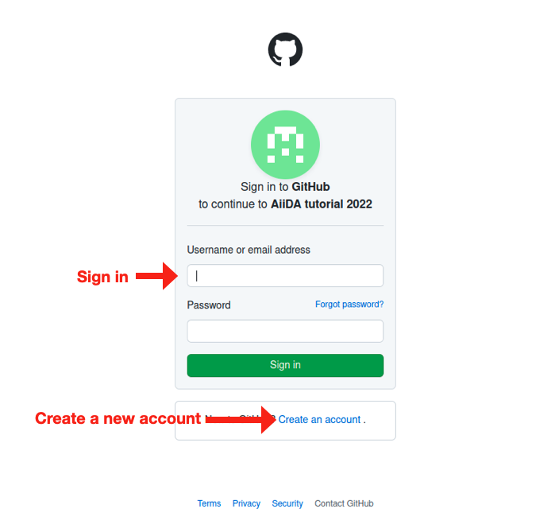
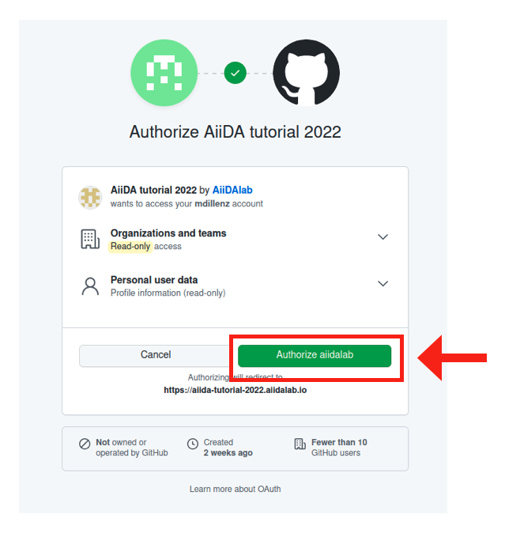

(fundamentals-setup)=

# Set up

## Running on Microsoft Azure Kubernetes deployment

For the tutorial running from 4-7 October 2022, we have set up a JupyterHub deployment based on the [AiiDAlab docker stack](https://github.com/aiidalab/aiidalab-docker-stack) and a [Kubernetes cluster on Microsoft Azure](https://github.com/aiidalab/aiidalab-on-azure).
The JupyterHub is accessible via the following link:

[https://aiida-tutorial-2022.aiidalab.io/](https://aiida-tutorial-2022.aiidalab.io/)

Authentication is done via GitHub, just click the "Sign in with GitHub button" to get started.
If you don't have a GitHub account yet, you'll have to sign up for one:

:::{figure-md} fig-github-auth-1
:align: center



Signing into GitHub.

:::

Once you've signed in, the GitHub authentication needs some basic information regarding your profile.
Click "Authorize aiidalab" to continue.

:::{figure-md} fig-github-auth-2
:align: center



Authorizing the AiiDAlab authentication.

:::

Once you've managed to authenticate successfully, you should see the [JupyterLab interface](https://jupyterlab.readthedocs.io/en/stable/user/interface.html).
Try to open a terminal and type `verdi status`.
If you see all green checkmarks, everything is set up successfully and you should be ready to go!

:::{important}

As the tutorial has been fully tested on the Azure JupyterHub deployment, we highly recommend tutorial participants to run the tutorial material here!

:::

:::{note} **Deploying AiiDAlab on Microsoft Azure**

Interested in having your own deployment of AiiDAlab on the Microsoft Azure Kubernetes Service?
You can find all instructions on the corresponding GitHub repository:

[https://github.com/aiidalab/aiidalab-on-azure](https://github.com/aiidalab/aiidalab-on-azure)

:::

## Setup on your own machine

To run the tutorial on your own machine, you need to install:

- [AiiDA](https://aiida.readthedocs.io/projects/aiida-core/en/latest/intro/get_started.html) (version 2.0.4)
- [aiida-quantumespresso](https://aiida-quantumespresso.readthedocs.io/en/latest/#installation) (version 4.0.1)
- [Quantum ESPRESSO](https://www.quantum-espresso.org/) (version 7.0)

```{note} Version numbers indicate the versions with which the tutorial was tested.
```
