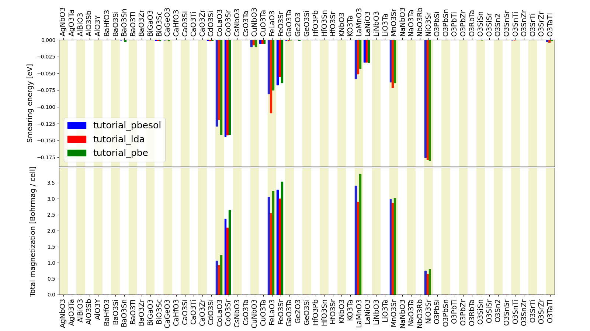

.. _data:

*******************************************
Working with data and querying your results
*******************************************

In this section of the tutorial, we will focus on how to organise and explore the data in an AiiDA database.
We will use a previously created database for this tutorial.
To follow the tutorial, you first need to import that archive into your database:

.. code-block:: console

   $ verdi import https://object.cscs.ch/v1/AUTH_b1d80408b3d340db9f03d373bbde5c1e/marvel-vms/tutorials/aiida_tutorial_2020_07_perovskites_v0.9.aiida

The import can take several minutes.

How to group nodes
------------------

AiiDA's database is great for automatically storing all your data, but sometimes it can be tricky to navigate this flat data store.
To create some order in this mass of data, you can *group* sets of nodes together, just as you would with files in folders on your filesystem.
Each group can hold any amount of nodes and any node can be contained in any number of groups.
A typical use case is to store all nodes that share a common property in a single group.

Listing existing groups
^^^^^^^^^^^^^^^^^^^^^^^

Lets explore the groups already present in the imported archive:

.. code-block:: console

   $ verdi group list -a -A
   PK    Label            Type string    User
   ----  ---------------  -------------  ---------------
      1  tutorial_pbesol  core           aiida@localhost
      2  tutorial_lda     core           aiida@localhost
      3  tutorial_pbe     core           aiida@localhost
      4  GBRV_pbe         core.upf       aiida@localhost
      5  GBRV_pbesol      core.upf       aiida@localhost
      6  GBRV_lda         core.upf       aiida@localhost
      7  20200705-071658  core.import    aiida@localhost

The default table shows us four pieces of information:

PK
   The Primary Key of the group
Label
   The label by which the group has been named
Type string
   This tells us what "sub-class" of group this is.
   Type strings can be used to class certain types of data, for example here we have general groups (``core``), groups containing pseudopotentials (``core.upf``), and an auto-generated group containing the nodes we imported from the archive (``core.import``).
   For advanced use, you can create your own group subclass plugins, with specialised methods.
User
   The email of the user that created this group.

.. tip::

   The ``-a`` and ``-A`` flags we used above ensure that groups for all type strings and users are shown respectively.

We can then inspect the content of a group by its label (if it is unique) or the PK:

.. code-block:: console

   $ verdi group show tutorial_pbesol
   -----------------  ----------------
   Group label        tutorial_pbesol
   Group type_string  core
   Group description  <no description>
   -----------------  ----------------
   # Nodes:
   PK    Type         Created
   ----  -----------  -----------------
    380  CalcJobNode  2078D:17h:46m ago
   1273  CalcJobNode  2078D:18h:03m ago
   ...

Conversely, if you want to see all the groups a node belongs to, you can run:

.. code-block:: console

   $ verdi group list -a -A --node 380
   PK    Label            Type string    User
   ----  ---------------  -------------  ---------------
      1  tutorial_pbesol  core           aiida@localhost
      7  20200705-071658  core.import    aiida@localhost

Creating and manipulating groups
^^^^^^^^^^^^^^^^^^^^^^^^^^^^^^^^

Lets make a new group:

.. code-block:: console

   $ verdi group create a_group
   Success: Group created with PK = 8 and name 'a_group'

If we want to change the name of the group at any time:

.. code-block:: console

   $ verdi group relabel a_group my_group
   Success: Label changed to my_group

Now we can add one or more nodes to it:

.. code-block:: console

   $ verdi group add-nodes -G my_group 380 1273
   Do you really want to add 2 nodes to Group<my_group>? [y/N]: y

We can also copy the nodes from an existing group to another group:

.. code-block:: console

   $ verdi group copy tutorial_pbesol my_group
   Warning: Destination group<my_group> already exists and is not empty.
   Do you wish to continue anyway? [y/N]: y
   Success: Nodes copied from group<tutorial_pbesol> to group<my_group>
   $ verdi group show my_group
   -----------------  ----------------
   Group label        my_group
   Group type_string  core
   Group description  <no description>
   -----------------  ----------------
   # Nodes:
   PK    Type         Created
   ----  -----------  -----------------
   74  CalcJobNode  2078D:17h:51m ago
   76  CalcJobNode  2078D:17h:57m ago
   ...

To remove nodes from the group run:

.. code-block:: console

   $ verdi group remove-nodes -G my_group 74
   Do you really want to remove 1 nodes from Group<my_group>? [y/N]: y

and finally to remove the group entirely:

.. code-block:: console

   $ verdi group delete my_group
   Are you sure to delete Group<my_group>? [y/N]: y
   Success: Group<my_group> deleted.

.. important::

   Any deletion operation related to groups won't affect the nodes themselves.
   For example if you delete a group, the nodes that belonged to the group will remain in the database.
   The same happens if you remove nodes from the group -- they will remain in the database but won't belong to the group any more.

Organising groups in hierarchies
--------------------------------

Earlier, we mentioned that groups are like files in folders on your filesystem.
As with folders and sub-folders then, as the amount of groups we have grows, we may also wish to structure our groups in a hierarchy.
Groups in AiiDA are inherently "flat", in that groups may only contain nodes and not other groups.
However it is possible to construct *virtual* group hierarchies based on delimited group labels, using the ``grouppath`` utility.

Like folder paths grouppath requires delimitation by ``/`` (forward slash) characters.
Lets copy and rename the three tutorial groups:

.. code-block:: console

   $ verdi group copy tutorial_lda tutorial/lda/basic
   $ verdi group copy tutorial_pbe tutorial/gga/pbe
   $ verdi group copy tutorial_pbesol tutorial/gga/pbesol

We can now list the groups in a new way:

.. code-block:: console

   $ verdi group path ls -l
   Path             Sub-Groups
   ---------------  ------------
   tutorial                    3
   tutorial_lda                0
   tutorial_pbe                0
   tutorial_pbesol             0

.. note::

   In the terminal, paths that contain nodes are listed in bold

You can see that the actual groups that we create do not show, only the initial part of the "path", and how many sub-groups that path contains.
We can then step into a path:

.. code-block:: console

   $ verdi group path ls -l tutorial
   Path          Sub-Groups
   ------------  ------------
   tutorial/gga             2
   tutorial/lda             1

This feature is also particularly useful in the verdi shell:

.. code-block:: ipython

   In [1]: from aiida.tools.groups import GroupPath
   In [2]: for subpath in GroupPath("tutorial/gga").walk(return_virtual=False):
      ...:     print(subpath.get_group())
      ...:
   "tutorial/gga/pbesol" [type core], of user aiida@localhost
   "tutorial/gga/pbe" [type core], of user aiida@localhost

.. seealso::

   Please see the :ref:`corresponding section in the documentation <aiida:how-to:data:organize>` for more details on groups and how to use them.

Before we continue, let us delete these paths:

.. code-block:: console

   $ verdi group delete  -f tutorial/lda/basic
   $ verdi group delete  -f tutorial/gga/pbe
   $ verdi group delete  -f tutorial/gga/pbesol

Querying the database
---------------------

As you will use AiiDA to run your calculations, the database that stores all the data and the provenance will quickly grow to be very large.
To help you find the needle that you might be looking for in this big haystack, we need an efficient search tool.
AiiDA provides a tool to do exactly this: the ``QueryBuilder``.
The ``QueryBuilder`` acts as the gatekeeper to your database, to whom you can ask questions about its contents (also referred to as queries), by specifying what are looking for.
In this final part of the tutorial, we will show an short demo on how to use the ``QueryBuilder`` to make these queries and understand/use the results.

Let's have another look at the groups we've imported from the archive above, using the ``-C`` option so we also get a count of the number of nodes:

.. code-block:: console

    $ verdi group list --count
    Info: to show groups of all types, use the `-a/--all` option.
      PK  Label            Type string    User               Node count
    ----  ---------------  -------------  ---------------  ------------
       5  tutorial_pbesol  core           aiida@localhost            57
       6  tutorial_lda     core           aiida@localhost            57
       7  tutorial_pbe     core           aiida@localhost            57

Each group contains a different set of 57 ``PwCalculation`` nodes (one for every different perovskite structure), organized according to the functional which was used in the calculation (LDA, PBE and PBEsol) .
Imagine you want to use this data to understand the influence of the functional on the magnetization of the structure.
Let's *build* a query that helps us investigate this question.
Start the ``verdi shell``, and load the ``StructureData`` and ``PwCalculation`` classes:

.. code-block:: ipython

    In [1]: StructureData = DataFactory('structure')
       ...: PwCalculation = CalculationFactory('quantumespresso.pw')

We start every query by creating an instance of the ``QueryBuilder`` class:

.. code-block:: ipython

    In [2]: qb = QueryBuilder()

To build a query, we *append* entities (nodes, groups, ...) to the query.
Let's build the query for one of the groups - say, ``tutorial_pbesol`` - step by step to help understand the process.
We first append the ``Group`` to our ``QueryBuilder`` instance:

.. code-block:: ipython

    In [3]: qb.append(Group, filters={'label': 'tutorial_pbesol'}, tag='group');

Let's explain the different arguments used in this call of the ``append()`` method:

    * The first *positional* argument is the ``Group`` class, preloaded in the ``verdi shell``.
    * The first *keyword* argument is ``filters``, here we *filter* for the group with ``label`` equal to ``tutorial_pbesol``.
    * The second *keyword* argument is ``tag``.
      This is a reference we will use to indicate *relationships* between nodes in future ``append()`` calls (as seen below).

Next, we'll look for all the ``PwCalculations`` in this group:

.. code-block:: ipython

    In [4]: qb.append(PwCalculation, with_group='group', tag='pw');

Here, we use the ``'group'`` tag we created in the previous step to query for ``PwCalculation``'s in the ``tutorial_pbesol`` group using the ``with_group`` *relationship* argument.
Moreover, we once again *tag* this append step of our query with ``pw``.
Let's have a look at how many ``PwCalculation`` nodes we have in the ``tutorial_pbesol`` group:

.. code-block:: ipython

    In [5]: qb.count()
    Out[5]: 57

Great, now let's figure out which structures are magnetic!
Of course, the information we are interested in are the structures and their absolute magnetization, which we'll query for in the final two steps.
First, we'll *append* the ``StructureData`` to the query:

.. code-block:: ipython

    In [6]: qb.append(StructureData, with_outgoing='pw', project='extras.formula');

In this step, we've used the ``with_outgoing`` relationship to look for structures that have an *outgoing* link to the ``PwCalculations`` referenced with the ``pw`` tag.
That means that from the ``PwCalculation``'s perspective, the ``StructureData`` is an input.
We also use the ``project`` keyword argument to *project* the formula of the structure, which has been conveniently stored in the ``extras`` of these ``StructureData`` nodes for the purpose of this tutorial.
By *projecting* the formula, it will be a part of the results of our query.
Try looking at the results of the *current* query using ``qb.all()``:

.. code-block:: ipython

    In [7]: qb.all()

The final ``append()`` call puts using *relationships*, *filters* and *projections* together.
Here we are looking for the ``output_parameters`` ``Dict`` nodes, which are outputs of the ``PwCalculation`` nodes.
However, we are only interested in structures for which the ``absolute_magnetization`` is larger than zero:

.. code-block:: ipython

    In [8]: qb.append(
       ...:     Dict, with_incoming='pw', filters={'attributes.absolute_magnetization': {'>': 0.0}},
       ...:     project='attributes.absolute_magnetization'
       ...: );

Let's go over the arguments again:

    * The first *positional* argument tells the ``QueryBuilder`` we want to append ``Dict`` nodes to our query.
    * ``with_incoming`` indicates there is an incoming link from a ``PwCalculation``, referenced by the ``'pw'`` tag.
    * We're ``filter``-ing for magnetic structures, i.e. with ``absolute_magnetization`` above zero.
    * Finally, we ``project`` the absolute magnetization so it is added to the list of our results for *each* query result.

Our query is now complete!
Let's have a look at the results:

.. code-block:: ipython

    In [9]: qb.all()
    Out[9]:
    [['LaMnO3', 3.5],
     ['MnO3Sr', 3.15],
     ['CoO3Sr', 2.42],
     ['FeLaO3', 3.11],
     ['CoLaO3', 1.13],
     ['NiO3Sr', 0.77],
     ['FeO3Sr', 3.38]]

You can see that we've found 7 magnetic structures for the calculations in the ``tutorial_pbesol`` group, along with their formulas and magnetizations.
We've set up a script (:download:`demo_query.py <include/snippets/demo_query.py>`) that performs a similar query to obtain the magnetization and smearing energy for all results in the three groups, and then postprocess the data to visualize it.
You can find it in the dropdown panel below:

.. dropdown:: **Query demo script**

    .. literalinclude:: include/snippets/demo_query.py

Download it using ``wget``:

.. code-block:: console

    $ wget https://aiida-tutorials.readthedocs.io/en/tutorial-2020-bigmap-lab/_downloads/6773ba4cad0c046e468d13e15186cdd8/demo_query.py

and use ``verdi run`` to execute it:

.. code-block:: console

    $ verdi run demo_query.py

The resulting plot should look like the one shown in :numref:`BIGMAP_2020_Query_demo`.

.. _BIGMAP_2020_Query_demo:

    Comparison of the absolute magnetization and smearing energy of the cell of the perovskite structures, calculated with different functionals.

What next?
----------

You now have a first taste of the type of problems AiiDA tries to solve.
Here are some options for how to continue:

* Get a more detailed view of how to manipulate AiiDA objects in the :ref:`extra section<basics>` of this tutorial.
* Register for the `in-depth tutorial`_ organised July 5-9 2021.
* Try `setting up AiiDA`_ directly on your laptop.

.. _in-depth tutorial: https://www.aiida.net/aiida-virtual-tutorial-july-2021/
.. _setting up AiiDA: https://aiida.readthedocs.io/projects/aiida-core/en/latest/intro/install_system.html#intro-get-started-system-wide-install
